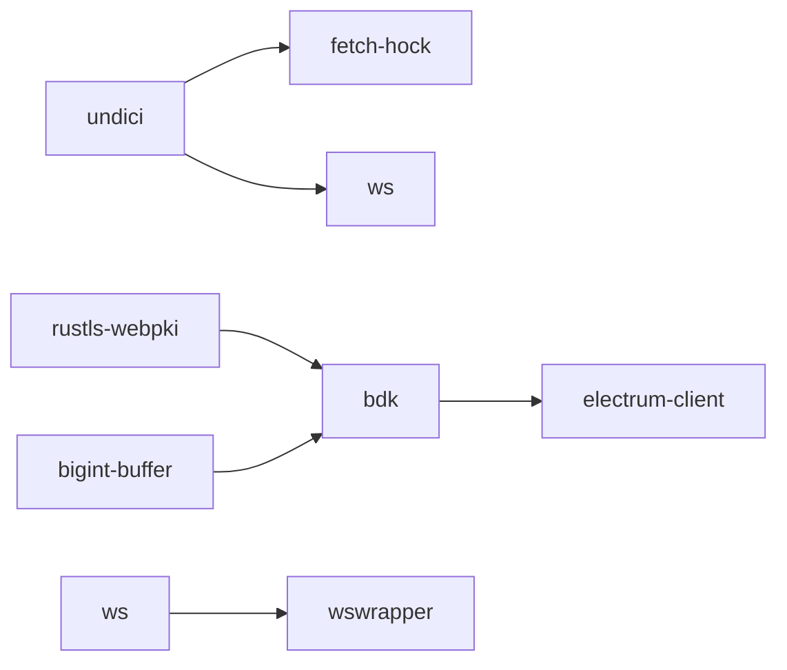
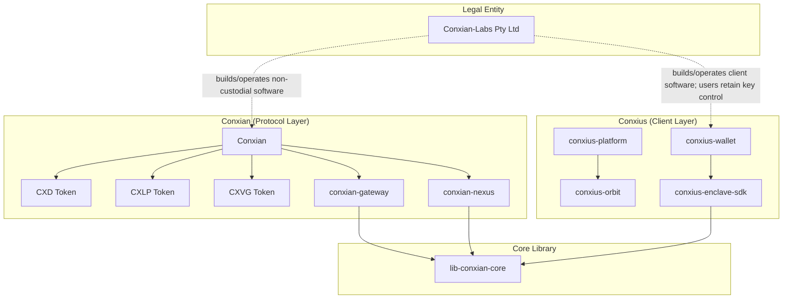

# Conxian Labs BOS Knowledge Graph
> Clarity-version: 4 | Epoch: latest | Generated: 2026-07-22

## Overview

This document is the **mandatory BOS Knowledge Graph** referenced in `AGENTS.md`. It provides structured entity extraction for graph-aware traversal by agentic systems.

---

## Doctrine decision — CON-1530 (2026-07-22)

The current doctrine relationship is:

- **Conxian-Labs (Pty) Ltd** is the legal builder/operator company and a non-custodial software and infrastructure builder/operator. It provides routing, orchestration, compliance integration, and verification; it is not a market participant, discretionary fund manager, or user-data extraction business.
- **Conxian** is the protocol/DAO layer. **Conxius** is the client/access/developer-tooling layer. Internal strategy and operations remain separate in the authorized Linear workspace under ZSE.
- **CSF / Conxian Finance Protocol**, **Fusion**, and **Nexus** are protocol/infrastructure product domains or legacy operating labels under the Conxian/Conxius crosswalk; they are not standalone legal custodians, fund controllers, or ambiguous business entities.
- Protocol contracts and DAO rules may implement escrow, settlement, treasury, or yield behavior. Those are protocol-level state transitions and do not establish Conxian-Labs custody, discretionary fund control, or market operation.
- Dated strategy, research, market-narrative, and planning surfaces are public-safe stubs with their restricted canonical source referenced by CON-1530; removed detail was not copied elsewhere in Git.
- Current technical artifact identity uses the exact repository slugs `conxian-gateway`, `conxius-enclave-sdk`, `conxius-orbit`, and `conxian_ui`; deprecated display aliases remain only in the narrowly documented normative/URL exceptions.
- Current role, audience, operating label, maturity, claim state, and document classification are governed by [`docs/PORTFOLIO_DOCTRINE_REGISTER.md`](docs/PORTFOLIO_DOCTRINE_REGISTER.md) and [`docs/DOCTRINE_ALIGNMENT_STANDARD.md`](docs/DOCTRINE_ALIGNMENT_STANDARD.md).

| Entity | Relationship | Boundary |
|--------|--------------|----------|
| Conxian-Labs (Pty) Ltd | builds/operates | Non-custodial software and infrastructure; no discretionary control over participant funds. |
| Conxian | defines | Protocol and DAO rules, contract state, verification, and governance interfaces. |
| Conxius | provides | Client, access, wallet, deployment, platform, and enclave-tooling surfaces. |
| CSF / Conxian Finance Protocol | classifies | Protocol/infrastructure product domain under Conxian; not a legal entity or custodian. |
| Fusion | classifies | Enterprise integration/infrastructure product domain under Conxian; not a legal entity or custodian. |
| Nexus | classifies | State/proof/telemetry infrastructure product domain under Conxian; not a legal entity or custodian. |
| Internal strategy and operations | remains separate from | Public-safe repository documentation; canonical restricted material is maintained in Linear. |

## Entity Registry

### 🏢 Organizations

| Entity | Type | Relationships | Source |
|--------|------|---------------|--------|
| **Conxian-Labs (Pty) Ltd** | Legal Entity | builds/operates non-custodial Conxian and Conxius software; does not custody participant assets | `docs/DOCTRINE_ALIGNMENT_STANDARD.md` |
| **Conxian** | Protocol/DAO Brand | defines protocol rules, contracts, verification, and governance interfaces | `docs/DOCTRINE_ALIGNMENT_STANDARD.md` |
| **Conxius** | Client/Access Brand | provides wallet, platform, deployment, and enclave-tooling surfaces | `docs/DOCTRINE_ALIGNMENT_STANDARD.md` |

### 🧭 Product domains and legacy taxonomy

| Domain | Canonical relationship | Boundary |
|--------|-----------------------|----------|
| **CSF / Conxian Finance Protocol** | Conxian protocol/infrastructure product domain | Contract, asset, fee, and protocol-state scope; not a standalone legal custodian. |
| **Fusion** | Conxian enterprise-infrastructure product domain | Gateway and compliance integration scope; not an independent fund or custody authority. |
| **Nexus** | Conxian state/proof infrastructure product domain | State, synchronization, proof, and telemetry scope; not a standalone legal entity. |

### 📦 Repositories (Submodules)

| Entity | GitHub | Language | Focus | Operating label / maturity and claim state |
|--------|--------|----------|-------|--------|
| `conxian-business` | Conxian/conxian-business | Mixed | Governance and specifications | Production intent / Beta; Implemented governance, Target-state proposals |
| `Conxian` | Conxian/Conxian | Clarity | Protocol contracts | Production intent / Beta; Implemented code, readiness conditional |
| `conxian-gateway` | Conxian/conxian-gateway | Rust | Routing and compliance middleware | Production intent / Beta; Implemented runtime, verification conditional |
| `conxian-nexus` | Conxian/conxian-nexus | Clarity/Rust | State and proof node | Production intent / Beta; Implemented code, deployment claims conditional |
| `conxius-wallet` | Conxian/conxius-wallet | TypeScript | Android client and signing surface | Production intent / Stable; capability-scoped Implemented claims |
| `conxius-platform` | Conxian/conxius-platform | TypeScript | Local developer orchestration | Reference implementation / Incubating |
| `conxius-orbit` | Conxian/conxius-orbit | TypeScript | Contract deployment toolkit | Reference implementation / Incubating |
| `conxius-enclave-sdk` | Conxian/conxius-enclave-sdk | Rust | Enclave and attestation abstraction | Reference implementation / Beta, conditional |
| `conxian_ui` | `Conxian/Conxian_UI` | TypeScript | Public web interaction surface | Reference implementation / Incubating; interface/code presence |
| `lib-conxian-core` | Conxian/lib-conxian-core | Rust | Shared cryptographic and state primitives | Production intent / Beta; Implemented code-visible |
| `conxian-labs-site` | Conxian/conxian-labs-site | TypeScript | Public website and docs surface | Reference implementation / Incubating |

### 🔐 Smart Contracts (Core)

| Entity | File | Tier | Clarity 4 | Issues |
|--------|------|------|-----------|--------|
| `bridge-nft.clar` | cross-chain/ | Core | ✅ | 0 |
| `yield-optimizer.clar` | yield/ | Core | ✅ | 0 |
| `payment-forge.clar` | agents/ | Core | ✅ | 0 |
| `jurisdictional-sharding.clar` | compliance/ | Compliance | ✅ | 0 |
| `block-utils.clar` | utils/ | Util | ✅ | 0 |
| `operational-treasury.clar` | agents/ | **Critical** | ✅ | 0 |
| `cxd-price-initializer.clar` | tokens/ | Stub | ⚠️ | 7-line placeholder stub — `(define-public (placeholder) (ok true))`. No oracle feed, no collateral ratio, no price feed. |
| `pausable.clar` | access/ | **Critical** | ⚠️ | ❌ `set-paused` permissionless (anyone can pause). 4 lines, no admin guard. **Not imported by any contract** (staking/vaults use inline pause with ACL). Dead code risk. |

### 🪙 Tokens

| Entity | Type | Trait | Issue |
|--------|------|-------|-------|
| **CXD** | Stablecoin | ft-trait | ⚠️ Price initializer is stub (no oracle/peg) | `contracts/tokens/cxd-token.clar` (98 lines), `contracts/tokens/cxd-price-initializer.clar` (7-line stub) |
| **CXLP** | LP Token | sip-010-ft-trait | ✅ Fully functional (KB was outdated) | `contracts/tokens/cxlp-token.clar` (189 lines) |
| **CXVG** | Governance | sip-010-ft-trait | ⚠️ No distribution (mint only) | `contracts/tokens/cxvg-token.clar` — has mint() but no airdrop/claim/vesting |

### 🔧 Technical Components

| Component | Technology | Purpose | Status |
|-----------|------------|---------|--------|
| **CXN Guardian** | TEE (SGX/TrustZone) | Hardware key isolation | ✅ Implemented |
| **ZKC** | Zero-Knowledge | Compliance verification | ✅ Designed |
| **SYI** | Sovereign Yield Index | Yield measurement | ✅ Designed |
| **BitVM2** | Groth16 | L2 state verification | ⚠️ Stub |
| **RGB** | Client-side | Asset validation | ⚠️ In progress |

### 🔧 CI/CD & DevOps

| Component | Technology | Purpose | Status |
|-----------|------------|---------|--------|
| **Gitleaks** | v8.24.2 | Secret scanning | ✅ Configured |
| **cargo audit** | Rust advisory db | Dependency vulnerability scanning | ✅ Active |
| **Conxian Unified CI** | GitHub Actions | Multi-suite test orchestration | ✅ Active |
| **Secret Scan** | Gitleaks workflow | Pre-commit secret detection | ✅ Active |
| **Branch Promotion Policy** | GitHub Actions | Enforce dev → staged → main flow | ✅ Active |

### 🛡️ Vulnerability Allowlist (Cargo Audit)

| RUSTSEC ID | Crate | Status | Rationale |
|------------|-------|--------|------------|
| RUSTSEC-2026-0204 | crossbeam-epoch | ✅ Ignored | Transitive via sled → bdk → electrum-client; no local upgrade path |
| RUSTSEC-2026-0104 | (various) | ✅ Ignored | Transitive dep chain |
| RUSTSEC-2026-0099 | rustls-webpki | ✅ Ignored | Transitive via bdk/electrum-client |
| RUSTSEC-2026-0098 | rustls-webpki | ✅ Ignored | Transitive via bdk/electrum-client |
| RUSTSEC-2024-0388 | instant | ✅ Ignored | Transitive via parking_lot |

### 📦 Dependabot Security Alerts (2026-07-08)

#### High Severity (8) - Action Required
| Alert | Package | Issue | Fixable | Mitigation |
|-------|---------|-------|---------|------------|
| #148 | form-data | CRLF injection | ⚠️ Update | `pnpm update form-data` |
| #143 | vite | fs.deny bypass (Windows) | ⚠️ Update | `pnpm update vite` |
| #149 | ws | Memory exhaustion DoS | ⚠️ Update | `pnpm update ws` |
| #21 | bigint-buffer | Buffer Overflow | ❌ Transitive | Via bdk - no local fix |
| #153 | undici | WebSocket DoS | ⚠️ Update | `pnpm update undici` |
| #146 | undici | TLS cert bypass | ⚠️ Update | `pnpm update undici` |
| #150 | undici | SOCKS5 pool reuse | ⚠️ Update | `pnpm update undici` |
| #58 | rustls-webpki | DoS via panic | ❌ Transitive | Via bdk - no local fix |

#### Moderate Severity (8) - Monitor
| Alert | Package | Issue |
|-------|---------|-------|
| #139 | uuid | Buffer bounds check |
| #60 | postcss | XSS (showcase-dapp) |
| #147 | undici | Cache whitespace bypass |
| #152 | undici | Header injection |
| #144 | launch-editor | NTLMv2 hash (Windows) |
| #145 | protobufjs | Property shadowing |
| #159 | cmov | aarch64 wrong results |
| #142 | ws | Uninitialized memory |

#### Low Severity (7) - Acceptable Risk
| Alert | Package | Issue |
|-------|---------|-------|
| #154 | undici | SameSite downgrade |
| #151 | undici | Response queue |
| #22 | elliptic | Risky crypto |
| #38 | tracing-subscriber | ANSI escape |
| #45 | webpki | Wildcard names |
| #44 | webpki | URI constraints |
| #52 | rand | Custom logger |

#### Known Unfixable Transitive Chains

### 👥 People (Entity Relationships)

| Role | Entity | Repository Access | Responsibility |
|------|--------|-------------------|----------------|
| Governance maintainer | - | Governance baseline | Maintains public-safe policy and repository boundaries; no custody claim |
| Protocol maintainer | - | Conxian | Maintains protocol/DAO specifications and evidence boundaries |
| Verification reviewer | - | lib-conxian-core | Reviews proof and compliance evidence; no discretionary fund role |
| Protocol metric maintainer | - | `conxian-gateway` | Maintains reference metrics and integrations; no managed-yield claim |

---

## Relationship Graph

---

## Decision Registry

| Decision | Date | Rationale | Superseded By |
|----------|------|----------|---------------|
| Clarity 4 only | 2026-04-23 | Security + epoch features | - |
| epoch = "latest" mandatory | 2026-04-23 | Always use newest epoch | - |
| Dynamic principals from treasury | 2026-04-23 | Eliminate hardcoded SPOF | - |
| TEE via `conxius-enclave-sdk` | 2026-04-23 | Hardware key isolation | - |
| ISO 20022 via `conxian-gateway` | 2026-04-23 | Legacy banking bridge | - |
| Doctrine alignment: company is non-custodial infrastructure builder/operator | 2026-07-22 | Separate company role from protocol/DAO and client/access layers; qualify custody, data, market, and protocol-fund language | `docs/DOCTRINE_ALIGNMENT_STANDARD.md` + `docs/PORTFOLIO_DOCTRINE_REGISTER.md` |
| Canonical taxonomy crosswalk and ZSE stub disposition | 2026-07-22 | Keep Conxian-Labs, Conxian, and Conxius as the canonical company/brand boundaries; classify CSF/Fusion/Nexus as product domains and move dated strategy surfaces to authorized Linear under CON-1530 | `docs/DOCTRINE_ALIGNMENT_STANDARD.md` + `docs/DOCUMENTATION_ALIGNMENT_INDEX.md` |
| Cargo audit allowlist for transitive deps | 2026-07-08 | Transitive vulnerabilities without local upgrade path | Upgrade dep chain |
| Gitleaks license via GitHub Secrets | 2026-07-08 | ZSE compliance; no hardcoded secrets | - |
| Infrastructure fixes to main, cherry-pick to PR | 2026-07-08 | Workflow configs belong in main | - |
| Dependabot allowlist for transitive npm deps | 2026-07-08 | undici/ws transitive chains via bdk/wswrapper | Fix upstream |
| GitGuardian var naming convention (no PASSWORD/SECRET in keys) | 2026-07-08 | Avoid false positives from variable names | - |
| Docker env vars use DB_* prefix, not *_PASSWORD | 2026-07-08 | GitGuardian pattern avoidance | - |
| CON-1573 Core boundary: BDK std-only now; transport-neutral capability/provenance contracts strategically | 2026-07-29 | Keep networking and persistence drivers outside Core, preserve offline/non-custodial behavior and existing multi-chain protocol/adapter surfaces, and separate transport authentication from chain-proof verification | [CON-1573](https://linear.app/conxian-labs/issue/CON-1573/security-provide-a-v02-compatible-core-candidate-without-legacy), [Core #227](https://github.com/Conxian/lib-conxian-core/issues/227), [PR #229](https://github.com/Conxian/lib-conxian-core/pull/229), [PR #231](https://github.com/Conxian/lib-conxian-core/pull/231) |
| Community governance remediation scope | 2026-07-21 | Prefer the self-contained, non-executing community-voting ledger in protocol PR #521 over isolated `upgrade-controller` work; keep the broader governance gap open until proposal/timelock plumbing and the overlapping #499 scope are resolved. | Protocol PR #521 merge and broader governance decision |

---

## Knowledge Citation Index

| Topic | Knowledge Doc | Last Updated |
|-------|---------------|--------------|
| Operational Standards | `AGENTS.md` | 2026-07-06 |
| Mathematical Framework | `lib-conxian-core/docs/CONXIAN_UNIFIED_THEORY_v2.md` | 2026-04-23 |
| Security Audit | `lib-conxian-core/docs/ADVISORY_REPORT_2026_07_06.md` | 2026-07-06 |
| Knowledge Gaps | `docs/KNOWLEDGE_GAP_ANALYSIS.md` | 2026-07-21 |
| Gateway Research | `conxian-gateway/docs/research/KNOWLEDGE_MAP.md` | 2026-04-23 |
| ISO 20022 Patterns | External: BIS d218, ISO white paper | 2025 |
| Clarity Patterns | External: Stacks Cookbook, CertiK | 2026 |

---

## Critical Links

### Standards
- [Clarity 4](https://stacks.co/blog/clarity-4-bitcoin-smart-contract-upgrade)
- [SIP-033](https://stacks.org/sip-033-clarity-4)
- [SIP Process](https://github.com/stacksgov/sips)
- [ISO 20022 Web APIs](https://iso20022.org)

### Security
- [CertiK Clarity Checklist](https://www.certik.com/resources/blog/clarity-best-practices-and-checklist)
- [sBTC Security Review](https://clarityalliance.org/reports/sbtc)

### Integration
- [Chainlink ISO 20022](https://chain.link/article/iso-20022-integration)
- [BIP-322 Signed Messages](https://bips.dev/322)
- [Lightspark ISO](https://lightspark.com/glossary/iso-20022)

---

## Dated Digest: CON-1506 Production Enablement (2026-07-20)

### Status

| Field | Record |
|-------|--------|
| Linear umbrella | [CON-1506 — production enablement](https://linear.app/conxian-labs/issue/CON-1506/production-enablement) — **authenticated/internal reference only; not public evidence**. Private Linear content is not reproduced here. |
| GitHub umbrella | [conxius-enclave-sdk issue #191](https://github.com/Conxian/conxius-enclave-sdk/issues/191) (**OPEN / REOPENED**) |
| Historical status snapshot | **Beta / conditional**; the latest mandatory gate recorded in [the failed-gate comment](https://github.com/Conxian/conxius-enclave-sdk/issues/191#issuecomment-5027149779) was **136 passed, 1 failed** because of a nondeterministic future-timestamp attestation test. This July 20 snapshot is historical. Current issue state is recorded in the July 22 CON-1512 digest below: #195, #198, #200, and #202 remain open; #196, #197, #199, and #201 are closed. Production enablement remains blocked for value-bearing use. |
| Review boundary | The dated audit remains historical evidence; current status is governed by live GitHub records and the July 22 CON-1512 research/phase-plan record while provider, runtime, release, and independent-acceptance gaps remain open. |
| Historical-status boundary | Older closure/readiness indexes are point-in-time records and are superseded for current status by live GitHub #191 and #195–#202. The 2026-06-03 readiness report is dated and marked internal at [lines 3–6](docs/UNIFIED_PRODUCTION_READINESS_GAP_REPORT.md#L3-L6), records its earlier readiness verdict at [lines 27–35](docs/UNIFIED_PRODUCTION_READINESS_GAP_REPORT.md#L27-L35), and records historical closure indexes at [lines 529–564](docs/UNIFIED_PRODUCTION_READINESS_GAP_REPORT.md#L529-L564). |

### Typed Entities

| Entity | Type | Role / state | Evidence |
|--------|------|--------------|----------|
| `CON-1506` | Linear umbrella issue | Authenticated/internal tracking reference only, not public evidence; private Linear content is not reproduced, and no value-bearing production approval is implied | [Linear issue](https://linear.app/conxian-labs/issue/CON-1506/production-enablement) |
| `#191` | GitHub umbrella issue | **OPEN / REOPENED** historical public umbrella for the enablement review; current unresolved blockers are tracked in #195, #198, #200, and #202, while #196, #197, #199, and #201 are closed but do not by themselves authorize production support | [GitHub issue](https://github.com/Conxian/conxius-enclave-sdk/issues/191) |
| `#191 comment 5027149779` | GitHub issue comment / mandatory-gate result | Latest public gate evidence: **136 passed, 1 failed** because of a nondeterministic future-timestamp attestation test; implementation is paused pending remediation and a repeatable exact-full-gate pass | [Failed-gate comment](https://github.com/Conxian/conxius-enclave-sdk/issues/191#issuecomment-5027149779) |
| `#193` | Audit documentation pull request | Merged public-safe audit baseline; corrects readiness language to Beta / conditional | [Audit PR](https://github.com/Conxian/conxius-enclave-sdk/pull/193) |
| `conxius-enclave-sdk` | Canonical technical repository/package identifier; shared runtime | Audited at the recorded source revision; support is capability-specific and remains conditional until the required gates pass | [Audited SDK main SHA](https://github.com/Conxian/conxius-enclave-sdk/commit/8194aa8ade26a9d5d7ed54b7f80f36796fce585c) |
| `#195–#202` | Production-enablement gate set | Historical gate set with current public states: **open** #195, #198, #200, #202; **closed** #196, #197, #199, #201. Closed issue state does not promote unsupported capabilities or bypass final acceptance in #202. | [Child gate backlog](https://github.com/Conxian/conxius-enclave-sdk/issues/195) |

### Relationships

| From | Relationship | To | Boundary / meaning |
|------|--------------|----|--------------------|
| `CON-1506` | tracks | [GitHub #191](https://github.com/Conxian/conxius-enclave-sdk/issues/191) | Linear and GitHub records represent the same production-enablement review. |
| `CON-1506` | is an authenticated/internal reference for | [GitHub #191](https://github.com/Conxian/conxius-enclave-sdk/issues/191) | Linear is not public evidence; current public status is taken from live GitHub records, without reproducing private Linear content. |
| [Failed-gate comment #5027149779](https://github.com/Conxian/conxius-enclave-sdk/issues/191#issuecomment-5027149779) | reports the latest mandatory-gate result for | [GitHub #191](https://github.com/Conxian/conxius-enclave-sdk/issues/191) | The public comment records 136 passed and 1 failed due to a nondeterministic future-timestamp attestation test. |
| [GitHub #191](https://github.com/Conxian/conxius-enclave-sdk/issues/191) | is evidenced by | [Audit PR #193](https://github.com/Conxian/conxius-enclave-sdk/pull/193) | The audit establishes the Beta / conditional status and identifies the remaining blockers. |
| [Audit PR #193](https://github.com/Conxian/conxius-enclave-sdk/pull/193) | gates | [Child issues #195–#202](https://github.com/Conxian/conxius-enclave-sdk/issues/195) | P0/P1 work and final acceptance remain required before any affected value-bearing capability is enabled. |
| `conxius-enclave-sdk` | is consumed by | downstream wallet, gateway, and state-node integrations | The SDK is a shared runtime; application UX and protocol authority remain with downstream integrations. |
| [Child issues #195–#201](https://github.com/Conxian/conxius-enclave-sdk/issues/195) | are prerequisites for | [Final acceptance #202](https://github.com/Conxian/conxius-enclave-sdk/issues/202) | Final acceptance is capability-by-capability and applies only to the exact reviewed candidate. |

### Decisions

| Decision | Operational meaning |
|----------|---------------------|
| Fail closed | Missing, insufficient, unsupported, or unverifiable security and protocol evidence produces a typed disabled/unsupported outcome rather than a permissive success path. |
| Simulation is not production evidence | Simulated, mock, structural, or placeholder paths cannot satisfy production acceptance for signing, attestation, verification, settlement, or recovery. |
| Trace every production claim | Each supported capability requires a requirement → code → test → CI → artifact evidence chain tied to the exact reviewed candidate. |
| Support is capability-specific | A working build or repository-level audit does not imply support for every chain, adapter, hardware tier, runtime, or protocol; unsupported capabilities remain disabled or conditional. |
| Public documentation stays ZSE-safe | Public records contain only minimum necessary status, evidence, and ownership boundaries; private endpoints, credentials, privileged identifiers, financial strategy, recovery procedures, incident secrets, and raw configurations remain excluded. |
| Preserve the failed-gate boundary | The historical **136 passed, 1 failed** result is not an acceptance pass. Current progress includes merged #237/#239/#244, but provider, runtime, release, and independent evidence still block production enablement. |
| Keep Linear evidence internal | CON-1506 is an authenticated/internal reference, not public evidence; no private Linear content is copied into this graph. |

### Risks

| Risk | Current implication / follow-up |
|------|-------------------------------|
| Software or simulated signer boundary | Value-bearing signing must not instantiate a software or simulated signer; remediation and negative evidence are tracked in [#195](https://github.com/Conxian/conxius-enclave-sdk/issues/195). |
| Incomplete attestation enforcement | Hardware trust, freshness, replay protection, trusted roots, and purpose binding require explicit enforcement evidence; tracked in [#195](https://github.com/Conxian/conxius-enclave-sdk/issues/195). |
| Protocol correctness and placeholders | Bitcoin/Ethereum verification, threshold/settlement, CCTP, account abstraction, asset metadata, and rail-address behavior remain conditional until canonical evidence or typed disablement exists; tracked in [#196](https://github.com/Conxian/conxius-enclave-sdk/issues/196), [#197](https://github.com/Conxian/conxius-enclave-sdk/issues/197), and [#198](https://github.com/Conxian/conxius-enclave-sdk/issues/198). |
| Release, MSRV, and version evidence drift | Toolchain, dependency, release, provenance, and exact-artifact records must reconcile before a stable support statement; tracked in [#199](https://github.com/Conxian/conxius-enclave-sdk/issues/199). |
| WASM secret boundary and platform evidence | Build success alone does not prove opaque secret handling or runtime support across browser, Node, bundler, and worker surfaces; tracked in [#200](https://github.com/Conxian/conxius-enclave-sdk/issues/200). |
| Telemetry and operations | Privacy-safe defaults, payload minimization, monitoring, rollback, and public-safe operational evidence remain required; tracked in [#201](https://github.com/Conxian/conxius-enclave-sdk/issues/201). |
| Nondeterministic future-timestamp attestation test | At the July 20 historical snapshot, the mandatory gate was non-repeatable at **136 passed, 1 failed**. Current progress includes merged #237/#239/#244; the exact provider, runtime, release, and independent-acceptance gates still remain. Evidence: [#191 failed-gate comment](https://github.com/Conxian/conxius-enclave-sdk/issues/191#issuecomment-5027149779). |
| Historical readiness-index drift | Older closure/readiness indexes can overstate current readiness when treated as live status; use GitHub #191 and #195–#202 as the current public boundary, with the dated report retained only as historical evidence ([lines 3–6](docs/UNIFIED_PRODUCTION_READINESS_GAP_REPORT.md#L3-L6), [lines 529–564](docs/UNIFIED_PRODUCTION_READINESS_GAP_REPORT.md#L529-L564)). |
| Stale BOS repository identity or submodule pin | Repository inspection verified legacy SDK identity references in existing BOS records, a `.gitmodules` branch reference that does not match the public remote default, and a current gitlink distinct from the audited SHA. Reconcile these separately; this PR intentionally changes neither submodule pins nor unrelated stale documentation. |

### Gates

| Gate | Priority | Required outcome | Status |
|------|----------|------------------|--------|
| [#195 — hardware signing and mandatory attestation](https://github.com/Conxian/conxius-enclave-sdk/issues/195) | P0 | Hardware-backed signing and complete attestation policy for value-bearing operations; no simulated signer fallback | Open; blocks affected production claims |
| [#196 — canonical Bitcoin and Ethereum verification](https://github.com/Conxian/conxius-enclave-sdk/issues/196) | P0 | Canonical verification, hashing, derivation, vectors, and deterministic negative behavior | **Closed; capability claims remain evidence-scoped** |
| [#197 — threshold and settlement placeholders](https://github.com/Conxian/conxius-enclave-sdk/issues/197) | P0 | Audited protocol-conformant implementations or typed unsupported/disabled paths | **Closed; capability claims remain evidence-scoped** |
| [#198 — CCTP, account abstraction, and asset metadata](https://github.com/Conxian/conxius-enclave-sdk/issues/198) | P0 | Canonical adapter, address, asset, network, provenance, and checksum evidence or fail-closed disablement | Open; blocks affected rail and asset claims |
| [#199 — reproducible release and toolchain](https://github.com/Conxian/conxius-enclave-sdk/issues/199) | P1 | One supported toolchain and release path with exact artifact, provenance, SBOM, and scan evidence | **Closed; current business pin/release synchronization remains separate** |
| [#200 — WASM boundary and platform evidence](https://github.com/Conxian/conxius-enclave-sdk/issues/200) | P1 | Opaque secret boundary plus runtime/platform support evidence and mock separation | Open; required for WASM support claims |
| [#201 — telemetry, privacy, and operations](https://github.com/Conxian/conxius-enclave-sdk/issues/201) | P1 | Minimized telemetry, safe defaults, and public-safe monitoring/recovery evidence | **Closed; current production evidence remains capability-specific** |
| [#202 — independent review and release acceptance](https://github.com/Conxian/conxius-enclave-sdk/issues/202) | P0 | Final capability-by-capability acceptance for the exact candidate after #195–#201 are resolved or explicitly scoped | Open; final gate, cannot be bypassed |

### Evidence Index

| Evidence | Link |
|----------|------|
| Linear umbrella | [CON-1506 — production enablement](https://linear.app/conxian-labs/issue/CON-1506/production-enablement) — authenticated/internal reference only; not public evidence |
| Current public status boundary | [conxius-enclave-sdk issue #191](https://github.com/Conxian/conxius-enclave-sdk/issues/191), current [#195–#202](https://github.com/Conxian/conxius-enclave-sdk/issues/195), and the July 22 [CON-1512 research/phase plan](docs/CON-1512_HARDWARE_SIGNING_ATTESTATION_PHASE_PLAN.md) |
| Current mandatory-gate evidence | [#191 comment 5027149779](https://github.com/Conxian/conxius-enclave-sdk/issues/191#issuecomment-5027149779) — **136 passed, 1 failed**; nondeterministic future-timestamp attestation test; implementation paused pending a fix and repeatable exact-full-gate pass |
| Historical audit documentation | [PR #193](https://github.com/Conxian/conxius-enclave-sdk/pull/193) |
| Historical audit PR head / changeset | [`39f9a885e03f7d259bcbdfe33f0722db76a83ec9`](https://github.com/Conxian/conxius-enclave-sdk/commit/39f9a885e03f7d259bcbdfe33f0722db76a83ec9) |
| Historical SDK main merge commit | [`79a4a082ab2c05e5b1b30335ab56b9e6d068c7e8`](https://github.com/Conxian/conxius-enclave-sdk/commit/79a4a082ab2c05e5b1b30335ab56b9e6d068c7e8) |
| Historical audited SDK baseline | [`8194aa8ade26a9d5d7ed54b7f80f36796fce585c`](https://github.com/Conxian/conxius-enclave-sdk/commit/8194aa8ade26a9d5d7ed54b7f80f36796fce585c) |

---

## Dated Digest: CON-1512 Hardware Signing and Attestation Research (2026-07-22)

### Status

| Field | Record |
|-------|--------|
| Linear umbrella | [CON-1512 — enforce hardware-backed signing and mandatory attestation](https://linear.app/conxian-labs/issue/CON-1512/p0-enforce-hardware-backed-signing-and-mandatory-attestation-for-value) — current implementation/research authority; private Linear detail is not reproduced here. |
| Child issues | [CON-1543](https://linear.app/conxian-labs/issue/CON-1543/p0-operationalize-attestation-roots-collateral-revocation-and), [CON-1544](https://linear.app/conxian-labs/issue/CON-1544/p0-qualify-android-keymintstrongbox-authorization-and-play-integrity), and [CON-1545](https://linear.app/conxian-labs/issue/CON-1545/p0-qualify-aws-nitro-attestation-and-kms-secret-release-boundary) |
| Live state revalidation | GitHub and Linear states were revalidated on **July 22, 2026**: CON-1512 is **Urgent / In Progress**; CON-1543 and CON-1519 are **Urgent / Triage**; CON-1544 is **Urgent / In Review** and remains open; CON-1546 is **Urgent / Triage**; SDK #241 and #240 are open; SDK #243 and wallet #441/#442 are merged; SDK #246 was **MERGED** at **2026-07-22 16:36:34 UTC**. Wallet #443 was still open at that earlier snapshot and later **MERGED** at **2026-07-22 18:34:15 UTC**. These administrative states do not establish production support. |
| Current boundary | Authorization proof, platform attestation, and protocol-key custody/signing are separate claims. Their intersection is required for value-bearing operations; unsupported paths remain fail closed. Administrative closure/completion of a tracker is not production qualification evidence. |
| Provider decision | Split portfolio: Android KeyMint/StrongBox plus server-verified Play Integrity for phone/client evidence; AWS Nitro plus attested KMS release for server/cloud evidence. Neither track is current production support or a substitute for protocol-key custody evidence. |
| Current implementation point | Merged repository PRs [#237](https://github.com/Conxian/conxius-enclave-sdk/pull/237), [#239](https://github.com/Conxian/conxius-enclave-sdk/pull/239), [#243](https://github.com/Conxian/conxius-enclave-sdk/pull/243), [#244](https://github.com/Conxian/conxius-enclave-sdk/pull/244) (**2026-07-22 15:55:09 UTC**), [#246](https://github.com/Conxian/conxius-enclave-sdk/pull/246), and [#249](https://github.com/Conxian/conxius-enclave-sdk/pull/249) provide bounded implementation/containment evidence. Wallet [#441](https://github.com/Conxian/conxius-wallet/pull/441), [#442](https://github.com/Conxian/conxius-wallet/pull/442), and [#443](https://github.com/Conxian/conxius-wallet/pull/443) are merged bounded client boundaries; #443 was open at the earlier July 22 snapshot and merged at **2026-07-22 18:34:15 UTC**. Merge and hosted-check state do not establish provider qualification, real-device proof, production support, or independent acceptance. |
| Downstream gate | [Business Gate #890](https://github.com/Conxian/conxian-business/issues/890) remains open and blocked at Gate 0; it is not an execution authorization. |

### Six evidence lanes

The three-claim boundary is expanded into six auditable evidence lanes. Progress in one lane cannot be promoted into another.

| Evidence lane | Current boundary | Promotion requirement | No-go claim |
|----------------|------------------|-----------------------|-------------|
| **Android client evidence/token collection and deterministic request binding** | Merged SDK [#243](https://github.com/Conxian/conxius-enclave-sdk/pull/243) and wallet [#441](https://github.com/Conxian/conxius-wallet/pull/441) / [#442](https://github.com/Conxian/conxius-wallet/pull/442), with merged hardening [SDK #246](https://github.com/Conxian/conxius-enclave-sdk/pull/246) (**2026-07-22 16:36:34 UTC**) / wallet [#443](https://github.com/Conxian/conxius-wallet/pull/443) (**2026-07-22 18:34:15 UTC**), define bounded client/SDK evidence collection and binding interfaces. | Canonical operation digest, nonce/challenge, audience, package/signing identity, key identity, purpose, algorithm, and evidence/token digests with deterministic positive and negative vectors. | Client-collected evidence, a bound request envelope, or a merged interface PR does not qualify a real device/provider or create an authoritative backend verdict. |
| **Trusted backend certificate/token verification and revocation** | Open SDK [#240](https://github.com/Conxian/conxius-enclave-sdk/issues/240), [CON-1543](https://linear.app/conxian-labs/issue/CON-1543/p0-operationalize-attestation-roots-collateral-revocation-and), and [CON-1544](https://linear.app/conxian-labs/issue/CON-1544/p0-qualify-android-keymintstrongbox-authorization-and-play-integrity) own the operational trust boundary. | Versioned verifier registry, certificate-chain/trusted-root validation, current collateral, revocation, server-side Play Integrity token verification, exact release identity/request binding, and a normalized policy verdict. | Token presence, client-side parsing, or structural certificate evidence does not prove backend verification, current revocation status, or provider qualification. |
| **Freshness and durable replay** | Shared under open SDK [#240](https://github.com/Conxian/conxius-enclave-sdk/issues/240) / [CON-1543](https://linear.app/conxian-labs/issue/CON-1543/p0-operationalize-attestation-roots-collateral-revocation-and); no completed distributed replay service is claimed. | Trusted time/expiry, stale-result rejection, nonce/challenge uniqueness, and atomic durable `consume_once` across restarts, replicas, and recovery. | A process-local cache, client timestamp, fixture, or one successful request does not establish durable replay protection. |
| **Production authorization enforcement** | The merged boundaries are inputs only. Wallet gate/envelope work is tracked in [#444 / CON-1546](https://github.com/Conxian/conxius-wallet/issues/444); the canonical rail artifact [#244](https://github.com/Conxian/conxius-enclave-sdk/pull/244) merged on 2026-07-22. | A centralized fail-closed gate must combine authoritative evidence, exact operation binding, freshness/replay, signer policy, and typed outcomes; software, mock, debug, and synthetic-success routes must be ineligible for value operations. | Merged interface code, green CI, a current branch, or UI confirmation does not authorize production value operations. |
| **Protocol-key custody** | Protocol-key custody remains separate under [CON-1512](https://linear.app/conxian-labs/issue/CON-1512/p0-enforce-hardware-backed-signing-and-mandatory-attestation-for-value) and SDK [#195](https://github.com/Conxian/conxius-enclave-sdk/issues/195). Android P-256 authorization is distinct from Bitcoin/Stacks secp256k1/Schnorr signing. | Exact protocol-key identity, non-exportability or approved custody boundary, signer authorization, algorithm/payload binding, deterministic protocol vectors, and exact runtime/release evidence. | KeyMint/StrongBox or Play Integrity evidence does not establish custody of the Bitcoin/Stacks protocol key or prove the required protocol signature path. |
| **Independent release acceptance** | [CON-1519](https://linear.app/conxian-labs/issue/CON-1519/p0-complete-independent-security-review-and-release-acceptance) and SDK [#202](https://github.com/Conxian/conxius-enclave-sdk/issues/202) remain the independent review and release gate. | Exact source/artifact identity, SBOM, provenance, dependency/security evidence, version/pin synchronization, capability-level tests, and independent review of the claimed scope. | A merged PR, current head, green CI, or generated documentation does not establish independent release acceptance. |

The no-go boundary is explicit: merged SDK #243 and #246 and wallet #441/#442/#443 do not qualify real devices/providers, prove trusted backend verification or revocation, establish durable replay, authorize production value operations, establish protocol-key custody, or satisfy independent release acceptance. Wallet #443 merged at **2026-07-22 18:34:15 UTC** as bounded hardening evidence; open SDK #240 and CON-1544 remain prerequisite tracks.

### Typed Entities

| Entity | Type | Current state | Evidence |
|--------|------|---------------|----------|
| `CON-1512` | Linear implementation umbrella | Current research and sequencing authority for hardware-backed signing and mandatory attestation | [Linear issue](https://linear.app/conxian-labs/issue/CON-1512/p0-enforce-hardware-backed-signing-and-mandatory-attestation-for-value) |
| `CON-1543` | Linear shared prerequisite | Trust roots, collateral, revocation, and distributed replay | [Linear issue](https://linear.app/conxian-labs/issue/CON-1543/p0-operationalize-attestation-roots-collateral-revocation-and) |
| `CON-1544` | Linear provider track | **URGENT / IN REVIEW**; remains open as of July 22, 2026 | Android qualification remains incomplete: trusted roots/collateral, server-side verification, real-device/runtime evidence, exact key/operation binding, replay, and independent release acceptance remain required; unsupported production paths stay fail closed. [Linear issue](https://linear.app/conxian-labs/issue/CON-1544/p0-qualify-android-keymintstrongbox-authorization-and-play-integrity) |
| `CON-1545` | Linear provider track | AWS Nitro attestation and KMS secret-release boundary qualification | [Linear issue](https://linear.app/conxian-labs/issue/CON-1545/p0-qualify-aws-nitro-attestation-and-kms-secret-release-boundary) |
| `#195` | SDK issue | **OPEN** P0 hardware-backed signing and mandatory attestation umbrella | [GitHub issue](https://github.com/Conxian/conxius-enclave-sdk/issues/195) |
| `#196` | SDK issue | **CLOSED** canonical Bitcoin/Ethereum verification and derivation; closure is not universal production support | [GitHub issue](https://github.com/Conxian/conxius-enclave-sdk/issues/196) |
| `#197` | SDK issue | **CLOSED** threshold and settlement placeholder quarantine/remediation; closure is capability-scoped | [GitHub issue](https://github.com/Conxian/conxius-enclave-sdk/issues/197) |
| `#198` | SDK issue | **OPEN** CCTP, account abstraction, and asset metadata fail-closed work | [GitHub issue](https://github.com/Conxian/conxius-enclave-sdk/issues/198) |
| `#199` | SDK issue | **CLOSED** toolchain/dependency/release evidence work; current pin/release drift remains separate | [GitHub issue](https://github.com/Conxian/conxius-enclave-sdk/issues/199) |
| `#200` | SDK issue | **OPEN** WASM secret boundary and runtime/platform evidence | [GitHub issue](https://github.com/Conxian/conxius-enclave-sdk/issues/200) |
| `#201` | SDK issue | **CLOSED** telemetry privacy and public-safe operational work; current capability evidence remains scoped | [GitHub issue](https://github.com/Conxian/conxius-enclave-sdk/issues/201) |
| `#202` | SDK issue | **OPEN** independent security review and release acceptance | [GitHub issue](https://github.com/Conxian/conxius-enclave-sdk/issues/202) |
| `#240` | SDK issue | **OPEN** shared trust/collateral/revocation/replay prerequisite | [GitHub issue](https://github.com/Conxian/conxius-enclave-sdk/issues/240) |
| `#241` | SDK issue | **OPEN** Android provider track; corresponding Linear CON-1544 is **URGENT / IN REVIEW** | Qualification remains incomplete; real trusted roots/collateral, server-side verification, real-device/runtime evidence, exact key/operation binding, replay, and independent release acceptance remain required; unsupported production paths stay fail closed. [GitHub issue](https://github.com/Conxian/conxius-enclave-sdk/issues/241) |
| `#242` | SDK issue | **OPEN** AWS Nitro provider track | [GitHub issue](https://github.com/Conxian/conxius-enclave-sdk/issues/242) |
| `#444 / CON-1546` | Wallet issue / Linear tracker | **OPEN / TRIAGE** centralized wallet value-operation gate and software/synthetic-success quarantine; **next 86/100 containment candidate; not production support** | [GitHub issue](https://github.com/Conxian/conxius-wallet/issues/444) |
| `#237` | SDK pull request | **MERGED** independent proof-factor verification at `8f3fa687f4a880c0a12ec1fabc613ecc9e043df4` | [GitHub PR](https://github.com/Conxian/conxius-enclave-sdk/pull/237) |
| `#239` | SDK pull request | **MERGED** independent proof verification at `0510ecd5096c39eed4b8909f9e48e56697a7bc57` | [GitHub PR](https://github.com/Conxian/conxius-enclave-sdk/pull/239) |
| `#243` | SDK pull request | **MERGED** Android authorization-evidence boundary | Bounded SDK evidence/request interface only; no provider, real-device, backend-verifier, custody, or release claim. [GitHub PR](https://github.com/Conxian/conxius-enclave-sdk/pull/243) |
| `#246` | SDK pull request | **MERGED** (2026-07-22 16:36:34 UTC) Android authorization-binding hardening | Merged implementation evidence remains bounded; no provider/device qualification, production support, durable replay, protocol-key custody, authorization enforcement, or independent release acceptance claim. [GitHub PR](https://github.com/Conxian/conxius-enclave-sdk/pull/246) |
| `#441` | Wallet pull request | **MERGED** KeyMint authorization boundary | Bounded wallet-side authorization interface only; no real-device/provider, backend-verification, custody, or production value-authorization claim. [GitHub PR](https://github.com/Conxian/conxius-wallet/pull/441) |
| `#442` | Wallet pull request | **MERGED** Play Integrity SDK request boundary | Bounded client token/request collection and binding only; server-side verification, revocation, real-device qualification, and production authorization remain open. [GitHub PR](https://github.com/Conxian/conxius-wallet/pull/442) |
| `#443` | Wallet pull request | **MERGED** at **2026-07-22 18:34:15 UTC** — KeyMint authorization-evidence hardening follow-up | Bounded merged implementation evidence; no hardware/provider qualification, production support, or independent acceptance claim. [GitHub PR](https://github.com/Conxian/conxius-wallet/pull/443) |
| `#244` | Repository pull request | **MERGED** on **2026-07-22 15:55:09 UTC** as bounded canonical six-proof rail implementation; merge commit [`4292dcd8a6ceb1301e7f2085a95cce544527cdb0`](https://github.com/Conxian/conxius-enclave-sdk/commit/4292dcd8a6ceb1301e7f2085a95cce544527cdb0). Merge does not establish hardware/provider qualification, production support, or independent acceptance. | [GitHub PR](https://github.com/Conxian/conxius-enclave-sdk/pull/244) |
| `CON-1517` | Linear runtime/release issue | Runtime/platform evidence and WASM secret-boundary work remain required | [Linear issue](https://linear.app/conxian-labs/issue/CON-1517/p1-harden-the-wasm-secret-boundary-and-add-runtimeplatform-evidence) |
| `CON-1519` | Linear acceptance issue | Independent security review and release acceptance remain required | [Linear issue](https://linear.app/conxian-labs/issue/CON-1519/p0-complete-independent-security-review-and-release-acceptance) |
| `#890` | Business issue / downstream gate | **OPEN**, Gate 0 blocked; not execution authorization | [GitHub issue](https://github.com/Conxian/conxian-business/issues/890) |

### Relationships

| From | Relationship | To | Boundary / meaning |
|------|--------------|----|--------------------|
| `CON-1512` | decomposes into | `CON-1543`, `CON-1544`, `CON-1545` | Shared trust/replay work precedes Android and Nitro qualification. |
| `#240` | blocks | `#241`, `#242` | Provider tracks require common roots, collateral, revocation, normalized results, freshness, and durable replay. |
| `#237` | strengthens | authorization proof | Independent proof factors are typed and checked separately. |
| `#239` | enforces | fail-closed authorization | Independent verification contains missing or invalid proof outcomes. |
| `#243` and wallet `#441` / `#442` | provide | client evidence/request-boundary artifacts | Merged interface/containment evidence only; SDK `#246` and wallet `#443` are also merged hardening. |
| SDK `#246` and wallet `#443` | harden | deterministic Android authorization binding | SDK `#246` merged at **2026-07-22 16:36:34 UTC**; wallet `#443` merged at **2026-07-22 18:34:15 UTC**. Neither merge qualifies providers, backend verification, protocol-key custody, production value operations, or independent acceptance. |
| `#244` | contains | canonical six-proof settlement rail | Merged bounded implementation; not hardware/provider qualification or independent acceptance. |
| `#444 / CON-1546` | executes | wallet gate/envelope phase | After canonical rail convergence; no provider qualification claim. |
| `#195` | governs | value-bearing signing/attestation claims | No production claim is allowed without the full acceptance chain. |
| `CON-1517` | blocks | runtime/platform claims | Build success does not prove secret-boundary or runtime evidence. |
| `CON-1519` / `#202` | gates | immutable release and independent acceptance | Exact artifact and capability-by-capability acceptance remain required. |
| `#890` | depends on | hardware/attestation and independent acceptance | Downstream control-plane handoff remains blocked and cannot authorize execution. |

### Decisions and risks

| Decision / risk | Operational meaning |
|----------------|---------------------|
| Split providers | Keep phone/client and server/cloud evidence as separate tracks; do not make a universal hardware-support claim. |
| Authorization ≠ attestation ≠ custody | A valid user proof, platform report, or signature is insufficient in isolation. |
| Unsupported paths fail closed | Software, simulated, heuristic, unverified, stale, and unregistered provider paths remain disabled. |
| Wallet readiness language is stale/high-risk | Merged KeyMint/Play Integrity boundaries and merged wallet hardening are bounded interface evidence; backend verification and qualification remain open, so older StrongBox/Play Integrity wording is not current production evidence. |
| Pin/release drift is separate | `.gitmodules` tracks `master` while upstream default is `main`; business pin, SDK release, and current upstream `main` must not be conflated. Pin/release drift is not current evidence and is not changed in this docs PR. |
| Historical records remain historical | The July 20 CON-1506 digest is preserved; current issue states and PR progress are recorded here rather than retroactively rewriting history. |

### Evidence Index

| Evidence | Link |
|----------|------|
| Canonical research and phase plan | [`docs/CON-1512_HARDWARE_SIGNING_ATTESTATION_PHASE_PLAN.md`](docs/CON-1512_HARDWARE_SIGNING_ATTESTATION_PHASE_PLAN.md) |
| Stable bounded interface/containment artifacts | Merged SDK Android boundary [#243](https://github.com/Conxian/conxius-enclave-sdk/pull/243), merged SDK hardening [#246](https://github.com/Conxian/conxius-enclave-sdk/pull/246) (**2026-07-22 16:36:34 UTC**), open provider-neutral contracts [#245](https://github.com/Conxian/conxius-enclave-sdk/pull/245) with current review findings [#4755943314](https://github.com/Conxian/conxius-enclave-sdk/pull/245#pullrequestreview-4755943314), merged wallet KeyMint boundary [#441](https://github.com/Conxian/conxius-wallet/pull/441), merged wallet Play Integrity request boundary [#442](https://github.com/Conxian/conxius-wallet/pull/442), and merged wallet hardening follow-up [#443](https://github.com/Conxian/conxius-wallet/pull/443) (**2026-07-22 18:34:15 UTC**). These are bounded interface/containment artifacts only: they do not establish production provider verification, durable replay, real-device qualification, protocol-key custody evidence, or independent release acceptance. PR #245's current review identified unresolved policy-digest/expected-collateral binding, idempotent-vs-conflicting replay outcome, deserialization invariant, and non-production replay-store registration gaps; SDK [#240](https://github.com/Conxian/conxius-enclave-sdk/issues/240), [CON-1543](https://linear.app/conxian-labs/issue/CON-1543/p0-operationalize-attestation-roots-collateral-revocation-and), and [CON-1544](https://linear.app/conxian-labs/issue/CON-1544/p0-qualify-android-keymintstrongbox-authorization-and-play-integrity) remain open prerequisite tracks, and this update does not modify PR #245. |
| SDK umbrella | [#195](https://github.com/Conxian/conxius-enclave-sdk/issues/195) |
| Shared prerequisite | [#240](https://github.com/Conxian/conxius-enclave-sdk/issues/240) |
| Android track | [#241](https://github.com/Conxian/conxius-enclave-sdk/issues/241) |
| AWS Nitro track | [#242](https://github.com/Conxian/conxius-enclave-sdk/issues/242) |
| Merged proof verification | [#237](https://github.com/Conxian/conxius-enclave-sdk/pull/237), [#239](https://github.com/Conxian/conxius-enclave-sdk/pull/239) |
| Rail-convergence implementation | Merged [#244](https://github.com/Conxian/conxius-enclave-sdk/pull/244) at merge commit [`4292dcd8a6ceb1301e7f2085a95cce544527cdb0`](https://github.com/Conxian/conxius-enclave-sdk/commit/4292dcd8a6ceb1301e7f2085a95cce544527cdb0); bounded implementation evidence only. |
| Runtime/platform evidence | [CON-1517](https://linear.app/conxian-labs/issue/CON-1517/p1-harden-the-wasm-secret-boundary-and-add-runtimeplatform-evidence) |
| Independent review/release acceptance | [CON-1519](https://linear.app/conxian-labs/issue/CON-1519/p0-complete-independent-security-review-and-release-acceptance), [#202](https://github.com/Conxian/conxius-enclave-sdk/issues/202) |
| Downstream business gate | [#890](https://github.com/Conxian/conxian-business/issues/890) |

## Dated Digest: CON-1421 Governance Stub Reconciliation (2026-07-21)

### Status

| Field | Record |
|-------|--------|
| Linear issue | [CON-1421 — 16 of 28 governance contracts are stubs](https://linear.app/conxian-labs/issue/CON-1421/medium-16-of-28-governance-contracts-are-stubs) — **In Progress** |
| Historical accounting | The issue body names 15 contracts. `proposal-engine-trait.clar` is the likely omitted 16th entry; six listed entries are partial skeletons rather than blank stubs, so the original “16 non-functional stubs” wording requires typed reconciliation. |
| Community-voting implementation | [Protocol PR #521](https://github.com/Conxian/Conxian/pull/521) is **OPEN / MERGEABLE / CLEAN** at audited head [`90ef8a2f883ddab7cb0cfd00f68ba4d829f0a8e1`](https://github.com/Conxian/Conxian/commit/90ef8a2f883ddab7cb0cfd00f68ba4d829f0a8e1); all currently reported checks pass and the independent re-audit reports no P0/P1 findings. State is **implemented and pinned for review**, not merged or deployed. |
| Historical umbrella | [Conxian #463](https://github.com/Conxian/Conxian/issues/463) is an OPEN / REOPENED historical umbrella. This scoped remediation does not close the broader governance gap or make the umbrella a proof of full resolution. |
| Active overlap | [Conxian #499](https://github.com/Conxian/Conxian/issues/499) remains the active overlapping scope for `upgrade-controller`, `sab-election`, and `gauge-manager`. |
| Remaining gap | `upgrade-controller.clar`, `proposal-engine-trait.clar`, and other governance gaps remain stub, partial, deferred, or separately scoped. Community voting is one reviewed remediation path, not a claim that all governance contracts are complete. |

### Projects and Records

| Entity | Type | Role / state | Evidence |
|--------|------|--------------|----------|
| `Governance remediation workstream` | Project | Reconciles the historical governance-stub inventory while preserving explicit review and deployment boundaries | [CON-1421](https://linear.app/conxian-labs/issue/CON-1421/medium-16-of-28-governance-contracts-are-stubs), [#463](https://github.com/Conxian/Conxian/issues/463), [#499](https://github.com/Conxian/Conxian/issues/499) |
| `conxian-business` | Parent repository | Carries the review-only `Conxian` submodule pin and this knowledge crystallization | [Parent repository](https://github.com/Conxian/conxian-business) |
| `Conxian` | Protocol repository | Supplies the audited governance implementation candidate; the parent pin is review-bound to the exact protocol commit | [Protocol repository](https://github.com/Conxian/Conxian) |
| `CON-1421` | Linear issue | Tracks the medium-priority governance inventory correction and scoped remediation; remains In Progress | [Linear issue](https://linear.app/conxian-labs/issue/CON-1421/medium-16-of-28-governance-contracts-are-stubs) |
| `#521` | Protocol pull request | Implements the community-voting lifecycle; open and not merged | [Protocol PR #521](https://github.com/Conxian/Conxian/pull/521) |
| `90ef8a2f883ddab7cb0cfd00f68ba4d829f0a8e1` | Audited protocol commit | Exact reviewed head to pin; not a deployment or merge claim | [Protocol commit](https://github.com/Conxian/Conxian/commit/90ef8a2f883ddab7cb0cfd00f68ba4d829f0a8e1) |

### Contracts / Libraries

| Entity | Type | Role / state | Evidence |
|--------|------|--------------|----------|
| `community-voting-engine.clar` | Governance contract | Escrowed, non-executing strategic voting ledger implemented on PR #521; remains under review until the PR merges | [Source at audited head](https://github.com/Conxian/Conxian/blob/90ef8a2f883ddab7cb0cfd00f68ba4d829f0a8e1/contracts/governance/community-voting-engine.clar), [governance README](https://github.com/Conxian/Conxian/blob/90ef8a2f883ddab7cb0cfd00f68ba4d829f0a8e1/contracts/governance/README.md) |
| `operational-treasury.clar` | Routing / treasury contract | Runtime source of truth for the `cxvg-token` and `regulatory-adapter` routes used by the voting engine | [Source at audited head](https://github.com/Conxian/Conxian/blob/90ef8a2f883ddab7cb0cfd00f68ba4d829f0a8e1/contracts/core/operational-treasury.clar) |
| `cxvg-token.clar` | SIP-010 governance token | Real token transferred into escrow as voting power | [Source at audited head](https://github.com/Conxian/Conxian/blob/90ef8a2f883ddab7cb0cfd00f68ba4d829f0a8e1/contracts/tokens/cxvg-token.clar) |
| `proposal-engine → proposal-registry → proposal-executor → timelock` | Governance contract path | Existing execution-oriented path; kept separate from the non-executing community-voting ledger | [Governance README at audited head](https://github.com/Conxian/Conxian/blob/90ef8a2f883ddab7cb0cfd00f68ba4d829f0a8e1/contracts/governance/README.md) |
| `proposal-engine-trait.clar` | Governance trait / stub | Likely omitted 16th inventory entry; remains a stub and is not remediated by PR #521 | [Source at audited head](https://github.com/Conxian/Conxian/blob/90ef8a2f883ddab7cb0cfd00f68ba4d829f0a8e1/contracts/governance/proposal-engine-trait.clar) |
| `upgrade-controller.clar` | Governance contract / stub | Deferred; no isolated implementation in PR #521 because upgrade routing depends on proposal/timelock plumbing and overlaps #499 | [Source at audited head](https://github.com/Conxian/Conxian/blob/90ef8a2f883ddab7cb0cfd00f68ba4d829f0a8e1/contracts/governance/upgrade-controller.clar) |

### Relationships

| From | Relationship | To | Boundary / meaning |
|------|--------------|----|--------------------|
| `CON-1421` | tracks | [Protocol PR #521](https://github.com/Conxian/Conxian/pull/521) | The PR addresses one bounded governance path selected after inventory reconciliation. |
| `CON-1421` | reconciles | [Conxian #463](https://github.com/Conxian/Conxian/issues/463) | Corrects the “16 of 28” accounting without claiming full umbrella closure. |
| [Protocol PR #521](https://github.com/Conxian/Conxian/pull/521) | implements | `community-voting-engine.clar` | Functional escrowed voting lifecycle at the exact reviewed head. |
| [`90ef8a2f883ddab7cb0cfd00f68ba4d829f0a8e1`](https://github.com/Conxian/Conxian/commit/90ef8a2f883ddab7cb0cfd00f68ba4d829f0a8e1) | is the reviewed head of | [Protocol PR #521](https://github.com/Conxian/Conxian/pull/521) | Current candidate for the parent gitlink; PR remains open. |
| `community-voting-engine.clar` | reads routes from | `operational-treasury.clar` | Dynamic token and compliance route checks fail closed on missing or mismatched principals. |
| `community-voting-engine.clar` | escrows | `cxvg-token.clar` | Successful votes use real SIP-010 transfers into the engine. |
| `community-voting-engine.clar` | complements | `proposal-engine → proposal-registry → proposal-executor → timelock` | Voting records and settlement do not execute arbitrary proposal actions. |
| `upgrade-controller.clar` | overlaps | [Conxian #499](https://github.com/Conxian/Conxian/issues/499) | Isolated upgrade routing is deferred until the surrounding governance architecture is resolved. |
| `proposal-engine-trait.clar` | is counted as | corrected 16th governance-gap entry | The likely omitted entry is recorded without asserting that every listed item is a blank stub. |

### Decisions

| Decision | Operational meaning |
|----------|---------------------|
| Prefer community voting over isolated `upgrade-controller` work | Community voting has no production callers, documented requirements, and a complete self-contained vertical. Upgrade routing depends on proposal/timelock plumbing and overlaps the active #499 scope. |
| Record implemented behavior precisely | The reviewed engine performs dynamic operational-treasury route checks, real CXVG escrow, compliance checks, future and bounded voting windows, aggregate supply snapshot/cap enforcement, quorum and approval thresholds with strict tie failure, permissionless finalization, and historical one-time stake claims. |
| Keep the execution boundary explicit | The engine does not execute arbitrary actions or withdraw treasury assets; the existing proposal/execution path remains separate. |
| Defer reputation weighting | Voting uses raw escrowed CXVG; reputation weighting waits for a trustworthy, independently reviewed reputation source and rules. |
| Treat PR #521 as under review | The parent may pin the exact audited head for provenance, but the state remains pinned for review until PR #521 merges into `main`; no deployment claim is made. |
| Preserve typed gap states | Partial skeletons, blank stubs, implemented-but-under-review contracts, and deferred architecture must not be collapsed into one resolved count. |
| Do not close #463 by implication | One clean, audited PR does not resolve the historical or active governance backlog. |

### Risks and Gates

| Risk / gate | Current implication |
|-------------|---------------------|
| Protocol PR merge order | The parent pin must merge only with or after [PR #521](https://github.com/Conxian/Conxian/pull/521) so the gitlink remains backed by the audited provenance. |
| Broader governance completion | `upgrade-controller`, `proposal-engine-trait`, and other remaining gaps require separate design, implementation, or explicit retirement decisions. |
| Historical inventory quality | The original issue body lists 15 contracts and six listed entries are partial skeletons; a future full inventory should classify every contract rather than reuse the blanket 16-stub label. |

### Evidence Index

| Evidence | Link |
|----------|------|
| Linear issue | [CON-1421](https://linear.app/conxian-labs/issue/CON-1421/medium-16-of-28-governance-contracts-are-stubs) |
| Historical umbrella | [Conxian #463](https://github.com/Conxian/Conxian/issues/463) |
| Active overlapping scope | [Conxian #499](https://github.com/Conxian/Conxian/issues/499) |
| Protocol implementation PR | [Conxian PR #521](https://github.com/Conxian/Conxian/pull/521) |
| Exact protocol commit | [`90ef8a2f883ddab7cb0cfd00f68ba4d829f0a8e1`](https://github.com/Conxian/Conxian/commit/90ef8a2f883ddab7cb0cfd00f68ba4d829f0a8e1) |
| Parent repository | [Conxian/conxian-business](https://github.com/Conxian/conxian-business) |

---

## Dated Digest: External Semantic-Source Intake Control (2026-07-27)

### Status and boundary

| Field | Record |
|---|---|
| Parent research tracker | [Business #940](https://github.com/Conxian/conxian-business/issues/940) records public-safe FIBO provenance research and the scored decision to implement a generic intake control before source-specific evaluation. |
| Implementation control | [Business #955](https://github.com/Conxian/conxian-business/issues/955) defines the empty registry, policy/schema, fail-closed validator, tests, CI, and graph acceptance boundary. |
| Initial registry state | [`governance/external-semantic-sources.json`](governance/external-semantic-sources.json) is version `1.0.0` with `sources: []`; it contains no FIBO/OMG source record, URL, ontology, archive, or corpus content. |
| Claim state | Control infrastructure only. Registry presence or validation is not adoption, legal advice, endorsement, certification, partnership, compliance/authority/attestation evidence, candidate acceptance, release approval, or BOS Gate 0–6 advancement. |

### Typed entities

| Entity | Type | Role / state | Evidence |
|---|---|---|---|
| External semantic-source intake policy | Governance policy | Defines controlled lifecycle states, immutable evidence, selection/import closure, notice review, namespace ownership, transformation provenance, review references, SBOM handoff, offline failure, and claim boundaries. | [`docs/governance/EXTERNAL_SEMANTIC_SOURCE_INTAKE_POLICY.md`](docs/governance/EXTERNAL_SEMANTIC_SOURCE_INTAKE_POLICY.md) |
| External semantic-source schema v1 | JSON Schema | Versioned closed contract for generic source records; schema drift and unknown fields fail closed. | [`governance/external-semantic-sources.schema.v1.json`](governance/external-semantic-sources.schema.v1.json) |
| External semantic-source registry | Governance registry | Canonical registry initialized exactly empty apart from schema/version metadata. | [`governance/external-semantic-sources.json`](governance/external-semantic-sources.json) |
| External semantic-source validator | CI control / Python tool | Standard-library-only, deterministic, offline validation of pins, hashes, dates, URLs, states, dispositions, evidence paths/digests, closure, notices, namespaces, transformations, SBOM handoff, duplicates, and claims. | [`scripts/validate_external_semantic_sources.py`](scripts/validate_external_semantic_sources.py) |
| External semantic-source validator tests | Test suite | Negative and positive fixtures for empty, research-only, and fully evidenced adopted states without vendoring an external corpus. | [`tests/test_validate_external_semantic_sources.py`](tests/test_validate_external_semantic_sources.py) |
| Semantic-source CI control | GitHub Actions control | Runs registry validation and unit tests unconditionally in `repo-hygiene`; there is no source-presence or `hashFiles` bypass for this control. | [`.github/workflows/conxian-unified-ci.yml`](.github/workflows/conxian-unified-ci.yml) |
| Immutable evidence bundle | Evidence type | Full commit/archive identity, local hashed artifacts, selected/imported file closure, notices, namespace, transformations, review reference, claims, and SBOM handoff. | [Policy](docs/governance/EXTERNAL_SEMANTIC_SOURCE_INTAKE_POLICY.md) |
| Review authority reference | Traceability token | Links a closed disposition to its authoritative record without copying restricted advice into public Git. It is not itself approval beyond the enumerated disposition. | [Policy](docs/governance/EXTERNAL_SEMANTIC_SOURCE_INTAKE_POLICY.md) |
| FIBO provenance research note | Research record | Re-verifies the candidate tag/commit, commit-addressed primary sources, release metadata (`immutable: false`, `target_commitish: master`, zero assets), observed GitHub archive-byte hash, non-deterministic aggregate-root statement, notice gaps, and candidate score; records no adoption. | [`docs/governance/FIBO_PROVENANCE_RESEARCH_NOTE.md`](docs/governance/FIBO_PROVENANCE_RESEARCH_NOTE.md) |

### Relationships

| From | Relationship | To | Boundary / meaning |
|---|---|---|---|
| [Business #940](https://github.com/Conxian/conxian-business/issues/940) | selects for implementation | [Business #955](https://github.com/Conxian/conxian-business/issues/955) | Generic fail-closed intake scored above source-specific lint, SBOM adaptation, or corpus vendoring. |
| External semantic-source intake policy | governs | schema, registry, validator, review reference, and CI control | Policy meaning is authoritative; machine artifacts enforce its public-safe subset. |
| Schema v1 | constrains | registry records | Version and field vocabulary are closed; registry/schema mismatch fails. |
| Validator | verifies offline | registry and immutable evidence bundle | No URL retrieval, RDF parsing, inference, or third-party Python dependency occurs. |
| Selected/adopted source record | requires | selected-file and import closure | Every selected and transitively imported file must be enumerated and uniquely mapped. |
| Selected/adopted source record | requires | root and per-file notice disposition | Root-license evidence does not substitute for selected-file/import notice closure. |
| Selected/adopted source record | requires | Conxian-owned extension namespace | Upstream and third-party namespaces cannot be represented as locally controlled. |
| Selected/adopted source record | requires | transformation provenance and SBOM handoff | A `none` transformation disposition still needs evidence; SBOM handoff is a pre-component boundary, not release approval. |
| Registry presence | does not establish | adoption or BOS Gate progress | Only a complete state/disposition/evidence record can express controlled adoption, and even that is not legal, compliance, authority, attestation, candidate, release, or Gate evidence. |
| FIBO provenance research note | informs but does not populate | external semantic-source registry | Research remains outside the empty canonical registry until a future bounded intake passes the full policy. |

### Decision rationale

| Decision | Operational meaning |
|---|---|
| Keep the initial registry empty | Establish the reusable control without adding, fetching, parsing, endorsing, selecting, or adopting FIBO, OMG, or another corpus. |
| Pin immutable identities | Full lowercase commit SHAs and lowercase SHA-256 digests replace tags, branches, short refs, and moving evidence. |
| Verify local artifacts by digest | Evidence is reviewable offline and fails if absent, relocated, duplicated, traversing, or modified. |
| Separate root license from notice closure | A repository license cannot by itself close exact selected-file, import, or third-party notice obligations. |
| Require local namespace ownership | Conxian extensions must remain distinguishable from upstream vocabulary and authority. |
| Put negative claims in `claims.notSupported` | Mandatory unsupported statements are allowed and required; the validator prohibits positive claims in `claims.supported` without falsely rejecting the negative boundary list. |
| Defer source-specific profile work | Generic intake precedes any future narrow domain-profile evaluation, including a possible LEI-oriented profile; no such profile is approved or selected, and no candidate is treated as accepted before evidence controls exist. |

### Risks and gates

| Risk / gate | Current implication |
|---|---|
| Legal and notice review | Exact-source license/notice/trademark disposition remains future restricted work; no legal conclusion is stored here. |
| Archive-byte stability | The FIBO archive digest is an observed GitHub-generated byte hash, not an upstream signed checksum or publisher attestation. |
| Release/tag metadata | The observed GitHub release reports `immutable: false`, targets moving branch `master`, and has zero assets, so it is not immutable artifact or checksum authority. |
| RDF and network behavior | No parser, import resolver, ontology transformation, or runtime network behavior is authorized or introduced. |
| Gate and release status | #940/#955 and these files do not modify #890, candidate acceptance, release approval, or any BOS Gate 0–6 state. |

### Evidence index

| Evidence | Link |
|---|---|
| Parent research tracker | [Business #940](https://github.com/Conxian/conxian-business/issues/940) |
| Implementation control | [Business #955](https://github.com/Conxian/conxian-business/issues/955) |
| Intake policy | [`docs/governance/EXTERNAL_SEMANTIC_SOURCE_INTAKE_POLICY.md`](docs/governance/EXTERNAL_SEMANTIC_SOURCE_INTAKE_POLICY.md) |
| Research note | [`docs/governance/FIBO_PROVENANCE_RESEARCH_NOTE.md`](docs/governance/FIBO_PROVENANCE_RESEARCH_NOTE.md) |
| Registry and schema | [`governance/external-semantic-sources.json`](governance/external-semantic-sources.json), [`governance/external-semantic-sources.schema.v1.json`](governance/external-semantic-sources.schema.v1.json) |
| Validator and tests | [`scripts/validate_external_semantic_sources.py`](scripts/validate_external_semantic_sources.py), [`tests/test_validate_external_semantic_sources.py`](tests/test_validate_external_semantic_sources.py) |
| Unconditional CI wiring | [`.github/workflows/conxian-unified-ci.yml`](.github/workflows/conxian-unified-ci.yml) |

---

## Dated Digest: GitHub-first BOS Research-Cycle Authority (2026-07-28)

### Status and boundaries

| Field | Record |
|---|---|
| Public-safe authority | [Business #943](https://github.com/Conxian/conxian-business/issues/943) and [`docs/GITHUB_FIRST_BOS_OPERATING_MODEL.md`](docs/GITHUB_FIRST_BOS_OPERATING_MODEL.md) own the reusable lifecycle, scoring rubric, phase artifacts, evidence vocabulary, and refresh rules. |
| Dated evidence ledger | [`docs/BOS_RESEARCH_CANDIDATE_LEDGER.md`](docs/BOS_RESEARCH_CANDIDATE_LEDGER.md) and [`docs/bos_research_candidate_ledger.json`](docs/bos_research_candidate_ledger.json) record the bounded 2026-07-28 candidate set, scores, gap classes, dispositions, provenance, uncertainty, and non-claims. This is not an exhaustive ecosystem audit. |
| Dependent governance | [Business #944](https://github.com/Conxian/conxian-business/issues/944) owns classified migration; [Business #945](https://github.com/Conxian/conxian-business/issues/945) owns branch/promotion reconciliation; [Conxian/.github #61](https://github.com/Conxian/.github/issues/61) owns organization Project authorization, name, and schema. |
| Restricted-record boundary | GitHub stores only minimum-necessary public-safe coordination and sanitized evidence. The approved non-Git successor and accountable owner remain explicit human-owned blockers and are not inferred. |
| Ownership rule | Implementation and acceptance live in each owning repository. `conxian-business` stores portfolio links, comparable scores, decisions, evidence state, and non-claims only. |
| Claim boundary | Scores, issue state, merge state, hosted checks, implementation presence, runtime/hardware evidence, and independent acceptance are distinct. None may be promoted into another without exact evidence. |

### Typed entities

| Entity | Type | Verified state on 2026-07-28 | Evidence / relationship |
|---|---|---|---|
| `#943` | Business authority issue | **OPEN**, selected initial initiative at **84/100** | Governs the public-safe cycle and precedes #944/#945/.github#61 governance work. |
| BOS program steward | Person/role | Accountable role; no individual recorded | Maintains authority/index/graph and escalates human decisions without inventing owners. |
| `#944` | Business migration issue | **OPEN** | Depends on #943 boundaries and the approved restricted-record successor/owner. |
| `#945` | Business branch-governance issue | **OPEN** | Coordinates with organization Project governance under `.github#61`. |
| `.github#61` | Organization governance issue | **OPEN** | Human authorization/name/schema dependency for the organization Project. |
| `#940 → #955 → PR #956` | Semantic-source research/implementation cycle | #940 **OPEN**; #955 **CLOSED**; PR #956 **MERGED** on 2026-07-27 | Comparable completed cycle. PR #956 had unresolved/non-clean hosted checks; merge is not a clean-check, adoption, release, or acceptance claim. |
| `#240 → #241/#242 → #202` | Attestation ownership chain | All four repository issues **OPEN** | Existing owner chain scored **82/100**; not selected as a new umbrella. #240 is the shared prerequisite, #241/#242 are provider tracks, and #202 is independent acceptance. |
| Wallet `#444` | Consumer boundary | **OPEN** | Consumes accepted upstream evidence; does not own or imply provider qualification or independent acceptance. |
| Repository PRs `#237/#244/#249` | Implementation evidence | **MERGED** on 2026-07-22 | Bounded implementation presence; not a fresh umbrella candidate or production-acceptance claim. |
| Wallet PRs `#451/#452/#455` | Consumer implementation evidence | **MERGED** on 2026-07-25/26 | Bounded enforcement artifacts; not real-device/provider proof or independent acceptance. |
| Nexus `#178` | Independent candidate | **OPEN**, scored **69/100** | Separate narrow CI remediation in `conxian-nexus`; not part of #943 implementation. |
| BOS candidate ledger | Evidence artifact | Dated bounded scan; deterministically validated | Records two separate decisions: #943 remains selected authority at 84/100; Core #227 is selected next technical candidate at the scored maximum of 88/100. |
| Core `#227 → PR #229 → PR #231` | Technical candidate and implementation artifacts | Selected at **88/100**; PR #229 is merged to `candidate-base/v0.2.5` at `60eee84d3279dc73c02376bf2fe8abbfda5a88ce`; follow-up PR #231 is ready for review at `7edcae397383bd99a9b7a97703d6cab1507a7657` | PR #229 removed the unused legacy BDK Electrum path. PR #231 narrows BDK to `default-features = false, features = ["std"]`; final release, immutable downstream repin, administration, and acceptance remain owner gates. |
| Unscored refinement gaps | Gap set | Tracker required before scoring unless an existing lower-scope owner exists | Residual advisories, historical CI/rustfmt gaps, and unmaintained-dependency research leads do not masquerade as scored candidates or create duplicate umbrellas. |

### Relationships and decisions

| From | Relationship | To | Boundary / decision |
|---|---|---|---|
| `#943` | governs | `inventory → gap map → score → selected initiative → implementation/evidence → review → next-cycle refresh` | One reusable public-safe cycle; no second generic research index. |
| `#943` | governs | BOS candidate ledger | The operating model remains lifecycle/rubric authority; the ledger is the dated evidence record. |
| BOS candidate ledger | selects without transferring ownership | Core `#227 → PR #229 → PR #231` | Core remains the next technical candidate at 88/100; #943 remains the separate selected authority at 84/100. PR #229 is merged evidence and PR #231 is the current review artifact. |
| BOS candidate ledger | links | existing owner trackers and unscored gaps | Owner issues remain canonical; unowned gaps require a tracker before scoring. |
| `#943` | precedes | `#944`, `#945`, `.github#61` | Authority/boundary alignment comes before classified migration and Project/branch governance. |
| `#940` | selected | `#955`, implemented by PR `#956` | Existing semantic-source cycle is linked, not duplicated; its hosted-check failures remain explicit. |
| `#240` | blocks | `#241`, `#242` | Shared trust/collateral/revocation/replay requirements precede provider qualification. |
| `#241`, `#242` | flow to | `#202` | Provider work still requires exact independent release acceptance. |
| Wallet `#444` | consumes | accepted attestation evidence | Consumer enforcement cannot substitute for upstream qualification/acceptance. |
| Nexus `#178` | remains independent from | Business `#943` | Lower-scored narrow remediation proceeds in its owning repository. |
| Research-cycle score | prioritizes but does not establish | assurance, severity, funding, release, or production readiness | Original dated result remains #943 84, attestation chain 82, Nexus #178 69; expanded ledger selects Core #227 as the next technical candidate at 88 without rewriting the original history. |

### Phase sequence and unresolved decisions

1. Authority alignment under #943.
2. Classified migration under #944.
3. Branch and organization Project governance under #945 and `.github#61`.
4. Dated bounded candidate ledger, then candidate execution in owning repositories.
5. Evidence review and dated ledger/graph refresh.

Two blockers remain human-owned: approval of the non-Git restricted-record
successor with its accountable owner, and organization Project authorization,
name, and field/schema decisions. No private record, person, approval, Project
URL, hardware result, or acceptance state is inferred by this digest.

### Ledger evidence links

| Evidence | Link |
|---|---|
| Human-readable ledger | [`docs/BOS_RESEARCH_CANDIDATE_LEDGER.md`](docs/BOS_RESEARCH_CANDIDATE_LEDGER.md) |
| Machine-readable ledger | [`docs/bos_research_candidate_ledger.json`](docs/bos_research_candidate_ledger.json) |
| Validator and focused tests | [`scripts/verify_bos_research_candidate_ledger.py`](scripts/verify_bos_research_candidate_ledger.py), [`scripts/tests/test_verify_bos_research_candidate_ledger.py`](scripts/tests/test_verify_bos_research_candidate_ledger.py) |
| Selected Core artifact | [Core #227](https://github.com/Conxian/lib-conxian-core/issues/227), [merged PR #229](https://github.com/Conxian/lib-conxian-core/pull/229), [review-ready PR #231](https://github.com/Conxian/lib-conxian-core/pull/231) |

---

## Dated Digest: CON-1573 Core Transport and Persistence Boundary (2026-07-29)

### Decision and scope boundary

| Field | Public-safe record |
|---|---|
| Authority | [CON-1573](https://linear.app/conxian-labs/issue/CON-1573/security-provide-a-v02-compatible-core-candidate-without-legacy) and [Core #227](https://github.com/Conxian/lib-conxian-core/issues/227) own the maintenance decision and implementation evidence. |
| Immediate v0.2 maintenance decision | Core uses BDK with `default-features = false, features = ["std"]`; networking and persistence drivers are not enabled in Core. |
| Strategic decision | Core defines transport-neutral capability and provenance contracts. Opt-in Electrum, Esplora, RPC, light-client, and indexer backends belong in Gateway/backend or other owning adapter layers outside Core. |
| Verification boundary | TLS authenticates a transport endpoint; chain-proof validation establishes state. Remote observations must not be labeled verified unless the applicable proof policy succeeds. |
| Product boundary | The decision preserves offline and non-custodial behavior plus existing multi-chain protocol/adapter surfaces. It is not a claim of production-complete “universal blockchain support.” |

### Typed entities and relationships

| Entity | Type | Relationship / state |
|---|---|---|
| `lib-conxian-core` | Core library | Owns transport-neutral types, capability/provenance contracts, proof-policy boundaries, and BDK std-only integration; it does not own network or persistence drivers. |
| BDK | Library dependency | Supplies std-capable Bitcoin primitives to Core with default features disabled; legacy Electrum TLS and unused Sled/crossbeam-epoch paths are absent from the PR #231 candidate graph. |
| `conxian-nexus` | Downstream state/proof consumer | Nexus PR #177 was evaluated against an equivalent std-only Core overlay; Nexus has no direct BDK dependency and did not re-enable BDK features. Exact validation against the final immutable Core SHA remains required. |
| Gateway/backend layer | Opt-in adapter boundary | Owns transport-specific Electrum, Esplora, RPC, light-client, or indexer implementations and their operational policy rather than moving those drivers into Core. |
| Core PR #229 | Merged implementation evidence | Merged to `candidate-base/v0.2.5` at `60eee84d3279dc73c02376bf2fe8abbfda5a88ce`; earlier draft/head references are stale. |
| Core PR #231 | Current implementation artifact | Ready for review at `7edcae397383bd99a9b7a97703d6cab1507a7657`, based on `60eee84d3279dc73c02376bf2fe8abbfda5a88ce`; changes only `Cargo.toml` and `Cargo.lock`. |

### Validation evidence and release gates

- Exact PR #231 candidate check, 17 tests, clippy, documentation, and package
  validation pass. Exact dependency checks show the legacy Electrum TLS path and
  unused Sled/crossbeam-epoch path absent.
- `cargo fmt --check` still reports historical unrelated drift; that drift is
  not attributed to the manifest/lock-only PR #231 change.
- Residual audit findings remain separate owner-tracked work and are not
  represented as resolved by the BDK feature-boundary change.
- Release approval and a final immutable Core commit remain owner gates. Nexus
  must repin to that exact SHA and repeat downstream validation before any
  acceptance or release claim.

### Evidence index

| Evidence | Link |
|---|---|
| Architecture/maintenance authority | [CON-1573](https://linear.app/conxian-labs/issue/CON-1573/security-provide-a-v02-compatible-core-candidate-without-legacy) |
| Core owner tracker | [Core #227](https://github.com/Conxian/lib-conxian-core/issues/227) |
| Merged predecessor | [Core PR #229](https://github.com/Conxian/lib-conxian-core/pull/229) |
| Current review artifact | [Core PR #231](https://github.com/Conxian/lib-conxian-core/pull/231) |
| Downstream exact-head evaluation | [Nexus PR #177](https://github.com/Conxian/conxian-nexus/pull/177) |
| Structured evidence registry | [`docs/BOS_RESEARCH_CANDIDATE_LEDGER.md`](docs/BOS_RESEARCH_CANDIDATE_LEDGER.md), [`docs/bos_research_candidate_ledger.json`](docs/bos_research_candidate_ledger.json) |

---

## Dated Digest: CON-1571 Governance Bootstrap (2026-07-28)

### Decision and incident boundary

| Field | Public-safe record |
|---|---|
| Authority | [CON-1571](https://linear.app/conxian-labs/issue/CON-1571/bosp1-reconcile-default-branch-promotion-policy-and-branch-protections) and [Business #945](https://github.com/Conxian/conxian-business/issues/945) govern branch-policy reconciliation. |
| Canonical hierarchy | `main` remains the GitHub default and production branch; `dev` is the non-production integration branch; `staged` is the candidate branch. |
| Route decision | Normal work targets `dev`; only `dev` or an exact immutable dev candidate targets `staged`; only `staged` or an exact immutable staged candidate targets `main`. |
| Split-lineage incident | Full-history inspection found split roots between `main` and `dev`/`staged`. This bootstrap authorizes no merge, reset, bulk cherry-pick, pin rewrite, or long-lived branch-ref mutation. |
| Prior merge | [PR #970](https://github.com/Conxian/conxian-business/pull/970) is already merged in `main` at `f6e7331c3e2eb6e35ed42e47b9e4c88aafbc7bc2`; it is evidence already present, not branch reconciliation and not a transplant source. |
| Enforcement boundary | The proposed workflow uses `pull_request_target`, read-only permissions, and trusted default-branch policy code only. Checked-in workflows, validator code, tests, and docs define reviewable policy. Live default-branch, ruleset, required-check, review, force-push, and deletion settings remain separate administrator-owned state and are not claimed verified. |
| Hosted Actions state | On 2026-07-28 hosted Actions are blocked before workflow steps by the account billing/spend state. That blocker is neither a code failure nor test success. |

### Typed entities and relationships

| Entity | Type | Relationship / state |
|---|---|---|
| `main` | Long-lived branch | GitHub default + production; current bootstrap base is exact commit `f6e7331c3e2eb6e35ed42e47b9e4c88aafbc7bc2`. |
| `dev` | Long-lived branch | Non-production integration; normal work lands here before promotion. |
| `staged` | Long-lived branch | Candidate lane; receives only `dev` or exact `promotion/dev-to-staged-<source-sha>` candidates. |
| Exact staged candidate | Immutable promotion ref | `promotion/staged-to-main-<source-sha>` may target `main` only with same-repository SHA/body evidence and a complete Mainnet Acceptance Evidence Pack. |
| Branch Promotion Policy workflow | Checked-in CI control | On merge, `pull_request_target` shallow-checks out trusted default-branch code and delegates exact route/evidence decisions to that copy of `scripts/branch_promotion_policy.py` under the stable check name `Enforce branch promotion rules`; it never executes PR-controlled code. |
| Auto-Promotion workflow | Candidate publisher | Creates source-SHA-suffixed refs, records source/target/window evidence, detects exact existing PRs, avoids bare force, and fails closed to a manual-PR fallback. |
| Promotion controls verifier | Static evidence tool | Rejects contradictory default-branch language and reports inaccessible live administration as `UNVERIFIED/BLOCKED`, never passing. |
| Finite bootstrap exception | One-PR governance control | Keyed only to CON-1571 draft PR #971, its exact head, `main` base, and same repository; near-matches are rejected. PR #971 is manually owner-reviewed and cannot self-prove the new trusted workflow because the live PR uses the older workflow from `main`; operational proof requires a later sentinel PR. |

### Evidence and non-claims

| Evidence | Meaning |
|---|---|
| `openspec/specs/git-management/spec.md` | Normative hierarchy, route matrix, immutable evidence, finite bootstrap, and administration boundary. |
| `docs/BRANCH_AND_PROMOTION_STANDARD.md` | Concise operational source. |
| `scripts/tests/test_branch_promotion_policy.py` | Focused route, fork, malformed candidate, evidence mismatch, and exact-bootstrap tests. |
| Local validation recorded on the draft PR | Changed-code evidence only; it does not prove hosted Actions execution or administrator settings. |
| [`docs/CON_1571_BRANCH_RECONCILIATION_LEDGER.md`](docs/CON_1571_BRANCH_RECONCILIATION_LEDGER.md) | Public-safe archive-tag evidence, historical logical-unit dispositions, rollout/abort gates, and typed reconciliation digest. |
| Future branch reconstruction | Separate controlled work after review; this bootstrap neither performs nor approves it. |

---

## Maintenance

**Crystallization Rule:** Every agent session MUST update this document with:
1. New entities discovered
2. Relationship changes
3. Decision outcomes
4. Issue resolutions

**Verification:** Cross-reference claims against this graph before acting.

---

*Generated per AGENTS.md Knowledge Management mandate*
*Next update: After Phase 1 remediation (Week 2)*
