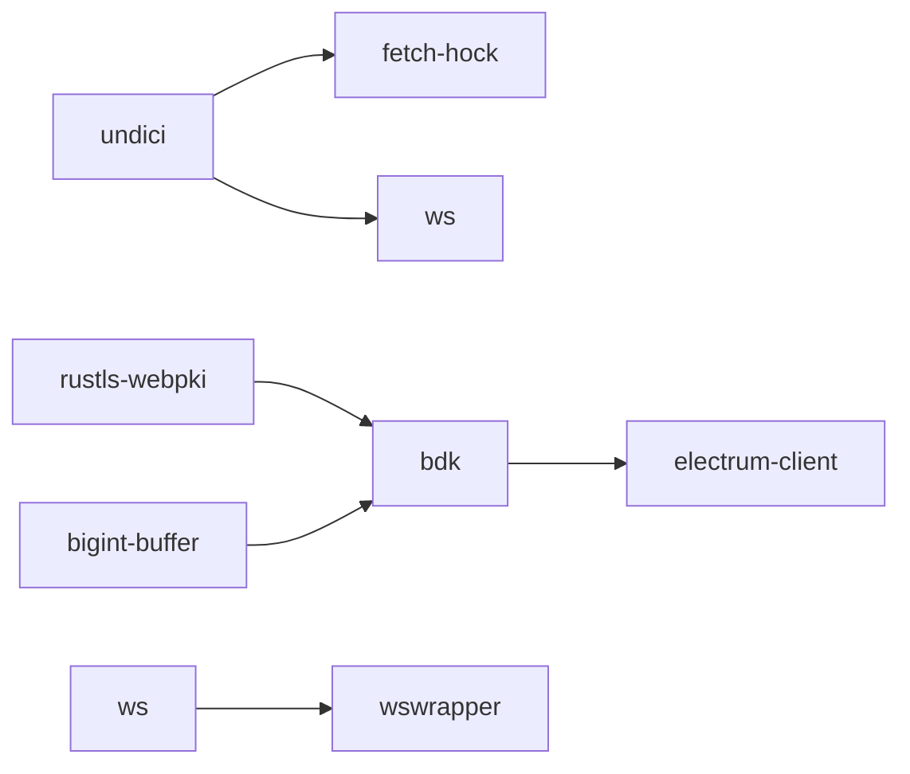
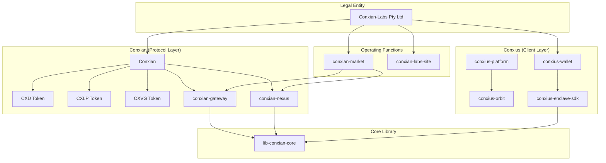

# Conxian Labs BOS Knowledge Graph
> Clarity-version: 4 | Epoch: latest | Generated: 2026-07-21

## Overview

This document is the **mandatory BOS Knowledge Graph** referenced in `AGENTS.md`. It provides structured entity extraction for graph-aware traversal by agentic systems.

---

## Entity Registry

### 🏢 Organizations

| Entity | Type | Relationships | Source |
|--------|------|---------------|--------|
| **Conxian-Labs (Pty) Ltd** | Legal Entity | owns: Conxian, Conxius | AGENTS.md |
| **Conxian** | Protocol Brand | implements: CXD, CXLP, CXVG | Conxian repo |
| **Conxius** | Client Brand | provides: Wallet, Platform, Enclave SDK | AGENTS.md |

### 📦 Repositories (Submodules)

| Entity | GitHub | Language | Focus | Status |
|--------|--------|----------|-------|--------|
| `conxian-business` | Conxian/conxian-business | Mixed | Business ops, AGENTS.md | ✅ Active |
| `Conxian` | Conxian/Conxian | Clarity | Smart contracts (221) | ⚠️ 27 issues |
| `conxian-gateway` | Conxian/conxian-gateway | Rust | ISO 20022 bridge | ✅ Active |
| `conxian-nexus` | Conxian/conxian-nexus | Clarity/Rust | Settlement layer | ✅ Active |
| `conxius-wallet` | Conxian/conxius-wallet | TypeScript | Android wallet | ✅ Active |
| `conxius-platform` | Conxian/conxius-platform | TypeScript | Dev orchestration | ✅ Active |
| `conxius-orbit` | Conxian/conxius-orbit | TypeScript | Deployment toolkit | ✅ Active |
| `conxius-enclave-sdk` | Conxian/conxius-enclave-sdk | Rust | TEE abstraction | ✅ Active |
| `conxian-ui` | Conxian/Conxian_UI | TypeScript | UI components | ✅ Active |
| `lib-conxian-core` | Conxian/lib-conxian-core | Rust | Crypto primitives | ✅ Audited |
| `conxian-labs-site` | Conxian/conxian-labs-site | TypeScript | Marketing site | ✅ Active |
| `conxian-market` | Conxian/conxian_market | Markdown/TypeScript | Marketplace and agentic commerce | ✅ Active |

### 🔐 Smart Contracts (Core)

| Entity | File | Tier | Clarity 4 | Issues |
|--------|------|------|-----------|--------|
| `bridge-nft.clar` | cross-chain/ | Core | ✅ | 0 |
| `yield-optimizer.clar` | yield/ | Core | ✅ | 0 |
| `payment-forge.clar` | agents/ | Core | ✅ | 0 |
| `jurisdictional-sharding.clar` | compliance/ | Compliance | ✅ | 0 |
| `block-utils.clar` | utils/ | Util | ✅ | 0 |
| `operational-treasury.clar` | agents/ | **Critical** | ✅ | 0 |
| `pausable.clar` | access/ | **Critical** | ✅ | ❌ ACL missing |

### 🪙 Tokens

| Entity | Type | Trait | Issue |
|--------|------|-------|-------|
| **CXD** | Stablecoin | ft-trait | No peg mechanism |
| **CXLP** | LP Token | sip-010-ft-trait | Mint/burn broken |
| **CXVG** | Governance | sip-010-ft-trait | No distribution |

### 🔧 Technical Components

| Component | Technology | Purpose | Status |
|-----------|------------|---------|--------|
| **CXN Guardian** | TEE (SGX/TrustZone) | Hardware key isolation | ✅ Implemented |
| **ZKC** | Zero-Knowledge | Compliance verification | ✅ Designed |
| **SYI** | Sovereign Yield Index | Yield measurement | ✅ Designed |
| **BitVM2** | Groth16 | L2 state verification | ⚠️ Stub |
| **RGB** | Client-side | Asset validation | ⚠️ In progress |

### 🔧 CI/CD & DevOps

| Component | Technology | Purpose | Status |
|-----------|------------|---------|--------|
| **Gitleaks** | v8.24.2 | Secret scanning | ✅ Configured |
| **cargo audit** | Rust advisory db | Dependency vulnerability scanning | ✅ Active |
| **Conxian Unified CI** | GitHub Actions | Multi-suite test orchestration | ✅ Active |
| **Secret Scan** | Gitleaks workflow | Pre-commit secret detection | ✅ Active |
| **Branch Promotion Policy** | GitHub Actions | Enforce dev → staged → main flow | ✅ Active |

### 🛡️ Vulnerability Allowlist (Cargo Audit)

| RUSTSEC ID | Crate | Status | Rationale |
|------------|-------|--------|------------|
| RUSTSEC-2026-0204 | crossbeam-epoch | ✅ Ignored | Transitive via sled → bdk → electrum-client; no local upgrade path |
| RUSTSEC-2026-0104 | (various) | ✅ Ignored | Transitive dep chain |
| RUSTSEC-2026-0099 | rustls-webpki | ✅ Ignored | Transitive via bdk/electrum-client |
| RUSTSEC-2026-0098 | rustls-webpki | ✅ Ignored | Transitive via bdk/electrum-client |
| RUSTSEC-2024-0388 | instant | ✅ Ignored | Transitive via parking_lot |

### 📦 Dependabot Security Alerts (2026-07-08)

#### High Severity (8) - Action Required
| Alert | Package | Issue | Fixable | Mitigation |
|-------|---------|-------|---------|------------|
| #148 | form-data | CRLF injection | ⚠️ Update | `pnpm update form-data` |
| #143 | vite | fs.deny bypass (Windows) | ⚠️ Update | `pnpm update vite` |
| #149 | ws | Memory exhaustion DoS | ⚠️ Update | `pnpm update ws` |
| #21 | bigint-buffer | Buffer Overflow | ❌ Transitive | Via bdk - no local fix |
| #153 | undici | WebSocket DoS | ⚠️ Update | `pnpm update undici` |
| #146 | undici | TLS cert bypass | ⚠️ Update | `pnpm update undici` |
| #150 | undici | SOCKS5 pool reuse | ⚠️ Update | `pnpm update undici` |
| #58 | rustls-webpki | DoS via panic | ❌ Transitive | Via bdk - no local fix |

#### Moderate Severity (8) - Monitor
| Alert | Package | Issue |
|-------|---------|-------|
| #139 | uuid | Buffer bounds check |
| #60 | postcss | XSS (showcase-dapp) |
| #147 | undici | Cache whitespace bypass |
| #152 | undici | Header injection |
| #144 | launch-editor | NTLMv2 hash (Windows) |
| #145 | protobufjs | Property shadowing |
| #159 | cmov | aarch64 wrong results |
| #142 | ws | Uninitialized memory |

#### Low Severity (7) - Acceptable Risk
| Alert | Package | Issue |
|-------|---------|-------|
| #154 | undici | SameSite downgrade |
| #151 | undici | Response queue |
| #22 | elliptic | Risky crypto |
| #38 | tracing-subscriber | ANSI escape |
| #45 | webpki | Wildcard names |
| #44 | webpki | URI constraints |
| #52 | rand | Custom logger |

#### Known Unfixable Transitive Chains

### 👥 People (Entity Relationships)

| Role | Entity | Repository Access | Responsibility |
|------|--------|-------------------|----------------|
| Founder | - | All repos | Network operator (transitioning) |
| Protocol Architect | - | All repos | Future role (post-transition) |
| ZKC Auditor | - | lib-conxian-core | Compliance verification |
| SYI Strategist | - | conxian-gateway | Yield index design |

---

## Relationship Graph

---

## Decision Registry

| Decision | Date | Rationale | Superseded By |
|----------|------|----------|---------------|
| Clarity 4 only | 2026-04-23 | Security + epoch features | - |
| epoch = "latest" mandatory | 2026-04-23 | Always use newest epoch | - |
| Dynamic principals from treasury | 2026-04-23 | Eliminate hardcoded SPOF | - |
| TEE via conxius-enclave-sdk | 2026-04-23 | Hardware key isolation | - |
| ISO 20022 via Conxian Gateway | 2026-04-23 | Legacy banking bridge | - |
| Cargo audit allowlist for transitive deps | 2026-07-08 | Transitive vulnerabilities without local upgrade path | Upgrade dep chain |
| Gitleaks license via GitHub Secrets | 2026-07-08 | ZSE compliance; no hardcoded secrets | - |
| Branch and PR promotion flow | 2026-07-14 | Protected branches require review and dev -> staged -> main promotion | - |
| Dependabot allowlist for transitive npm deps | 2026-07-08 | undici/ws transitive chains via bdk/wswrapper | Fix upstream |
| GitGuardian var naming convention (no PASSWORD/SECRET in keys) | 2026-07-08 | Avoid false positives from variable names | - |
| Docker credentials use external secret files and DB_* connection inputs | 2026-07-14 | Fail-closed ZSE without inline credentials | - |
| Docker env vars use DB_* prefix, not *_PASSWORD | 2026-07-08 | GitGuardian pattern avoidance | - |
| Community governance remediation scope | 2026-07-21 | Prefer the self-contained, non-executing community-voting ledger in protocol PR #521 over isolated `upgrade-controller` work; keep the broader governance gap open until proposal/timelock plumbing and the overlapping #499 scope are resolved. | Protocol PR #521 merge and broader governance decision |

---

## Knowledge Citation Index

| Topic | Knowledge Doc | Last Updated |
|-------|---------------|--------------|
| Operational Standards | `AGENTS.md` | 2026-07-06 |
| Mathematical Framework | `lib-conxian-core/docs/CONXIAN_UNIFIED_THEORY_v2.md` | 2026-04-23 |
| Security Audit | `lib-conxian-core/docs/ADVISORY_REPORT_2026_07_06.md` | 2026-07-06 |
| Knowledge Gaps | `docs/KNOWLEDGE_GAP_ANALYSIS.md` | 2026-07-21 |
| Gateway Research | `conxian-gateway/docs/research/KNOWLEDGE_MAP.md` | 2026-04-23 |
| ISO 20022 Patterns | External: BIS d218, ISO white paper | 2025 |
| Clarity Patterns | External: Stacks Cookbook, CertiK | 2026 |

---

## Critical Links

### Standards
- [Clarity 4](https://stacks.co/blog/clarity-4-bitcoin-smart-contract-upgrade)
- [SIP-033](https://stacks.org/sip-033-clarity-4)
- [SIP Process](https://github.com/stacksgov/sips)
- [ISO 20022 Web APIs](https://iso20022.org)

### Security
- [CertiK Clarity Checklist](https://www.certik.com/resources/blog/clarity-best-practices-and-checklist)
- [sBTC Security Review](https://clarityalliance.org/reports/sbtc)

### Integration
- [Chainlink ISO 20022](https://chain.link/article/iso-20022-integration)
- [BIP-322 Signed Messages](https://bips.dev/322)
- [Lightspark ISO](https://lightspark.com/glossary/iso-20022)

---

## Dated Digest: CON-1506 Production Enablement (2026-07-20)

### Status

| Field | Record |
|-------|--------|
| Linear umbrella | [CON-1506 — production enablement](https://linear.app/conxian-labs/issue/CON-1506/production-enablement) — **authenticated/internal reference only; not public evidence**. Private Linear content is not reproduced here. |
| GitHub umbrella | [conxius-enclave-sdk issue #191](https://github.com/Conxian/conxius-enclave-sdk/issues/191) (**OPEN / REOPENED**) |
| Current status | **Beta / conditional**; the latest mandatory gate recorded in [the failed-gate comment](https://github.com/Conxian/conxius-enclave-sdk/issues/191#issuecomment-5027149779) was **136 passed, 1 failed** because of a nondeterministic future-timestamp attestation test. Implementation is paused pending a fix and a repeatable exact-full-gate pass. GitHub #191 remains **OPEN / REOPENED**; #195–#202 are all open, and final acceptance in #202 cannot be bypassed. Production enablement remains blocked for value-bearing use. No unqualified production-readiness claim is authorized. |
| Review boundary | The dated audit establishes historical documentation evidence; current status is governed by live GitHub #191 and #195–#202 while the failed mandatory gate is remediated. |
| Historical-status boundary | Older closure/readiness indexes are point-in-time records and are superseded for current status by live GitHub #191 and #195–#202. The 2026-06-03 readiness report is dated and marked internal at [lines 3–6](docs/UNIFIED_PRODUCTION_READINESS_GAP_REPORT.md#L3-L6), records its earlier readiness verdict at [lines 27–35](docs/UNIFIED_PRODUCTION_READINESS_GAP_REPORT.md#L27-L35), and records historical closure indexes at [lines 529–564](docs/UNIFIED_PRODUCTION_READINESS_GAP_REPORT.md#L529-L564). |

### Typed Entities

| Entity | Type | Role / state | Evidence |
|--------|------|--------------|----------|
| `CON-1506` | Linear umbrella issue | Authenticated/internal tracking reference only, not public evidence; private Linear content is not reproduced, and no value-bearing production approval is implied | [Linear issue](https://linear.app/conxian-labs/issue/CON-1506/production-enablement) |
| `#191` | GitHub umbrella issue | **OPEN / REOPENED** canonical public umbrella for the enablement review; remains open while [#195–#202](https://github.com/Conxian/conxius-enclave-sdk/issues/195), including final acceptance [#202](https://github.com/Conxian/conxius-enclave-sdk/issues/202), remain unresolved | [GitHub issue](https://github.com/Conxian/conxius-enclave-sdk/issues/191) |
| `#191 comment 5027149779` | GitHub issue comment / mandatory-gate result | Latest public gate evidence: **136 passed, 1 failed** because of a nondeterministic future-timestamp attestation test; implementation is paused pending remediation and a repeatable exact-full-gate pass | [Failed-gate comment](https://github.com/Conxian/conxius-enclave-sdk/issues/191#issuecomment-5027149779) |
| `#193` | Audit documentation pull request | Merged public-safe audit baseline; corrects readiness language to Beta / conditional | [Audit PR](https://github.com/Conxian/conxius-enclave-sdk/pull/193) |
| `conxius-enclave-sdk` | Canonical technical repository/package identifier; shared runtime | Audited at the recorded source revision; support is capability-specific and remains conditional until the required gates pass | [Audited SDK main SHA](https://github.com/Conxian/conxius-enclave-sdk/commit/8194aa8ade26a9d5d7ed54b7f80f36796fce585c) |
| `#195–#202` | Production-enablement gate set | All open implementation, evidence, operational, and independent-review follow-ups; [#202](https://github.com/Conxian/conxius-enclave-sdk/issues/202) is final acceptance and cannot be bypassed | [Child gate backlog](https://github.com/Conxian/conxius-enclave-sdk/issues/195) |

### Relationships

| From | Relationship | To | Boundary / meaning |
|------|--------------|----|--------------------|
| `CON-1506` | tracks | [GitHub #191](https://github.com/Conxian/conxius-enclave-sdk/issues/191) | Linear and GitHub records represent the same production-enablement review. |
| `CON-1506` | is an authenticated/internal reference for | [GitHub #191](https://github.com/Conxian/conxius-enclave-sdk/issues/191) | Linear is not public evidence; current public status is taken from live GitHub records, without reproducing private Linear content. |
| [Failed-gate comment #5027149779](https://github.com/Conxian/conxius-enclave-sdk/issues/191#issuecomment-5027149779) | reports the latest mandatory-gate result for | [GitHub #191](https://github.com/Conxian/conxius-enclave-sdk/issues/191) | The public comment records 136 passed and 1 failed due to a nondeterministic future-timestamp attestation test. |
| [GitHub #191](https://github.com/Conxian/conxius-enclave-sdk/issues/191) | is evidenced by | [Audit PR #193](https://github.com/Conxian/conxius-enclave-sdk/pull/193) | The audit establishes the Beta / conditional status and identifies the remaining blockers. |
| [Audit PR #193](https://github.com/Conxian/conxius-enclave-sdk/pull/193) | gates | [Child issues #195–#202](https://github.com/Conxian/conxius-enclave-sdk/issues/195) | P0/P1 work and final acceptance remain required before any affected value-bearing capability is enabled. |
| `conxius-enclave-sdk` | is consumed by | downstream wallet, gateway, and state-node integrations | The SDK is a shared runtime; application UX and protocol authority remain with downstream integrations. |
| [Child issues #195–#201](https://github.com/Conxian/conxius-enclave-sdk/issues/195) | are prerequisites for | [Final acceptance #202](https://github.com/Conxian/conxius-enclave-sdk/issues/202) | Final acceptance is capability-by-capability and applies only to the exact reviewed candidate. |

### Decisions

| Decision | Operational meaning |
|----------|---------------------|
| Fail closed | Missing, insufficient, unsupported, or unverifiable security and protocol evidence produces a typed disabled/unsupported outcome rather than a permissive success path. |
| Simulation is not production evidence | Simulated, mock, structural, or placeholder paths cannot satisfy production acceptance for signing, attestation, verification, settlement, or recovery. |
| Trace every production claim | Each supported capability requires a requirement → code → test → CI → artifact evidence chain tied to the exact reviewed candidate. |
| Support is capability-specific | A working build or repository-level audit does not imply support for every chain, adapter, hardware tier, runtime, or protocol; unsupported capabilities remain disabled or conditional. |
| Public documentation stays ZSE-safe | Public records contain only minimum necessary status, evidence, and ownership boundaries; private endpoints, credentials, privileged identifiers, financial strategy, recovery procedures, incident secrets, and raw configurations remain excluded. |
| Pause after the failed mandatory gate | Implementation remains paused until the nondeterministic future-timestamp attestation test is fixed and the exact full mandatory gate passes repeatedly; 136 passed and 1 failed is not an acceptance pass. |
| Keep Linear evidence internal | CON-1506 is an authenticated/internal reference, not public evidence; no private Linear content is copied into this graph. |

### Risks

| Risk | Current implication / follow-up |
|------|-------------------------------|
| Software or simulated signer boundary | Value-bearing signing must not instantiate a software or simulated signer; remediation and negative evidence are tracked in [#195](https://github.com/Conxian/conxius-enclave-sdk/issues/195). |
| Incomplete attestation enforcement | Hardware trust, freshness, replay protection, trusted roots, and purpose binding require explicit enforcement evidence; tracked in [#195](https://github.com/Conxian/conxius-enclave-sdk/issues/195). |
| Protocol correctness and placeholders | Bitcoin/Ethereum verification, threshold/settlement, CCTP, account abstraction, asset metadata, and rail-address behavior remain conditional until canonical evidence or typed disablement exists; tracked in [#196](https://github.com/Conxian/conxius-enclave-sdk/issues/196), [#197](https://github.com/Conxian/conxius-enclave-sdk/issues/197), and [#198](https://github.com/Conxian/conxius-enclave-sdk/issues/198). |
| Release, MSRV, and version evidence drift | Toolchain, dependency, release, provenance, and exact-artifact records must reconcile before a stable support statement; tracked in [#199](https://github.com/Conxian/conxius-enclave-sdk/issues/199). |
| WASM secret boundary and platform evidence | Build success alone does not prove opaque secret handling or runtime support across browser, Node, bundler, and worker surfaces; tracked in [#200](https://github.com/Conxian/conxius-enclave-sdk/issues/200). |
| Telemetry and operations | Privacy-safe defaults, payload minimization, monitoring, rollback, and public-safe operational evidence remain required; tracked in [#201](https://github.com/Conxian/conxius-enclave-sdk/issues/201). |
| Nondeterministic future-timestamp attestation test | The latest mandatory gate is non-repeatable at **136 passed, 1 failed**; the failure blocks implementation progress until fixed and the exact full gate passes repeatedly. Evidence: [#191 failed-gate comment](https://github.com/Conxian/conxius-enclave-sdk/issues/191#issuecomment-5027149779). |
| Historical readiness-index drift | Older closure/readiness indexes can overstate current readiness when treated as live status; use GitHub #191 and #195–#202 as the current public boundary, with the dated report retained only as historical evidence ([lines 3–6](docs/UNIFIED_PRODUCTION_READINESS_GAP_REPORT.md#L3-L6), [lines 529–564](docs/UNIFIED_PRODUCTION_READINESS_GAP_REPORT.md#L529-L564)). |
| Stale BOS repository identity or submodule pin | Repository inspection verified legacy SDK identity references in existing BOS records, a `.gitmodules` branch reference that does not match the public remote default, and a current gitlink distinct from the audited SHA. Reconcile these separately; this PR intentionally changes neither submodule pins nor unrelated stale documentation. |

### Gates

| Gate | Priority | Required outcome | Status |
|------|----------|------------------|--------|
| [#195 — hardware signing and mandatory attestation](https://github.com/Conxian/conxius-enclave-sdk/issues/195) | P0 | Hardware-backed signing and complete attestation policy for value-bearing operations; no simulated signer fallback | Open; blocks affected production claims |
| [#196 — canonical Bitcoin and Ethereum verification](https://github.com/Conxian/conxius-enclave-sdk/issues/196) | P0 | Canonical verification, hashing, derivation, vectors, and deterministic negative behavior | Open; blocks affected network claims |
| [#197 — threshold and settlement placeholders](https://github.com/Conxian/conxius-enclave-sdk/issues/197) | P0 | Audited protocol-conformant implementations or typed unsupported/disabled paths | Open; blocks affected settlement claims |
| [#198 — CCTP, account abstraction, and asset metadata](https://github.com/Conxian/conxius-enclave-sdk/issues/198) | P0 | Canonical adapter, address, asset, network, provenance, and checksum evidence or fail-closed disablement | Open; blocks affected rail and asset claims |
| [#199 — reproducible release and toolchain](https://github.com/Conxian/conxius-enclave-sdk/issues/199) | P1 | One supported toolchain and release path with exact artifact, provenance, SBOM, and scan evidence | Open; required for release acceptance |
| [#200 — WASM boundary and platform evidence](https://github.com/Conxian/conxius-enclave-sdk/issues/200) | P1 | Opaque secret boundary plus runtime/platform support evidence and mock separation | Open; required for WASM support claims |
| [#201 — telemetry, privacy, and operations](https://github.com/Conxian/conxius-enclave-sdk/issues/201) | P1 | Minimized telemetry, safe defaults, and public-safe monitoring/recovery evidence | Open; required for operational claims |
| [#202 — independent review and release acceptance](https://github.com/Conxian/conxius-enclave-sdk/issues/202) | P0 | Final capability-by-capability acceptance for the exact candidate after #195–#201 are resolved or explicitly scoped | Open; final gate, cannot be bypassed |

### Evidence Index

| Evidence | Link |
|----------|------|
| Linear umbrella | [CON-1506 — production enablement](https://linear.app/conxian-labs/issue/CON-1506/production-enablement) — authenticated/internal reference only; not public evidence |
| Current public status boundary | [conxius-enclave-sdk issue #191](https://github.com/Conxian/conxius-enclave-sdk/issues/191) and live [#195–#202](https://github.com/Conxian/conxius-enclave-sdk/issues/195) |
| Current mandatory-gate evidence | [#191 comment 5027149779](https://github.com/Conxian/conxius-enclave-sdk/issues/191#issuecomment-5027149779) — **136 passed, 1 failed**; nondeterministic future-timestamp attestation test; implementation paused pending a fix and repeatable exact-full-gate pass |
| Historical audit documentation | [PR #193](https://github.com/Conxian/conxius-enclave-sdk/pull/193) |
| Historical audit PR head / changeset | [`39f9a885e03f7d259bcbdfe33f0722db76a83ec9`](https://github.com/Conxian/conxius-enclave-sdk/commit/39f9a885e03f7d259bcbdfe33f0722db76a83ec9) |
| Historical SDK main merge commit | [`79a4a082ab2c05e5b1b30335ab56b9e6d068c7e8`](https://github.com/Conxian/conxius-enclave-sdk/commit/79a4a082ab2c05e5b1b30335ab56b9e6d068c7e8) |
| Historical audited SDK baseline | [`8194aa8ade26a9d5d7ed54b7f80f36796fce585c`](https://github.com/Conxian/conxius-enclave-sdk/commit/8194aa8ade26a9d5d7ed54b7f80f36796fce585c) |

---

## Dated Digest: CON-1421 Governance Stub Reconciliation (2026-07-21)

### Status

| Field | Record |
|-------|--------|
| Linear issue | [CON-1421 — 16 of 28 governance contracts are stubs](https://linear.app/conxian-labs/issue/CON-1421/medium-16-of-28-governance-contracts-are-stubs) — **In Progress** |
| Historical accounting | The issue body names 15 contracts. `proposal-engine-trait.clar` is the likely omitted 16th entry; six listed entries are partial skeletons rather than blank stubs, so the original “16 non-functional stubs” wording requires typed reconciliation. |
| Community-voting implementation | [Protocol PR #521](https://github.com/Conxian/Conxian/pull/521) is **OPEN / MERGEABLE / CLEAN** at audited head [`90ef8a2f883ddab7cb0cfd00f68ba4d829f0a8e1`](https://github.com/Conxian/Conxian/commit/90ef8a2f883ddab7cb0cfd00f68ba4d829f0a8e1); all currently reported checks pass and the independent re-audit reports no P0/P1 findings. State is **implemented and pinned for review**, not merged or deployed. |
| Historical umbrella | [Conxian #463](https://github.com/Conxian/Conxian/issues/463) is an OPEN / REOPENED historical umbrella. This scoped remediation does not close the broader governance gap or make the umbrella a proof of full resolution. |
| Active overlap | [Conxian #499](https://github.com/Conxian/Conxian/issues/499) remains the active overlapping scope for `upgrade-controller`, `sab-election`, and `gauge-manager`. |
| Remaining gap | `upgrade-controller.clar`, `proposal-engine-trait.clar`, and other governance gaps remain stub, partial, deferred, or separately scoped. Community voting is one reviewed remediation path, not a claim that all governance contracts are complete. |

### Projects and Records

| Entity | Type | Role / state | Evidence |
|--------|------|--------------|----------|
| `Governance remediation workstream` | Project | Reconciles the historical governance-stub inventory while preserving explicit review and deployment boundaries | [CON-1421](https://linear.app/conxian-labs/issue/CON-1421/medium-16-of-28-governance-contracts-are-stubs), [#463](https://github.com/Conxian/Conxian/issues/463), [#499](https://github.com/Conxian/Conxian/issues/499) |
| `conxian-business` | Parent repository | Carries the review-only `Conxian` submodule pin and this knowledge crystallization | [Parent repository](https://github.com/Conxian/conxian-business) |
| `Conxian` | Protocol repository | Supplies the audited governance implementation candidate; the parent pin is review-bound to the exact protocol commit | [Protocol repository](https://github.com/Conxian/Conxian) |
| `CON-1421` | Linear issue | Tracks the medium-priority governance inventory correction and scoped remediation; remains In Progress | [Linear issue](https://linear.app/conxian-labs/issue/CON-1421/medium-16-of-28-governance-contracts-are-stubs) |
| `#521` | Protocol pull request | Implements the community-voting lifecycle; open and not merged | [Protocol PR #521](https://github.com/Conxian/Conxian/pull/521) |
| `90ef8a2f883ddab7cb0cfd00f68ba4d829f0a8e1` | Audited protocol commit | Exact reviewed head to pin; not a deployment or merge claim | [Protocol commit](https://github.com/Conxian/Conxian/commit/90ef8a2f883ddab7cb0cfd00f68ba4d829f0a8e1) |

### Contracts / Libraries

| Entity | Type | Role / state | Evidence |
|--------|------|--------------|----------|
| `community-voting-engine.clar` | Governance contract | Escrowed, non-executing strategic voting ledger implemented on PR #521; remains under review until the PR merges | [Source at audited head](https://github.com/Conxian/Conxian/blob/90ef8a2f883ddab7cb0cfd00f68ba4d829f0a8e1/contracts/governance/community-voting-engine.clar), [governance README](https://github.com/Conxian/Conxian/blob/90ef8a2f883ddab7cb0cfd00f68ba4d829f0a8e1/contracts/governance/README.md) |
| `operational-treasury.clar` | Routing / treasury contract | Runtime source of truth for the `cxvg-token` and `regulatory-adapter` routes used by the voting engine | [Source at audited head](https://github.com/Conxian/Conxian/blob/90ef8a2f883ddab7cb0cfd00f68ba4d829f0a8e1/contracts/core/operational-treasury.clar) |
| `cxvg-token.clar` | SIP-010 governance token | Real token transferred into escrow as voting power | [Source at audited head](https://github.com/Conxian/Conxian/blob/90ef8a2f883ddab7cb0cfd00f68ba4d829f0a8e1/contracts/tokens/cxvg-token.clar) |
| `proposal-engine → proposal-registry → proposal-executor → timelock` | Governance contract path | Existing execution-oriented path; kept separate from the non-executing community-voting ledger | [Governance README at audited head](https://github.com/Conxian/Conxian/blob/90ef8a2f883ddab7cb0cfd00f68ba4d829f0a8e1/contracts/governance/README.md) |
| `proposal-engine-trait.clar` | Governance trait / stub | Likely omitted 16th inventory entry; remains a stub and is not remediated by PR #521 | [Source at audited head](https://github.com/Conxian/Conxian/blob/90ef8a2f883ddab7cb0cfd00f68ba4d829f0a8e1/contracts/governance/proposal-engine-trait.clar) |
| `upgrade-controller.clar` | Governance contract / stub | Deferred; no isolated implementation in PR #521 because upgrade routing depends on proposal/timelock plumbing and overlaps #499 | [Source at audited head](https://github.com/Conxian/Conxian/blob/90ef8a2f883ddab7cb0cfd00f68ba4d829f0a8e1/contracts/governance/upgrade-controller.clar) |

### Relationships

| From | Relationship | To | Boundary / meaning |
|------|--------------|----|--------------------|
| `CON-1421` | tracks | [Protocol PR #521](https://github.com/Conxian/Conxian/pull/521) | The PR addresses one bounded governance path selected after inventory reconciliation. |
| `CON-1421` | reconciles | [Conxian #463](https://github.com/Conxian/Conxian/issues/463) | Corrects the “16 of 28” accounting without claiming full umbrella closure. |
| [Protocol PR #521](https://github.com/Conxian/Conxian/pull/521) | implements | `community-voting-engine.clar` | Functional escrowed voting lifecycle at the exact reviewed head. |
| [`90ef8a2f883ddab7cb0cfd00f68ba4d829f0a8e1`](https://github.com/Conxian/Conxian/commit/90ef8a2f883ddab7cb0cfd00f68ba4d829f0a8e1) | is the reviewed head of | [Protocol PR #521](https://github.com/Conxian/Conxian/pull/521) | Current candidate for the parent gitlink; PR remains open. |
| `community-voting-engine.clar` | reads routes from | `operational-treasury.clar` | Dynamic token and compliance route checks fail closed on missing or mismatched principals. |
| `community-voting-engine.clar` | escrows | `cxvg-token.clar` | Successful votes use real SIP-010 transfers into the engine. |
| `community-voting-engine.clar` | complements | `proposal-engine → proposal-registry → proposal-executor → timelock` | Voting records and settlement do not execute arbitrary proposal actions. |
| `upgrade-controller.clar` | overlaps | [Conxian #499](https://github.com/Conxian/Conxian/issues/499) | Isolated upgrade routing is deferred until the surrounding governance architecture is resolved. |
| `proposal-engine-trait.clar` | is counted as | corrected 16th governance-gap entry | The likely omitted entry is recorded without asserting that every listed item is a blank stub. |

### Decisions

| Decision | Operational meaning |
|----------|---------------------|
| Prefer community voting over isolated `upgrade-controller` work | Community voting has no production callers, documented requirements, and a complete self-contained vertical. Upgrade routing depends on proposal/timelock plumbing and overlaps the active #499 scope. |
| Record implemented behavior precisely | The reviewed engine performs dynamic operational-treasury route checks, real CXVG escrow, compliance checks, future and bounded voting windows, aggregate supply snapshot/cap enforcement, quorum and approval thresholds with strict tie failure, permissionless finalization, and historical one-time stake claims. |
| Keep the execution boundary explicit | The engine does not execute arbitrary actions or withdraw treasury assets; the existing proposal/execution path remains separate. |
| Defer reputation weighting | Voting uses raw escrowed CXVG; reputation weighting waits for a trustworthy, independently reviewed reputation source and rules. |
| Treat PR #521 as under review | The parent may pin the exact audited head for provenance, but the state remains pinned for review until PR #521 merges into `main`; no deployment claim is made. |
| Preserve typed gap states | Partial skeletons, blank stubs, implemented-but-under-review contracts, and deferred architecture must not be collapsed into one resolved count. |
| Do not close #463 by implication | One clean, audited PR does not resolve the historical or active governance backlog. |

### Risks and Gates

| Risk / gate | Current implication |
|-------------|---------------------|
| Protocol PR merge order | The parent pin must merge only with or after [PR #521](https://github.com/Conxian/Conxian/pull/521) so the gitlink remains backed by the audited provenance. |
| Broader governance completion | `upgrade-controller`, `proposal-engine-trait`, and other remaining gaps require separate design, implementation, or explicit retirement decisions. |
| Historical inventory quality | The original issue body lists 15 contracts and six listed entries are partial skeletons; a future full inventory should classify every contract rather than reuse the blanket 16-stub label. |

### Evidence Index

| Evidence | Link |
|----------|------|
| Linear issue | [CON-1421](https://linear.app/conxian-labs/issue/CON-1421/medium-16-of-28-governance-contracts-are-stubs) |
| Historical umbrella | [Conxian #463](https://github.com/Conxian/Conxian/issues/463) |
| Active overlapping scope | [Conxian #499](https://github.com/Conxian/Conxian/issues/499) |
| Protocol implementation PR | [Conxian PR #521](https://github.com/Conxian/Conxian/pull/521) |
| Exact protocol commit | [`90ef8a2f883ddab7cb0cfd00f68ba4d829f0a8e1`](https://github.com/Conxian/Conxian/commit/90ef8a2f883ddab7cb0cfd00f68ba4d829f0a8e1) |
| Parent repository | [Conxian/conxian-business](https://github.com/Conxian/conxian-business) |

---

## Maintenance

**Crystallization Rule:** Every agent session MUST update this document with:
1. New entities discovered
2. Relationship changes
3. Decision outcomes
4. Issue resolutions

**Verification:** Cross-reference claims against this graph before acting.

---

## Agent Session: 2026-07-14

### Actions Completed

| Action | Entity | Status | GitHub Reference |
|--------|--------|--------|------------------|
| PR Promotion Checklist Fix | PR #887 | ✅ Complete | [PR #887](https://github.com/Conxian/conxian-business/pull/887) |
| Orphan Branch Cleanup | test/add-unit-tests-... | ✅ Cleaned | Branch deleted |
| Orphan Branch Cleanup | dependabot/npm_and_yarn/... | ✅ Cleaned | PR #864 closed |
| Work Host Health Check | work-1 | ❌ 502 Error | [Issue #889](https://github.com/Conxian/conxian-business/issues/889) |
| Work Host Health Check | work-2 | ❌ 502 Error | [Issue #889](https://github.com/Conxian/conxian-business/issues/889) |
| GitHub Issue Created | Issue #888 | ✅ Complete | [Issue #888](https://github.com/Conxian/conxian-business/issues/888) |
| GitHub Issue Created | Issue #889 | ✅ Complete | [Issue #889](https://github.com/Conxian/conxian-business/issues/889) |

### Knowledge Graph Updates

#### New GitHub Issues
| Issue | Title | Type |
|-------|-------|------|
| #888 | [MAINTENANCE] PR #887 Promotion Checklist Compliance - Completed | maintenance |
| #889 | [INVESTIGATE] Work Hosts Returning 502 Bad Gateway | investigation |

#### PR Status Update
| PR | Title | Base | Head | Labels | Status |
|----|-------|------|------|--------|--------|
| #887 | chore: sync submodules + add Session Initialization Protocol | staged | dev | maintenance, promotion-ready | ✅ Mergeable |

#### Infrastructure Health
| Component | Host | Port | Status | Resolution |
|-----------|------|------|--------|------------|
| Work Host 1 | work-1-xfjclmsshsgtnzch.prod-runtime.all-hands.dev | 12000 | ❌ 502 | Investigate K8s pods |
| Work Host 2 | work-2-xfjclmsshsgtnzch.prod-runtime.all-hands.dev | 12001 | ❌ 502 | Investigate K8s pods |

### Decision Outcomes
| Decision | Outcome | Reference |
|----------|---------|-----------|
| PR #887 promotion checklist | Fixed - checklist added | PR #887 |
| Work host availability | Failed - 502 errors | Issue #889 |

---

*Generated per AGENTS.md Knowledge Management mandate*
*Updated: 2026-07-14*
