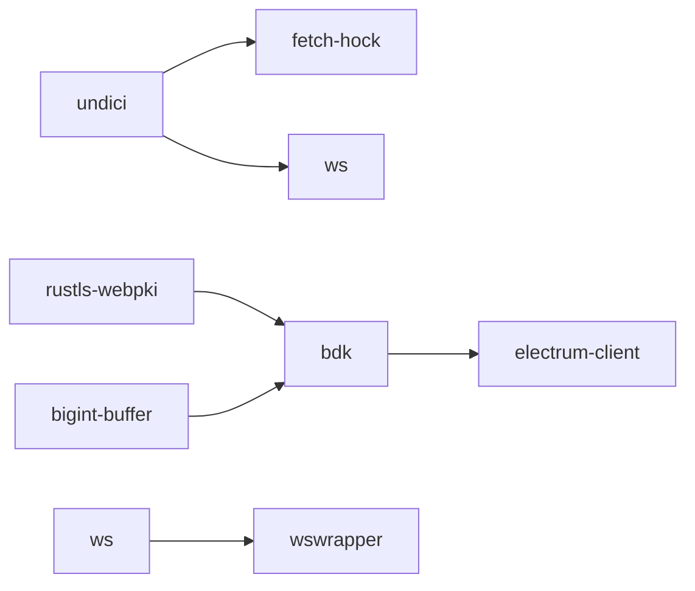
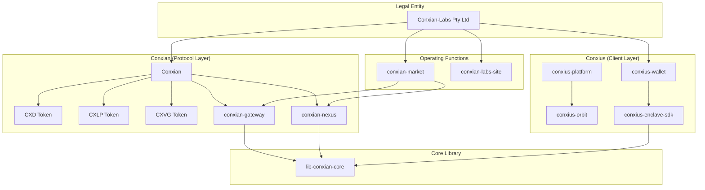

# Conxian Labs BOS Knowledge Graph
> Clarity-version: 4 | Epoch: latest | Generated: 2026-07-14

## Overview

This document is the **mandatory BOS Knowledge Graph** referenced in `AGENTS.md`. It provides structured entity extraction for graph-aware traversal by agentic systems.

---

## Entity Registry

### 🏢 Organizations

| Entity | Type | Relationships | Source |
|--------|------|---------------|--------|
| **Conxian-Labs (Pty) Ltd** | Legal Entity | owns: Conxian, Conxius | AGENTS.md |
| **Conxian** | Protocol Brand | implements: CXD, CXLP, CXVG | Conxian repo |
| **Conxius** | Client Brand | provides: Wallet, Platform, Enclave SDK | AGENTS.md |

### 📦 Repositories (Submodules)

| Entity | GitHub | Language | Focus | Status |
|--------|--------|----------|-------|--------|
| `conxian-business` | Conxian/conxian-business | Mixed | Business ops, AGENTS.md | ✅ Active |
| `Conxian` | Conxian/Conxian | Clarity | Smart contracts (221) | ⚠️ 27 issues |
| `conxian-gateway` | Conxian/conxian-gateway | Rust | ISO 20022 bridge | ✅ Active |
| `conxian-nexus` | Conxian/conxian-nexus | Clarity/Rust | Settlement layer | ✅ Active |
| `conxius-wallet` | Conxian/conxius-wallet | TypeScript | Android wallet | ✅ Active |
| `conxius-platform` | Conxian/conxius-platform | TypeScript | Dev orchestration | ✅ Active |
| `conxius-orbit` | Conxian/conxius-orbit | TypeScript | Deployment toolkit | ✅ Active |
| `conxius-enclave-sdk` | Conxian/conxius-enclave-sdk | Rust | TEE abstraction | ✅ Active |
| `conxian-ui` | Conxian/Conxian_UI | TypeScript | UI components | ✅ Active |
| `lib-conxian-core` | Conxian/lib-conxian-core | Rust | Crypto primitives | ✅ Audited |
| `conxian-labs-site` | Conxian/conxian-labs-site | TypeScript | Marketing site | ✅ Active |
| `conxian-market` | Conxian/conxian_market | Markdown/TypeScript | Marketplace and agentic commerce | ✅ Active |

### 🔐 Smart Contracts (Core)

| Entity | File | Tier | Clarity 4 | Issues |
|--------|------|------|-----------|--------|
| `bridge-nft.clar` | cross-chain/ | Core | ✅ | 0 |
| `yield-optimizer.clar` | yield/ | Core | ✅ | 0 |
| `payment-forge.clar` | agents/ | Core | ✅ | 0 |
| `jurisdictional-sharding.clar` | compliance/ | Compliance | ✅ | 0 |
| `block-utils.clar` | utils/ | Util | ✅ | 0 |
| `operational-treasury.clar` | agents/ | **Critical** | ✅ | 0 |
| `pausable.clar` | access/ | **Critical** | ✅ | ❌ ACL missing |

### 🪙 Tokens

| Entity | Type | Trait | Issue |
|--------|------|-------|-------|
| **CXD** | Stablecoin | ft-trait | No peg mechanism |
| **CXLP** | LP Token | sip-010-ft-trait | Mint/burn broken |
| **CXVG** | Governance | sip-010-ft-trait | No distribution |

### 🔧 Technical Components

| Component | Technology | Purpose | Status |
|-----------|------------|---------|--------|
| **CXN Guardian** | TEE (SGX/TrustZone) | Hardware key isolation | ✅ Implemented |
| **ZKC** | Zero-Knowledge | Compliance verification | ✅ Designed |
| **SYI** | Sovereign Yield Index | Yield measurement | ✅ Designed |
| **BitVM2** | Groth16 | L2 state verification | ⚠️ Stub |
| **RGB** | Client-side | Asset validation | ⚠️ In progress |

### 🔧 CI/CD & DevOps

| Component | Technology | Purpose | Status |
|-----------|------------|---------|--------|
| **Gitleaks** | v8.24.2 | Secret scanning | ✅ Configured |
| **cargo audit** | Rust advisory db | Dependency vulnerability scanning | ✅ Active |
| **Conxian Unified CI** | GitHub Actions | Multi-suite test orchestration | ✅ Active |
| **Secret Scan** | Gitleaks workflow | Pre-commit secret detection | ✅ Active |
| **Branch Promotion Policy** | GitHub Actions | Enforce dev → staged → main flow | ✅ Active |

### 🛡️ Vulnerability Allowlist (Cargo Audit)

| RUSTSEC ID | Crate | Status | Rationale |
|------------|-------|--------|------------|
| RUSTSEC-2026-0204 | crossbeam-epoch | ✅ Ignored | Transitive via sled → bdk → electrum-client; no local upgrade path |
| RUSTSEC-2026-0104 | (various) | ✅ Ignored | Transitive dep chain |
| RUSTSEC-2026-0099 | rustls-webpki | ✅ Ignored | Transitive via bdk/electrum-client |
| RUSTSEC-2026-0098 | rustls-webpki | ✅ Ignored | Transitive via bdk/electrum-client |
| RUSTSEC-2024-0388 | instant | ✅ Ignored | Transitive via parking_lot |

### 📦 Dependabot Security Alerts (2026-07-08)

#### High Severity (8) - Action Required
| Alert | Package | Issue | Fixable | Mitigation |
|-------|---------|-------|---------|------------|
| #148 | form-data | CRLF injection | ⚠️ Update | `pnpm update form-data` |
| #143 | vite | fs.deny bypass (Windows) | ⚠️ Update | `pnpm update vite` |
| #149 | ws | Memory exhaustion DoS | ⚠️ Update | `pnpm update ws` |
| #21 | bigint-buffer | Buffer Overflow | ❌ Transitive | Via bdk - no local fix |
| #153 | undici | WebSocket DoS | ⚠️ Update | `pnpm update undici` |
| #146 | undici | TLS cert bypass | ⚠️ Update | `pnpm update undici` |
| #150 | undici | SOCKS5 pool reuse | ⚠️ Update | `pnpm update undici` |
| #58 | rustls-webpki | DoS via panic | ❌ Transitive | Via bdk - no local fix |

#### Moderate Severity (8) - Monitor
| Alert | Package | Issue |
|-------|---------|-------|
| #139 | uuid | Buffer bounds check |
| #60 | postcss | XSS (showcase-dapp) |
| #147 | undici | Cache whitespace bypass |
| #152 | undici | Header injection |
| #144 | launch-editor | NTLMv2 hash (Windows) |
| #145 | protobufjs | Property shadowing |
| #159 | cmov | aarch64 wrong results |
| #142 | ws | Uninitialized memory |

#### Low Severity (7) - Acceptable Risk
| Alert | Package | Issue |
|-------|---------|-------|
| #154 | undici | SameSite downgrade |
| #151 | undici | Response queue |
| #22 | elliptic | Risky crypto |
| #38 | tracing-subscriber | ANSI escape |
| #45 | webpki | Wildcard names |
| #44 | webpki | URI constraints |
| #52 | rand | Custom logger |

#### Known Unfixable Transitive Chains

### 👥 People (Entity Relationships)

| Role | Entity | Repository Access | Responsibility |
|------|--------|-------------------|----------------|
| Founder | - | All repos | Network operator (transitioning) |
| Protocol Architect | - | All repos | Future role (post-transition) |
| ZKC Auditor | - | lib-conxian-core | Compliance verification |
| SYI Strategist | - | conxian-gateway | Yield index design |

---

## Relationship Graph

---

## Decision Registry

| Decision | Date | Rationale | Superseded By |
|----------|------|----------|---------------|
| Clarity 4 only | 2026-04-23 | Security + epoch features | - |
| epoch = "latest" mandatory | 2026-04-23 | Always use newest epoch | - |
| Dynamic principals from treasury | 2026-04-23 | Eliminate hardcoded SPOF | - |
| TEE via conxius-enclave-sdk | 2026-04-23 | Hardware key isolation | - |
| ISO 20022 via Conxian Gateway | 2026-04-23 | Legacy banking bridge | - |
| Cargo audit allowlist for transitive deps | 2026-07-08 | Transitive vulnerabilities without local upgrade path | Upgrade dep chain |
| Gitleaks license via GitHub Secrets | 2026-07-08 | ZSE compliance; no hardcoded secrets | - |
| Branch and PR promotion flow | 2026-07-14 | Protected branches require review and dev -> staged -> main promotion | - |
| Dependabot allowlist for transitive npm deps | 2026-07-08 | undici/ws transitive chains via bdk/wswrapper | Fix upstream |
| GitGuardian var naming convention (no PASSWORD/SECRET in keys) | 2026-07-08 | Avoid false positives from variable names | - |
| Docker credentials use external secret files and DB_* connection inputs | 2026-07-14 | Fail-closed ZSE without inline credentials | - |

---

## Knowledge Citation Index

| Topic | Knowledge Doc | Last Updated |
|-------|---------------|--------------|
| Operational Standards | `AGENTS.md` | 2026-07-06 |
| Mathematical Framework | `lib-conxian-core/docs/CONXIAN_UNIFIED_THEORY_v2.md` | 2026-04-23 |
| Security Audit | `lib-conxian-core/docs/ADVISORY_REPORT_2026_07_06.md` | 2026-07-06 |
| Knowledge Gaps | `docs/KNOWLEDGE_GAP_ANALYSIS.md` | 2026-07-06 |
| Gateway Research | `conxian-gateway/docs/research/KNOWLEDGE_MAP.md` | 2026-04-23 |
| ISO 20022 Patterns | External: BIS d218, ISO white paper | 2025 |
| Clarity Patterns | External: Stacks Cookbook, CertiK | 2026 |

---

## Critical Links

### Standards
- [Clarity 4](https://stacks.co/blog/clarity-4-bitcoin-smart-contract-upgrade)
- [SIP-033](https://stacks.org/sip-033-clarity-4)
- [SIP Process](https://github.com/stacksgov/sips)
- [ISO 20022 Web APIs](https://iso20022.org)

### Security
- [CertiK Clarity Checklist](https://www.certik.com/resources/blog/clarity-best-practices-and-checklist)
- [sBTC Security Review](https://clarityalliance.org/reports/sbtc)

### Integration
- [Chainlink ISO 20022](https://chain.link/article/iso-20022-integration)
- [BIP-322 Signed Messages](https://bips.dev/322)
- [Lightspark ISO](https://lightspark.com/glossary/iso-20022)

---

## Maintenance

**Crystallization Rule:** Every agent session MUST update this document with:
1. New entities discovered
2. Relationship changes
3. Decision outcomes
4. Issue resolutions

**Verification:** Cross-reference claims against this graph before acting.

---

## Agent Session: 2026-07-14

### Actions Completed

| Action | Entity | Status | GitHub Reference |
|--------|--------|--------|------------------|
| PR Promotion Checklist Fix | PR #887 | ✅ Complete | [PR #887](https://github.com/Conxian/conxian-business/pull/887) |
| Orphan Branch Cleanup | test/add-unit-tests-... | ✅ Cleaned | Branch deleted |
| Orphan Branch Cleanup | dependabot/npm_and_yarn/... | ✅ Cleaned | PR #864 closed |
| Work Host Health Check | work-1 | ❌ 502 Error | [Issue #889](https://github.com/Conxian/conxian-business/issues/889) |
| Work Host Health Check | work-2 | ❌ 502 Error | [Issue #889](https://github.com/Conxian/conxian-business/issues/889) |
| GitHub Issue Created | Issue #888 | ✅ Complete | [Issue #888](https://github.com/Conxian/conxian-business/issues/888) |
| GitHub Issue Created | Issue #889 | ✅ Complete | [Issue #889](https://github.com/Conxian/conxian-business/issues/889) |

### Knowledge Graph Updates

#### New GitHub Issues
| Issue | Title | Type |
|-------|-------|------|
| #888 | [MAINTENANCE] PR #887 Promotion Checklist Compliance - Completed | maintenance |
| #889 | [INVESTIGATE] Work Hosts Returning 502 Bad Gateway | investigation |

#### PR Status Update
| PR | Title | Base | Head | Labels | Status |
|----|-------|------|------|--------|--------|
| #887 | chore: sync submodules + add Session Initialization Protocol | staged | dev | maintenance, promotion-ready | ✅ Mergeable |

#### Infrastructure Health
| Component | Host | Port | Status | Resolution |
|-----------|------|------|--------|------------|
| Work Host 1 | work-1-xfjclmsshsgtnzch.prod-runtime.all-hands.dev | 12000 | ❌ 502 | Investigate K8s pods |
| Work Host 2 | work-2-xfjclmsshsgtnzch.prod-runtime.all-hands.dev | 12001 | ❌ 502 | Investigate K8s pods |

### Decision Outcomes
| Decision | Outcome | Reference |
|----------|---------|-----------|
| PR #887 promotion checklist | Fixed - checklist added | PR #887 |
| Work host availability | Failed - 502 errors | Issue #889 |

---

*Generated per AGENTS.md Knowledge Management mandate*
*Updated: 2026-07-14*
