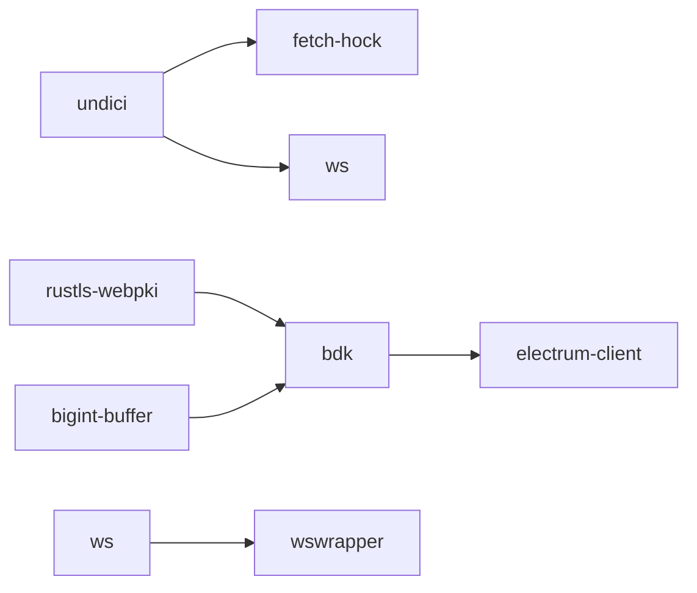
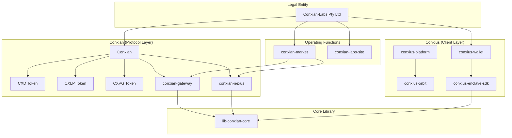

# Conxian Labs BOS Knowledge Graph
> Clarity-version: 4 | Epoch: latest | Generated: 2026-07-21

## Overview

This document is the **mandatory BOS Knowledge Graph** referenced in `AGENTS.md`. It provides structured entity extraction for graph-aware traversal by agentic systems.

---

## Entity Registry

### 🏢 Organizations

| Entity | Type | Relationships | Source |
|--------|------|---------------|--------|
| **Conxian-Labs (Pty) Ltd** | Legal Entity | owns: Conxian, Conxius | AGENTS.md |
| **Conxian** | Protocol Brand | implements: CXD, CXLP, CXVG | Conxian repo |
| **Conxius** | Client Brand | provides: Wallet, Platform, Enclave SDK | AGENTS.md |

### 📦 Repositories (Submodules)

| Entity | GitHub | Language | Focus | Status |
|--------|--------|----------|-------|--------|
| `conxian-business` | Conxian/conxian-business | Mixed | Business ops, AGENTS.md | ✅ Active |
| `Conxian` | Conxian/Conxian | Clarity | Smart contracts (221) | ⚠️ 27 issues |
| `conxian-gateway` | Conxian/conxian-gateway | Rust | ISO 20022 bridge | ✅ Active |
| `conxian-nexus` | Conxian/conxian-nexus | Clarity/Rust | Settlement layer | ✅ Active |
| `conxius-wallet` | Conxian/conxius-wallet | TypeScript | Android wallet | ✅ Active |
| `conxius-platform` | Conxian/conxius-platform | TypeScript | Dev orchestration | ✅ Active |
| `conxius-orbit` | Conxian/conxius-orbit | TypeScript | Deployment toolkit | ✅ Active |
| `conxius-enclave-sdk` | Conxian/conxius-enclave-sdk | Rust | TEE abstraction | ✅ Active |
| `conxian-ui` | Conxian/Conxian_UI | TypeScript | UI components | ✅ Active |
| `lib-conxian-core` | Conxian/lib-conxian-core | Rust | Crypto primitives | ✅ Audited |
| `conxian-labs-site` | Conxian/conxian-labs-site | TypeScript | Marketing site | ✅ Active |
| `conxian-market` | Conxian/conxian_market | Markdown/TypeScript | Marketplace and agentic commerce | ✅ Active |

### 🔐 Smart Contracts (Core)

| Entity | File | Tier | Clarity 4 | Issues |
|--------|------|------|-----------|--------|
| `bridge-nft.clar` | cross-chain/ | Core | ✅ | 0 |
| `yield-optimizer.clar` | yield/ | Core | ✅ | 0 |
| `payment-forge.clar` | agents/ | Core | ✅ | 0 |
| `jurisdictional-sharding.clar` | compliance/ | Compliance | ✅ | 0 |
| `block-utils.clar` | utils/ | Util | ✅ | 0 |
| `operational-treasury.clar` | agents/ | **Critical** | ✅ | 0 |
| `pausable.clar` | access/ | **Critical** | ✅ | ❌ ACL missing |

### 🪙 Tokens

| Entity | Type | Trait | Issue |
|--------|------|-------|-------|
| **CXD** | Stablecoin | ft-trait | No peg mechanism |
| **CXLP** | LP Token | sip-010-ft-trait | Mint/burn broken |
| **CXVG** | Governance | sip-010-ft-trait | No distribution |

### 🔧 Technical Components

| Component | Technology | Purpose | Status |
|-----------|------------|---------|--------|
| **CXN Guardian** | TEE (SGX/TrustZone) | Hardware key isolation | ✅ Implemented |
| **ZKC** | Zero-Knowledge | Compliance verification | ✅ Designed |
| **SYI** | Sovereign Yield Index | Yield measurement | ✅ Designed |
| **BitVM2** | Groth16 | L2 state verification | ⚠️ Stub |
| **RGB** | Client-side | Asset validation | ⚠️ In progress |

### 🔧 CI/CD & DevOps

| Component | Technology | Purpose | Status |
|-----------|------------|---------|--------|
| **Gitleaks** | v8.24.2 | Secret scanning | ✅ Configured |
| **cargo audit** | Rust advisory db | Dependency vulnerability scanning | ✅ Active |
| **Conxian Unified CI** | GitHub Actions | Multi-suite test orchestration | ✅ Active |
| **Secret Scan** | Gitleaks workflow | Pre-commit secret detection | ✅ Active |
| **Branch Promotion Policy** | GitHub Actions | Enforce dev → staged → main flow | ✅ Active |

### 🛡️ Vulnerability Allowlist (Cargo Audit)

| RUSTSEC ID | Crate | Status | Rationale |
|------------|-------|--------|------------|
| RUSTSEC-2026-0204 | crossbeam-epoch | ✅ Ignored | Transitive via sled → bdk → electrum-client; no local upgrade path |
| RUSTSEC-2026-0104 | (various) | ✅ Ignored | Transitive dep chain |
| RUSTSEC-2026-0099 | rustls-webpki | ✅ Ignored | Transitive via bdk/electrum-client |
| RUSTSEC-2026-0098 | rustls-webpki | ✅ Ignored | Transitive via bdk/electrum-client |
| RUSTSEC-2024-0388 | instant | ✅ Ignored | Transitive via parking_lot |

### 📦 Dependabot Security Alerts (2026-07-08)

#### High Severity (8) - Action Required
| Alert | Package | Issue | Fixable | Mitigation |
|-------|---------|-------|---------|------------|
| #148 | form-data | CRLF injection | ⚠️ Update | `pnpm update form-data` |
| #143 | vite | fs.deny bypass (Windows) | ⚠️ Update | `pnpm update vite` |
| #149 | ws | Memory exhaustion DoS | ⚠️ Update | `pnpm update ws` |
| #21 | bigint-buffer | Buffer Overflow | ❌ Transitive | Via bdk - no local fix |
| #153 | undici | WebSocket DoS | ⚠️ Update | `pnpm update undici` |
| #146 | undici | TLS cert bypass | ⚠️ Update | `pnpm update undici` |
| #150 | undici | SOCKS5 pool reuse | ⚠️ Update | `pnpm update undici` |
| #58 | rustls-webpki | DoS via panic | ❌ Transitive | Via bdk - no local fix |

#### Moderate Severity (8) - Monitor
| Alert | Package | Issue |
|-------|---------|-------|
| #139 | uuid | Buffer bounds check |
| #60 | postcss | XSS (showcase-dapp) |
| #147 | undici | Cache whitespace bypass |
| #152 | undici | Header injection |
| #144 | launch-editor | NTLMv2 hash (Windows) |
| #145 | protobufjs | Property shadowing |
| #159 | cmov | aarch64 wrong results |
| #142 | ws | Uninitialized memory |

#### Low Severity (7) - Acceptable Risk
| Alert | Package | Issue |
|-------|---------|-------|
| #154 | undici | SameSite downgrade |
| #151 | undici | Response queue |
| #22 | elliptic | Risky crypto |
| #38 | tracing-subscriber | ANSI escape |
| #45 | webpki | Wildcard names |
| #44 | webpki | URI constraints |
| #52 | rand | Custom logger |

#### Known Unfixable Transitive Chains

### 👥 People (Entity Relationships)

| Role | Entity | Repository Access | Responsibility |
|------|--------|-------------------|----------------|
| Founder | - | All repos | Network operator (transitioning) |
| Protocol Architect | - | All repos | Future role (post-transition) |
| ZKC Auditor | - | lib-conxian-core | Compliance verification |
| SYI Strategist | - | conxian-gateway | Yield index design |

---

## Relationship Graph

---

## Decision Registry

| Decision | Date | Rationale | Superseded By |
|----------|------|----------|---------------|
| Clarity 4 only | 2026-04-23 | Security + epoch features | - |
| epoch = "latest" mandatory | 2026-04-23 | Always use newest epoch | - |
| Dynamic principals from treasury | 2026-04-23 | Eliminate hardcoded SPOF | - |
| TEE via conxius-enclave-sdk | 2026-04-23 | Hardware key isolation | - |
| ISO 20022 via gateway service | 2026-04-23 | Legacy banking bridge | - |
| Cargo audit allowlist for transitive deps | 2026-07-08 | Transitive vulnerabilities without local upgrade path | Upgrade dep chain |
| Gitleaks license via GitHub Secrets | 2026-07-08 | ZSE compliance; no hardcoded secrets | - |
| Branch and PR promotion flow | 2026-07-14 | Protected branches require review and dev -> staged -> main promotion | - |
| Dependabot allowlist for transitive npm deps | 2026-07-08 | undici/ws transitive chains via bdk/wswrapper | Fix upstream |
| GitGuardian var naming convention (no PASSWORD/SECRET in keys) | 2026-07-08 | Avoid false positives from variable names | - |
| Docker credentials use external secret files and DB_* connection inputs | 2026-07-14 | Fail-closed ZSE without inline credentials | - |
| Docker env vars use DB_* prefix, not *_PASSWORD | 2026-07-08 | GitGuardian pattern avoidance | - |
| Community governance remediation scope | 2026-07-21 | Prefer the self-contained, non-executing community-voting ledger in protocol PR #521 over isolated `upgrade-controller` work; keep the broader governance gap open until proposal/timelock plumbing and the overlapping #499 scope are resolved. | Protocol PR #521 merge and broader governance decision |

---

## Knowledge Citation Index

| Topic | Knowledge Doc | Last Updated |
|-------|---------------|--------------|
| Operational Standards | `AGENTS.md` | 2026-07-06 |
| Mathematical Framework | `lib-conxian-core/docs/CONXIAN_UNIFIED_THEORY_v2.md` | 2026-04-23 |
| Security Audit | `lib-conxian-core/docs/ADVISORY_REPORT_2026_07_06.md` | 2026-07-06 |
| Knowledge Gaps | `docs/KNOWLEDGE_GAP_ANALYSIS.md` | 2026-07-21 |
| Gateway Research | `conxian-gateway/docs/research/KNOWLEDGE_MAP.md` | 2026-04-23 |
| ISO 20022 Patterns | External: BIS d218, ISO white paper | 2025 |
| Clarity Patterns | External: Stacks Cookbook, CertiK | 2026 |

---

## Critical Links

### Standards
- [Clarity 4](https://stacks.co/blog/clarity-4-bitcoin-smart-contract-upgrade)
- [SIP-033](https://stacks.org/sip-033-clarity-4)
- [SIP Process](https://github.com/stacksgov/sips)
- [ISO 20022 Web APIs](https://iso20022.org)

### Security
- [CertiK Clarity Checklist](https://www.certik.com/resources/blog/clarity-best-practices-and-checklist)
- [sBTC Security Review](https://clarityalliance.org/reports/sbtc)

### Integration
- [Chainlink ISO 20022](https://chain.link/article/iso-20022-integration)
- [BIP-322 Signed Messages](https://bips.dev/322)
- [Lightspark ISO](https://lightspark.com/glossary/iso-20022)

---

## Dated Digest: CON-1506 Production Enablement (2026-07-20)

### Status

| Field | Record |
|-------|--------|
| Linear umbrella | [CON-1506 — production enablement](https://linear.app/conxian-labs/issue/CON-1506/production-enablement) — **authenticated/internal reference only; not public evidence**. Private Linear content is not reproduced here. |
| GitHub umbrella | [conxius-enclave-sdk issue #191](https://github.com/Conxian/conxius-enclave-sdk/issues/191) (**OPEN / REOPENED**) |
| Current status | **Beta / conditional**; GitHub #191 remains **OPEN / REOPENED** as the canonical public umbrella and is not production approval. Open gates [#195–#196](https://github.com/Conxian/conxius-enclave-sdk/issues/195) and [#198–#202](https://github.com/Conxian/conxius-enclave-sdk/issues/198) remain required; [#197](https://github.com/Conxian/conxius-enclave-sdk/issues/197) is closed, but closure does not authorize production support. Production enablement remains blocked for value-bearing use. No unqualified production-readiness claim is authorized. |
| Review boundary | The dated audit establishes historical documentation evidence; current status is governed by live GitHub #191, the open gates, the exact active SDK pin, and final acceptance #202. The historical failed-gate result is retained as bounded evidence, not a current mandatory acceptance pass. |
| Historical-status boundary | Older closure/readiness indexes are point-in-time records and are superseded for current status by live GitHub #191, open gates #195–#196 and #198–#202, and the closed-but-non-authorizing #197 record. The 2026-06-03 readiness report is dated and marked internal at [lines 3–6](docs/UNIFIED_PRODUCTION_READINESS_GAP_REPORT.md#L3-L6), records its earlier readiness verdict at [lines 27–35](docs/UNIFIED_PRODUCTION_READINESS_GAP_REPORT.md#L27-L35), and records historical closure indexes at [lines 529–564](docs/UNIFIED_PRODUCTION_READINESS_GAP_REPORT.md#L529-L564). |

### Typed Entities

| Entity | Type | Role / state | Evidence |
|--------|------|--------------|----------|
| `CON-1506` | Linear umbrella issue | Authenticated/internal tracking reference only, not public evidence; private Linear content is not reproduced, and no value-bearing production approval is implied | [Linear issue](https://linear.app/conxian-labs/issue/CON-1506/production-enablement) |
| `#191` | GitHub umbrella issue | **OPEN / REOPENED** canonical public umbrella for the enablement review; remains open while the open gates [#195–#196](https://github.com/Conxian/conxius-enclave-sdk/issues/195) and [#198–#202](https://github.com/Conxian/conxius-enclave-sdk/issues/198), including final acceptance [#202](https://github.com/Conxian/conxius-enclave-sdk/issues/202), remain unresolved. #197 is closed, but its closure does not establish production acceptance. | [GitHub issue](https://github.com/Conxian/conxius-enclave-sdk/issues/191) |
| `#191 comment 5027149779` | GitHub issue comment / historical gate result | Historical public result: **136 passed, 1 failed** because of a nondeterministic future-timestamp attestation test; it is capability-specific historical evidence, not a current mandatory acceptance pass | [Failed-gate comment](https://github.com/Conxian/conxius-enclave-sdk/issues/191#issuecomment-5027149779) |
| `#193` | Audit documentation pull request | Merged public-safe audit baseline; corrects readiness language to Beta / conditional | [Audit PR](https://github.com/Conxian/conxius-enclave-sdk/pull/193) |
| `conxius-enclave-sdk` | Canonical technical repository/package identifier; shared runtime | Active safe business-repository pin is [`451202f51a9efed8fde70b7a5567a3e7e16c1db9`](https://github.com/Conxian/conxius-enclave-sdk/commit/451202f51a9efed8fde70b7a5567a3e7e16c1db9), descended from reviewed canonical ancestor [`dd1fc4f14e950a0b6119aeffbcbb4ae8ecce570`](https://github.com/Conxian/conxius-enclave-sdk/commit/dd1fc4f14e950a0b6119aeffbcbb4ae8ecce570) through [`5cd6fd4d486ccb00bd7057051bf5e1eb0abf47c7`](https://github.com/Conxian/conxius-enclave-sdk/commit/5cd6fd4d486ccb00bd7057051bf5e1eb0abf47c7) and the active fail-closed adapter remediation; support remains capability-specific and conditional until the required gates pass | [Active safe pin](https://github.com/Conxian/conxius-enclave-sdk/commit/451202f51a9efed8fde70b7a5567a3e7e16c1db9) |
| `#195–#202` | Production-enablement gate set | Open implementation, evidence, operational, and independent-review follow-ups are [#195–#196](https://github.com/Conxian/conxius-enclave-sdk/issues/195) and [#198–#202](https://github.com/Conxian/conxius-enclave-sdk/issues/198); #197 is closed, while [#202](https://github.com/Conxian/conxius-enclave-sdk/issues/202) is final acceptance and cannot be bypassed | [Child gate backlog](https://github.com/Conxian/conxius-enclave-sdk/issues/195) |

### Relationships

| From | Relationship | To | Boundary / meaning |
|------|--------------|----|--------------------|
| `CON-1506` | tracks | [GitHub #191](https://github.com/Conxian/conxius-enclave-sdk/issues/191) | Linear and GitHub records represent the same production-enablement review. |
| `CON-1506` | is an authenticated/internal reference for | [GitHub #191](https://github.com/Conxian/conxius-enclave-sdk/issues/191) | Linear is not public evidence; current public status is taken from live GitHub records, without reproducing private Linear content. |
| [Failed-gate comment #5027149779](https://github.com/Conxian/conxius-enclave-sdk/issues/191#issuecomment-5027149779) | reports a historical gate result for | [GitHub #191](https://github.com/Conxian/conxius-enclave-sdk/issues/191) | The public comment records 136 passed and 1 failed due to a nondeterministic future-timestamp attestation test; it is not a current mandatory acceptance gate. |
| [GitHub #191](https://github.com/Conxian/conxius-enclave-sdk/issues/191) | is evidenced by | [Audit PR #193](https://github.com/Conxian/conxius-enclave-sdk/pull/193) | The audit establishes the Beta / conditional status and identifies the remaining blockers. |
| [Audit PR #193](https://github.com/Conxian/conxius-enclave-sdk/pull/193) | gates | [Child issues #195–#202](https://github.com/Conxian/conxius-enclave-sdk/issues/195) | P0/P1 work and final acceptance remain required before any affected value-bearing capability is enabled. |
| `conxius-enclave-sdk` | is consumed by | downstream wallet, gateway, and state-node integrations | The SDK is a shared runtime; application UX and protocol authority remain with downstream integrations. |
| [Child issues #195–#201](https://github.com/Conxian/conxius-enclave-sdk/issues/195) | are prerequisites for | [Final acceptance #202](https://github.com/Conxian/conxius-enclave-sdk/issues/202) | Final acceptance is capability-by-capability and applies only to the exact reviewed candidate. |

### Decisions

| Decision | Operational meaning |
|----------|---------------------|
| Fail closed | Missing, insufficient, unsupported, or unverifiable security and protocol evidence produces a typed disabled/unsupported outcome rather than a permissive success path. |
| Simulation is not production evidence | Simulated, mock, structural, or placeholder paths cannot satisfy production acceptance for signing, attestation, verification, settlement, or recovery. |
| Trace every production claim | Each supported capability requires a requirement → code → test → CI → artifact evidence chain tied to the exact reviewed candidate. |
| Support is capability-specific | A working build or repository-level audit does not imply support for every chain, adapter, hardware tier, runtime, or protocol; unsupported capabilities remain disabled or conditional. |
| Public documentation stays ZSE-safe | Public records contain only minimum necessary status, evidence, and ownership boundaries; private endpoints, credentials, privileged identifiers, financial strategy, recovery procedures, incident secrets, and raw configurations remain excluded. |
| Historical failed-gate result is not acceptance | The 136 passed / 1 failed result is retained as historical capability evidence only. Current acceptance requires the exact active candidate, open gates, and final acceptance #202; the result is not a current mandatory acceptance pass. |
| Keep Linear evidence internal | CON-1506 is an authenticated/internal reference, not public evidence; no private Linear content is copied into this graph. |

### Risks

| Risk | Current implication / follow-up |
|------|-------------------------------|
| Software or simulated signer boundary | Value-bearing signing must not instantiate a software or simulated signer; remediation and negative evidence are tracked in [#195](https://github.com/Conxian/conxius-enclave-sdk/issues/195). |
| Incomplete attestation enforcement | Hardware trust, freshness, replay protection, trusted roots, and purpose binding require explicit enforcement evidence; tracked in [#195](https://github.com/Conxian/conxius-enclave-sdk/issues/195). |
| Protocol correctness and placeholders | Bitcoin/Ethereum verification, threshold/settlement, CCTP, account abstraction, asset metadata, and rail-address behavior remain conditional until canonical evidence or typed disablement exists; tracked in [#196](https://github.com/Conxian/conxius-enclave-sdk/issues/196), [#197](https://github.com/Conxian/conxius-enclave-sdk/issues/197), and [#198](https://github.com/Conxian/conxius-enclave-sdk/issues/198). |
| Release, MSRV, and version evidence drift | Toolchain, dependency, release, provenance, and exact-artifact records must reconcile before a stable support statement; tracked in [#199](https://github.com/Conxian/conxius-enclave-sdk/issues/199). |
| WASM secret boundary and platform evidence | Build success alone does not prove opaque secret handling or runtime support across browser, Node, bundler, and worker surfaces; tracked in [#200](https://github.com/Conxian/conxius-enclave-sdk/issues/200). |
| Telemetry and operations | Privacy-safe defaults, payload minimization, monitoring, rollback, and public-safe operational evidence remain required; tracked in [#201](https://github.com/Conxian/conxius-enclave-sdk/issues/201). |
| Nondeterministic future-timestamp attestation test | Historical gate evidence recorded **136 passed, 1 failed**; this does not define the current mandatory acceptance gate. Evidence: [#191 failed-gate comment](https://github.com/Conxian/conxius-enclave-sdk/issues/191#issuecomment-5027149779). |
| Historical readiness-index drift | Older closure/readiness indexes can overstate current readiness when treated as live status; use GitHub #191, open gates #195–#196 and #198–#202, and the closed-but-non-authorizing #197 record as the current public boundary, with the dated report retained only as historical evidence ([lines 3–6](docs/UNIFIED_PRODUCTION_READINESS_GAP_REPORT.md#L3-L6), [lines 529–564](docs/UNIFIED_PRODUCTION_READINESS_GAP_REPORT.md#L529-L564)). |
| Stale BOS repository identity or submodule pin | Repository inspection verified legacy SDK identity references in existing BOS records, a `.gitmodules` branch reference that does not match the public remote default, and a current gitlink distinct from the audited SHA. Reconcile these separately; this PR intentionally changes neither submodule pins nor unrelated stale documentation. |

### Gates

| Gate | Priority | Required outcome | Status |
|------|----------|------------------|--------|
| [#195 — hardware signing and mandatory attestation](https://github.com/Conxian/conxius-enclave-sdk/issues/195) | P0 | Hardware-backed signing and complete attestation policy for value-bearing operations; no simulated signer fallback | Open; blocks affected production claims |
| [#196 — canonical Bitcoin and Ethereum verification](https://github.com/Conxian/conxius-enclave-sdk/issues/196) | P0 | Canonical verification, hashing, derivation, vectors, and deterministic negative behavior | Focused subset is integrated at active safe pin; full issue scope remains open and unsupported forms/production claims stay blocked |
| [#197 — threshold and settlement placeholders](https://github.com/Conxian/conxius-enclave-sdk/issues/197) | P0 | Audited protocol-conformant implementations or typed unsupported/disabled paths | Closed; closure does not authorize production support |
| [#198 — CCTP, account abstraction, and asset metadata](https://github.com/Conxian/conxius-enclave-sdk/issues/198) | P0 | Canonical adapter, address, asset, network, provenance, and checksum evidence or fail-closed disablement | Open; blocks affected rail and asset claims |
| [#199 — reproducible release and toolchain](https://github.com/Conxian/conxius-enclave-sdk/issues/199) | P1 | One supported toolchain and release path with exact artifact, provenance, SBOM, and scan evidence | Open; required for release acceptance |
| [#200 — WASM boundary and platform evidence](https://github.com/Conxian/conxius-enclave-sdk/issues/200) | P1 | Opaque secret boundary plus runtime/platform support evidence and mock separation | Open; required for WASM support claims |
| [#201 — telemetry, privacy, and operations](https://github.com/Conxian/conxius-enclave-sdk/issues/201) | P1 | Minimized telemetry, safe defaults, and public-safe monitoring/recovery evidence | Open; required for operational claims |
| [#202 — independent review and release acceptance](https://github.com/Conxian/conxius-enclave-sdk/issues/202) | P0 | Final capability-by-capability acceptance for the exact candidate after #195–#201 are resolved or explicitly scoped | Open; final gate, cannot be bypassed |

### Evidence Index

| Evidence | Link |
|----------|------|
| Linear umbrella | [CON-1506 — production enablement](https://linear.app/conxian-labs/issue/CON-1506/production-enablement) — authenticated/internal reference only; not public evidence |
| Current public status boundary | [conxius-enclave-sdk issue #191](https://github.com/Conxian/conxius-enclave-sdk/issues/191), open [#195–#196](https://github.com/Conxian/conxius-enclave-sdk/issues/195) and [#198–#202](https://github.com/Conxian/conxius-enclave-sdk/issues/198), and closed-but-non-authorizing [#197](https://github.com/Conxian/conxius-enclave-sdk/issues/197) |
| Historical mandatory-gate evidence | [#191 comment 5027149779](https://github.com/Conxian/conxius-enclave-sdk/issues/191#issuecomment-5027149779) — historical **136 passed, 1 failed** result from a nondeterministic future-timestamp attestation test; not a current mandatory acceptance gate |
| Historical audit documentation | [PR #193](https://github.com/Conxian/conxius-enclave-sdk/pull/193) |
| Historical audit PR head / changeset | [`39f9a885e03f7d259bcbdfe33f0722db76a83ec9`](https://github.com/Conxian/conxius-enclave-sdk/commit/39f9a885e03f7d259bcbdfe33f0722db76a83ec9) |
| Historical SDK main merge commit | [`79a4a082ab2c05e5b1b30335ab56b9e6d068c7e8`](https://github.com/Conxian/conxius-enclave-sdk/commit/79a4a082ab2c05e5b1b30335ab56b9e6d068c7e8) |
| Historical audited SDK baseline | [`8194aa8ade26a9d5d7ed54b7f80f36796fce585c`](https://github.com/Conxian/conxius-enclave-sdk/commit/8194aa8ade26a9d5d7ed54b7f80f36796fce585c) |

---

## Dated Digest: CON-1513 Canonical Bitcoin/Ethereum Integration (2026-07-22)

### Decision

The business repository retains the active safe SDK pin [`451202f51a9efed8fde70b7a5567a3e7e16c1db9`](https://github.com/Conxian/conxius-enclave-sdk/commit/451202f51a9efed8fde70b7a5567a3e7e16c1db9). It descends from the reviewed canonical Bitcoin/Ethereum evidence ancestor [`dd1fc4f14e950a0b6119aeffbcbb4ae8ecce570`](https://github.com/Conxian/conxius-enclave-sdk/commit/dd1fc4f14e950a0b6119aeffbcbb4ae8ecce570) via [`5cd6fd4d486ccb00bd7057051bf5e1eb0abf47c7`](https://github.com/Conxian/conxius-enclave-sdk/commit/5cd6fd4d486ccb00bd7057051bf5e1eb0abf47c7) (WASM/provider boundary remediation) and [`451202f51a9efed8fde70b7a5567a3e7e16c1db9`](https://github.com/Conxian/conxius-enclave-sdk/commit/451202f51a9efed8fde70b7a5567a3e7e16c1db9) (fail-closed adapters). `dd1fc4f` is the reviewed canonical ancestor; it is not the active business-repository pin.

### Supported subset

- Bitcoin BIP-322 native P2WPKH and P2TR key-path witnesses without annexes.
- Canonical BIP-340/341 Taproot behavior and canonical BIP-86 path parsing/output-key derivation.
- Ethereum EIP-191 personal-sign hashing; strict signature, recovery, and address validation; Keccak address derivation; and EIP-55 checksum handling.

### Explicit limitations and gate

- P2WSH, Taproot script-path BIP-322 verification, and annex-bearing Taproot verification remain unsupported.
- EIP-155 transaction serialization and domain APIs remain out of scope.
- Issue [#197](https://github.com/Conxian/conxius-enclave-sdk/issues/197) is closed, but closure does not authorize production support. Open gates [#195](https://github.com/Conxian/conxius-enclave-sdk/issues/195)–[#196](https://github.com/Conxian/conxius-enclave-sdk/issues/196) and [#198](https://github.com/Conxian/conxius-enclave-sdk/issues/198)–[#202](https://github.com/Conxian/conxius-enclave-sdk/issues/202) remain required, with [#202](https://github.com/Conxian/conxius-enclave-sdk/issues/202) as final acceptance.
- The cryptographic subset is capability-specific, test-visible, historical where evidence is recorded, and not a production-support claim. The historical **136 passed / 1 failed** result is not a current mandatory acceptance gate. Beta/conditional, non-production, non-value-bearing, fail-closed boundaries remain in force.

### Knowledge-graph boundary

This focused digest uses the existing `conxius-enclave-sdk` entity and downstream relationships already present in the graph. It does not add or alter portfolio topology; the unrelated topology inconsistency from the old PR head is absent from this clean rebuild.

---

## Dated Amendment: CON-1506 SDK Containment Evidence (2026-07-26)

### Status and historical-state reconciliation

| Field | Record |
|-------|--------|
| Linear umbrella | [CON-1506 — production enablement](https://linear.app/conxian-labs/issue/CON-1506/production-enablement) is the umbrella reference. This public-safe amendment does not change or comment on its workflow state. |
| Historical reconciliation | The July 22 CON-1512 snapshot above correctly recorded SDK [PR #244](https://github.com/Conxian/conxius-enclave-sdk/pull/244) as open at that observation time. Live GitHub metadata now records it as **MERGED** at **2026-07-22 15:55:09 UTC**, merge commit [`4292dcd8a6ceb1301e7f2085a95cce544527cdb0`](https://github.com/Conxian/conxius-enclave-sdk/commit/4292dcd8a6ceb1301e7f2085a95cce544527cdb0). The dated snapshot is preserved rather than silently rewritten. |
| Merged containment artifact | SDK [PR #254](https://github.com/Conxian/conxius-enclave-sdk/pull/254) is **MERGED** at **2026-07-26 13:43:59 UTC**, with merge commit [`f61c68021009d658c47a12ab3f2f4e79cd2f7dbc`](https://github.com/Conxian/conxius-enclave-sdk/commit/f61c68021009d658c47a12ab3f2f4e79cd2f7dbc) from reviewed head [`3d26ba07a25c29aa99f53b34c43bdb33c809d534`](https://github.com/Conxian/conxius-enclave-sdk/commit/3d26ba07a25c29aa99f53b34c43bdb33c809d534). Live merge metadata reports **24 of 24 checks successful**, with no pending or failed checks. |
| Bounded evidence | PR #254 adds adversarial public-surface tests and a test-only WASM simulator proving that valid-looking CCTP/Iris inputs, ERC-7579 account execution and module-provenance inputs, and conflicting or quarantined asset metadata remain typed fail closed. They cannot produce execution/burn payloads, assert unsupported provenance, replace canonical metadata, or enter/change rail selection. |
| Non-promotion boundary | The merge does **not** establish Circle/Iris support, ERC-7579 execution or provenance support, arbitrary asset support, WASM value operations, provider qualification, roots or revocation, durable distributed replay, protocol-key custody, an immutable release artifact, independent acceptance, Gate 4 or Gate 5 completion, or production authorization. Containment is not enablement. |
| Live remaining gates | SDK issues [#198](https://github.com/Conxian/conxius-enclave-sdk/issues/198), [#200](https://github.com/Conxian/conxius-enclave-sdk/issues/200), [#240](https://github.com/Conxian/conxius-enclave-sdk/issues/240), and [#202](https://github.com/Conxian/conxius-enclave-sdk/issues/202) remain **OPEN**. Business [Gate #890](https://github.com/Conxian/conxian-business/issues/890) remains **OPEN / BLOCKED — Gate 0** and is unchanged by this amendment. SDK [PR #255](https://github.com/Conxian/conxius-enclave-sdk/pull/255) remains **OPEN** live work and is not accepted evidence. |

### Structured knowledge digest

#### People

| Person / agent | Platform-verifiable role | Acceptance boundary |
|----------------|--------------------------|---------------------|
| Botshelo Mokoka (`botshelomokoka`) | GitHub approver of SDK PR #254 on 2026-07-26 | Ordinary code approval is not independent security or release acceptance. |
| Charlie / `CharlieCreates` | GitHub App author of SDK PR #254 | Authorship is not independent security or release acceptance. |

#### Projects

| Project / tracker | Type | State in this amendment |
|-------------------|------|-------------------------|
| [CON-1506](https://linear.app/conxian-labs/issue/CON-1506/production-enablement) | Linear umbrella | Reference only; no workflow-state change or comment. |
| [Business #890](https://github.com/Conxian/conxian-business/issues/890) | Downstream business gate | **OPEN / BLOCKED — Gate 0**; not advanced. |
| [SDK #198](https://github.com/Conxian/conxius-enclave-sdk/issues/198) | Fail-closed protocol-surface gate | **OPEN**; PR #254 supplies bounded negative evidence, not completion. |
| [SDK #200](https://github.com/Conxian/conxius-enclave-sdk/issues/200) | WASM/runtime evidence gate | **OPEN**; test-only WASM rejection evidence is not value-operation or runtime qualification. |
| [SDK #240](https://github.com/Conxian/conxius-enclave-sdk/issues/240) | Roots, revocation, and distributed-replay gate | **OPEN** and unsatisfied by PR #254. |
| [SDK #202](https://github.com/Conxian/conxius-enclave-sdk/issues/202) | Independent security/release acceptance gate | **OPEN** and unsatisfied by authorship, approval, merge, or green CI. |

#### Libraries and artifacts

| Library / artifact | Typed record | Evidence boundary |
|--------------------|--------------|-------------------|
| [`Conxian/conxius-enclave-sdk`](https://github.com/Conxian/conxius-enclave-sdk) | Canonical SDK repository identifier | Repository identity only; no universal capability or readiness claim. |
| [SDK PR #254](https://github.com/Conxian/conxius-enclave-sdk/pull/254) | Merged containment evidence | Adversarial public-surface and test-only WASM rejection evidence only. |
| [`f61c68021009d658c47a12ab3f2f4e79cd2f7dbc`](https://github.com/Conxian/conxius-enclave-sdk/commit/f61c68021009d658c47a12ab3f2f4e79cd2f7dbc) | PR #254 merge commit | Merged graph-evidence identity; not an immutable release artifact. |
| [`3d26ba07a25c29aa99f53b34c43bdb33c809d534`](https://github.com/Conxian/conxius-enclave-sdk/commit/3d26ba07a25c29aa99f53b34c43bdb33c809d534) | PR #254 reviewed head | Review identity; not independent release acceptance. |
| [SDK PR #255](https://github.com/Conxian/conxius-enclave-sdk/pull/255) | Open durable-replay follow-up | Live/unaccepted work; it cannot be promoted into accepted evidence while open. |

#### Decisions

| Decision | Operational meaning |
|----------|---------------------|
| Containment is not enablement | Typed rejection and routing containment prevent unsupported inputs from entering rails; they do not add provider or protocol support. |
| Record merged graph evidence after revalidation | PR #254 is recorded only after its merge identity, reviewed head, approval, and all-green check rollup were revalidated. |
| Preserve dated snapshots | PR #244's later merge is reconciled in this amendment; the July 22 open-state observation remains historical truth for its date. |
| Keep Gate #890 unchanged | Documentation evidence does not advance a business gate, production-readiness state, or execution authorization. |

#### Relationships

| From | Relationship | To | Boundary / meaning |
|------|--------------|----|--------------------|
| SDK `#254` | provides bounded containment evidence toward | SDK `#198` | Valid-looking CCTP/Iris, ERC-7579, and asset-metadata inputs remain typed fail closed; issue #198 remains open. |
| SDK `#254` | provides test-only WASM rejection evidence toward | SDK `#200` | The simulator proves rejection behavior only; it does not enable WASM value operations or complete runtime qualification. |
| SDK `#254` | does not satisfy | SDK `#240` | No roots, collateral, revocation, or durable distributed replay evidence is established. |
| SDK `#254` | does not satisfy | SDK `#202` | Merge approval, authorship, and 24 green checks are not independent security or release acceptance. |
| SDK `#254` | does not advance | Business `#890` | Gate #890 remains blocked at Gate 0; no Gate 4/5 or production authorization claim is created. |
| SDK `#255` | remains separate open work from | accepted graph evidence | Open work is not accepted evidence and does not change the #240, #202, or #890 boundaries. |

## Dated Digest: CON-1421 Governance Stub Reconciliation (2026-07-21)

### Status

| Field | Record |
|-------|--------|
| Linear issue | [CON-1421 — 16 of 28 governance contracts are stubs](https://linear.app/conxian-labs/issue/CON-1421/medium-16-of-28-governance-contracts-are-stubs) — **In Progress** |
| Historical accounting | The issue body names 15 contracts. `proposal-engine-trait.clar` is the likely omitted 16th entry; six listed entries are partial skeletons rather than blank stubs, so the original “16 non-functional stubs” wording requires typed reconciliation. |
| Community-voting implementation | [Protocol PR #521](https://github.com/Conxian/Conxian/pull/521) is **OPEN / MERGEABLE / CLEAN** at audited head [`90ef8a2f883ddab7cb0cfd00f68ba4d829f0a8e1`](https://github.com/Conxian/Conxian/commit/90ef8a2f883ddab7cb0cfd00f68ba4d829f0a8e1); all currently reported checks pass and the independent re-audit reports no P0/P1 findings. State is **implemented and pinned for review**, not merged or deployed. |
| Historical umbrella | [Conxian #463](https://github.com/Conxian/Conxian/issues/463) is an OPEN / REOPENED historical umbrella. This scoped remediation does not close the broader governance gap or make the umbrella a proof of full resolution. |
| Active overlap | [Conxian #499](https://github.com/Conxian/Conxian/issues/499) remains the active overlapping scope for `upgrade-controller`, `sab-election`, and `gauge-manager`. |
| Remaining gap | `upgrade-controller.clar`, `proposal-engine-trait.clar`, and other governance gaps remain stub, partial, deferred, or separately scoped. Community voting is one reviewed remediation path, not a claim that all governance contracts are complete. |

### Projects and Records

| Entity | Type | Role / state | Evidence |
|--------|------|--------------|----------|
| `Governance remediation workstream` | Project | Reconciles the historical governance-stub inventory while preserving explicit review and deployment boundaries | [CON-1421](https://linear.app/conxian-labs/issue/CON-1421/medium-16-of-28-governance-contracts-are-stubs), [#463](https://github.com/Conxian/Conxian/issues/463), [#499](https://github.com/Conxian/Conxian/issues/499) |
| `conxian-business` | Parent repository | Carries the review-only `Conxian` submodule pin and this knowledge crystallization | [Parent repository](https://github.com/Conxian/conxian-business) |
| `Conxian` | Protocol repository | Supplies the audited governance implementation candidate; the parent pin is review-bound to the exact protocol commit | [Protocol repository](https://github.com/Conxian/Conxian) |
| `CON-1421` | Linear issue | Tracks the medium-priority governance inventory correction and scoped remediation; remains In Progress | [Linear issue](https://linear.app/conxian-labs/issue/CON-1421/medium-16-of-28-governance-contracts-are-stubs) |
| `#521` | Protocol pull request | Implements the community-voting lifecycle; open and not merged | [Protocol PR #521](https://github.com/Conxian/Conxian/pull/521) |
| `90ef8a2f883ddab7cb0cfd00f68ba4d829f0a8e1` | Audited protocol commit | Exact reviewed head to pin; not a deployment or merge claim | [Protocol commit](https://github.com/Conxian/Conxian/commit/90ef8a2f883ddab7cb0cfd00f68ba4d829f0a8e1) |

### Contracts / Libraries

| Entity | Type | Role / state | Evidence |
|--------|------|--------------|----------|
| `community-voting-engine.clar` | Governance contract | Escrowed, non-executing strategic voting ledger implemented on PR #521; remains under review until the PR merges | [Source at audited head](https://github.com/Conxian/Conxian/blob/90ef8a2f883ddab7cb0cfd00f68ba4d829f0a8e1/contracts/governance/community-voting-engine.clar), [governance README](https://github.com/Conxian/Conxian/blob/90ef8a2f883ddab7cb0cfd00f68ba4d829f0a8e1/contracts/governance/README.md) |
| `operational-treasury.clar` | Routing / treasury contract | Runtime source of truth for the `cxvg-token` and `regulatory-adapter` routes used by the voting engine | [Source at audited head](https://github.com/Conxian/Conxian/blob/90ef8a2f883ddab7cb0cfd00f68ba4d829f0a8e1/contracts/core/operational-treasury.clar) |
| `cxvg-token.clar` | SIP-010 governance token | Real token transferred into escrow as voting power | [Source at audited head](https://github.com/Conxian/Conxian/blob/90ef8a2f883ddab7cb0cfd00f68ba4d829f0a8e1/contracts/tokens/cxvg-token.clar) |
| `proposal-engine → proposal-registry → proposal-executor → timelock` | Governance contract path | Existing execution-oriented path; kept separate from the non-executing community-voting ledger | [Governance README at audited head](https://github.com/Conxian/Conxian/blob/90ef8a2f883ddab7cb0cfd00f68ba4d829f0a8e1/contracts/governance/README.md) |
| `proposal-engine-trait.clar` | Governance trait / stub | Likely omitted 16th inventory entry; remains a stub and is not remediated by PR #521 | [Source at audited head](https://github.com/Conxian/Conxian/blob/90ef8a2f883ddab7cb0cfd00f68ba4d829f0a8e1/contracts/governance/proposal-engine-trait.clar) |
| `upgrade-controller.clar` | Governance contract / stub | Deferred; no isolated implementation in PR #521 because upgrade routing depends on proposal/timelock plumbing and overlaps #499 | [Source at audited head](https://github.com/Conxian/Conxian/blob/90ef8a2f883ddab7cb0cfd00f68ba4d829f0a8e1/contracts/governance/upgrade-controller.clar) |

### Relationships

| From | Relationship | To | Boundary / meaning |
|------|--------------|----|--------------------|
| `CON-1421` | tracks | [Protocol PR #521](https://github.com/Conxian/Conxian/pull/521) | The PR addresses one bounded governance path selected after inventory reconciliation. |
| `CON-1421` | reconciles | [Conxian #463](https://github.com/Conxian/Conxian/issues/463) | Corrects the “16 of 28” accounting without claiming full umbrella closure. |
| [Protocol PR #521](https://github.com/Conxian/Conxian/pull/521) | implements | `community-voting-engine.clar` | Functional escrowed voting lifecycle at the exact reviewed head. |
| [`90ef8a2f883ddab7cb0cfd00f68ba4d829f0a8e1`](https://github.com/Conxian/Conxian/commit/90ef8a2f883ddab7cb0cfd00f68ba4d829f0a8e1) | is the reviewed head of | [Protocol PR #521](https://github.com/Conxian/Conxian/pull/521) | Current candidate for the parent gitlink; PR remains open. |
| `community-voting-engine.clar` | reads routes from | `operational-treasury.clar` | Dynamic token and compliance route checks fail closed on missing or mismatched principals. |
| `community-voting-engine.clar` | escrows | `cxvg-token.clar` | Successful votes use real SIP-010 transfers into the engine. |
| `community-voting-engine.clar` | complements | `proposal-engine → proposal-registry → proposal-executor → timelock` | Voting records and settlement do not execute arbitrary proposal actions. |
| `upgrade-controller.clar` | overlaps | [Conxian #499](https://github.com/Conxian/Conxian/issues/499) | Isolated upgrade routing is deferred until the surrounding governance architecture is resolved. |
| `proposal-engine-trait.clar` | is counted as | corrected 16th governance-gap entry | The likely omitted entry is recorded without asserting that every listed item is a blank stub. |

### Decisions

| Decision | Operational meaning |
|----------|---------------------|
| Prefer community voting over isolated `upgrade-controller` work | Community voting has no production callers, documented requirements, and a complete self-contained vertical. Upgrade routing depends on proposal/timelock plumbing and overlaps the active #499 scope. |
| Record implemented behavior precisely | The reviewed engine performs dynamic operational-treasury route checks, real CXVG escrow, compliance checks, future and bounded voting windows, aggregate supply snapshot/cap enforcement, quorum and approval thresholds with strict tie failure, permissionless finalization, and historical one-time stake claims. |
| Keep the execution boundary explicit | The engine does not execute arbitrary actions or withdraw treasury assets; the existing proposal/execution path remains separate. |
| Defer reputation weighting | Voting uses raw escrowed CXVG; reputation weighting waits for a trustworthy, independently reviewed reputation source and rules. |
| Treat PR #521 as under review | The parent may pin the exact audited head for provenance, but the state remains pinned for review until PR #521 merges into `main`; no deployment claim is made. |
| Preserve typed gap states | Partial skeletons, blank stubs, implemented-but-under-review contracts, and deferred architecture must not be collapsed into one resolved count. |
| Do not close #463 by implication | One clean, audited PR does not resolve the historical or active governance backlog. |

### Risks and Gates

| Risk / gate | Current implication |
|-------------|---------------------|
| Protocol PR merge order | The parent pin must merge only with or after [PR #521](https://github.com/Conxian/Conxian/pull/521) so the gitlink remains backed by the audited provenance. |
| Broader governance completion | `upgrade-controller`, `proposal-engine-trait`, and other remaining gaps require separate design, implementation, or explicit retirement decisions. |
| Historical inventory quality | The original issue body lists 15 contracts and six listed entries are partial skeletons; a future full inventory should classify every contract rather than reuse the blanket 16-stub label. |

### Evidence Index

| Evidence | Link |
|----------|------|
| Linear issue | [CON-1421](https://linear.app/conxian-labs/issue/CON-1421/medium-16-of-28-governance-contracts-are-stubs) |
| Historical umbrella | [Conxian #463](https://github.com/Conxian/Conxian/issues/463) |
| Active overlapping scope | [Conxian #499](https://github.com/Conxian/Conxian/issues/499) |
| Protocol implementation PR | [Conxian PR #521](https://github.com/Conxian/Conxian/pull/521) |
| Exact protocol commit | [`90ef8a2f883ddab7cb0cfd00f68ba4d829f0a8e1`](https://github.com/Conxian/Conxian/commit/90ef8a2f883ddab7cb0cfd00f68ba4d829f0a8e1) |
| Parent repository | [Conxian/conxian-business](https://github.com/Conxian/conxian-business) |

---

## Dated Digest: CON-1518 Telemetry Privacy & Monitoring (2026-07-21)

### Status

| Field | Record |
|-------|--------|
| Linear issue | [CON-1518](https://linear.app/conxian-labs/issue/CON-1518/p1-define-telemetry-privacy-monitoring-and-public-safe-operational) — internal tracking reference; private issue content is not reproduced. |
| Upstream implementation | [conxius-enclave-sdk PR #210](https://github.com/Conxian/conxius-enclave-sdk/pull/210), merged at `593af0d9120b612de5b2817866b0528e5c877570`; remediates the implementation scope tracked by [GitHub #201](https://github.com/Conxian/conxius-enclave-sdk/issues/201). |
| Business-repo integration | Root `conxius-enclave-sdk` gitlink remains pinned exactly `451202f51a9efed8fde70b7a5567a3e7e16c1db9` for this reviewed fail-closed PR; the upstream telemetry implementation is recorded at `593af0d9120b612de5b2817866b0528e5c877570`; `.gitmodules` branch metadata is `main`. |
| Public-safe authority | [`docs/operations/CON-1518_TELEMETRY_PRIVACY_EVIDENCE.md`](docs/operations/CON-1518_TELEMETRY_PRIVACY_EVIDENCE.md) records the privacy, delivery, non-gating, monitoring, rollback, and evidence boundary. |
| Current support boundary | **Beta / conditional**; no value-bearing production signing or settlement claim is authorized. |

### Typed Entities and Relationships

| Entity | Type | Role / state | Relationship |
|--------|------|--------------|--------------|
| `CON-1518` | Linear issue | Internal scope and evidence-tracking record | tracks the business-repo integration and public-safe evidence boundary |
| `GitHub #201` | Upstream issue | Telemetry privacy/operations implementation scope | remediated by upstream PR #210; remaining operational evidence is not implied closed |
| `PR #210` | Upstream pull request | Merged implementation record at exact SHA `593af0d9120b612de5b2817866b0528e5c877570` | provides an upstream implementation candidate; this PR intentionally retains the exact reviewed parent pin |
| `conxius-enclave-sdk` | Shared runtime repository | Exact reviewed candidate is pinned by this root repo | consumed by downstream integrations; support remains capability-specific |
| `CON-1518_TELEMETRY_PRIVACY_EVIDENCE.md` | Public-safe authority | Repository-visible privacy and operations boundary | links the upstream implementation to root CI and acceptance evidence |

### Residual Gates and Boundary

- Independent review of the exact business-repo candidate remains open.
- Service-side retention/deletion ownership and evidence remain private and are not claimed here.
- Deployed monitoring, alerting, rollback, and recovery evidence remains open and is not inferred from source tests or runbooks.
- Final release and production acceptance gates remain open; implementation landing does not equal production enablement.
- Preserve the **Beta / conditional**, no-value-bearing-production boundary across docs, CI, release notes, and downstream claims.

---

## Dated Digest: CON-1555 Knowledge-Retention Guard Restoration (2026-07-25)

### Entities and Relationships

| Entity | Type | Relationship / state |
|--------|------|----------------------|
| `CON-1555` | Security control remediation | Restores the repository's fail-closed knowledge-retention boundary. |
| `scripts/verify_knowledge_retention.py` | Verifier | Rejects missing or invalid migration evidence, tracked sensitive-root content, and uncovered ignored sensitive paths. |
| `audit/migration_manifest.json` | Migration evidence | Restored byte-for-byte from the approved pre-deletion revision; contents remain undisclosed. |
| `conxian-unified-ci.yml` | CI enforcement | Invokes the verifier unconditionally so deleting the verifier or manifest fails the job. |
| `admin/SECRETS.md` | Public-safe pointer | Directs sensitive records to approved private systems without exposing operational inventory. |

### Decision, Risk, and Evidence

| Dimension | Record |
|-----------|--------|
| Decision | Restore the compatible core verifier and exact historical manifest, then remove the workflow's silent-skip condition. |
| Risk addressed | A deleted verifier previously converted a mandatory Zero Secret Egress control into a successful no-op while normative references remained. |
| Boundary | Git content is public-safe even while the repository is private; private records and manifest details are not reproduced here. |
| Evidence | [CON-1555](https://linear.app/conxian-labs/issue/CON-1555/verify-security-boundary-and-secret-prevention-baseline), [synced GitHub issue](https://github.com/Conxian/.github/issues/47), source verifier commit `6143dd8b111a6bbee567e31dfbe8a07c618f8206`, source manifest commit `2122500b1403781fb529cbbb6ca17d7f9d89d21b`, deletion commit `69d21dce204b6a5172c8fb0978c9f579470fc049`. |

---

## Typed Digest CON-1542 Conxian 538 Revenue Automation Policy Handoff 2026-07-25

### Entities

| Entity | Type | Status | Role / boundary | Canonical evidence |
|--------|------|--------|-----------------|--------------------|
| `CON-1542` | Linear governance/knowledge work item | **OBSERVED — IN REVIEW** on 2026-07-25 | Owns the business-policy handoff, evidence classification, and knowledge crystallization. It does not implement contracts or prove deployment. | [Linear issue](https://linear.app/conxian-labs/issue/CON-1542/handoff-own-and-harden-revenue-automation-policy-from-conxius-platform) |
| `Conxian/Conxian` | Protocol repository | **APPROVED SOURCE OF TRUTH** for protocol behavior | Owns protocol economics, Clarity contracts, deployment policy, and fee-bearing behavior. | [Protocol repository](https://github.com/Conxian/Conxian), [handoff #538](https://github.com/Conxian/Conxian/issues/538) |
| `Conxian/conxius-platform` | Observation/routing repository | **OBSERVED BOUNDARY** | Owns observation, routing, and runbooks; it is not a custody or protocol-economics authority. | [Platform repository](https://github.com/Conxian/conxius-platform), [merged PR #1197](https://github.com/Conxian/conxius-platform/pull/1197) |
| `Conxian/conxian-business` | Governance/knowledge repository | **APPROVED CLASSIFICATION BOUNDARY** | Owns governance records, knowledge crystallization, and evidence classification; it does not implement protocol contracts. | [Business repository](https://github.com/Conxian/conxian-business) |
| Protocol PR #544 | Canonical collector change | **MERGED** on 2026-07-22 | Adds the scheduled protocol fee collector with a 200/150/100-bps implementation. This is merged source evidence only; it does not ratify that schedule or supersede the separate observed, non-immutable 100-bps governance boundary in Conxian #538 / CON-1542. | [Conxian PR #544](https://github.com/Conxian/Conxian/pull/544) |
| Protocol PR #556 | Lending migration change | **MERGED** on 2026-07-23 | Migrates lending-interest collection to the collector's 200/150/100-bps implementation. This is merged source evidence only, not fee-policy ratification or final approval of either that schedule or the observed 100-bps baseline. | [Conxian PR #556](https://github.com/Conxian/Conxian/pull/556) |
| Protocol PR #572 | DEX hardening change | **MERGED** on 2026-07-25 at landed commit [`daaea0cd6eab33a0f167cf16c09eee227311dcf4`](https://github.com/Conxian/Conxian/commit/daaea0cd6eab33a0f167cf16c09eee227311dcf4) | Removes false-success DEX collection by failing closed when segregated fee custody is unavailable; it does not implement asset-segregated settlement or transfer unsegregated LP/user balances. | [Conxian PR #572](https://github.com/Conxian/Conxian/pull/572) |
| Actual DEX fee settlement | Protocol capability | **UNRESOLVED** | Requires asset-segregated custody and a verified transfer path in the protocol repository. | [Conxian #538](https://github.com/Conxian/Conxian/issues/538), [legacy defect #469](https://github.com/Conxian/Conxian/issues/469) |
| Live deployment and revenue realization | Operational evidence class | **UNRESOLVED** | Requires independent deployment and on-chain execution evidence; code, plans, routing, and observation records are insufficient. | [Conxian #538](https://github.com/Conxian/Conxian/issues/538) |
| Historical 0.1% founder carve-out | OpenSpec proposal | **PROPOSAL-ONLY / GOVERNANCE-GATED** | Preserved as historical context; CON-1542 does not approve or activate any beneficiary, custody route, rate, or allocation semantics. | [Launch mechanics proposal](openspec/changes/csf-autonomous-launch/specs/launch-mechanics/spec.md) |

### Relationships

| From | Relationship | To | Status / meaning |
|------|--------------|----|------------------|
| `CON-1542` | hands protocol-policy ownership to | [`Conxian/Conxian`](https://github.com/Conxian/Conxian) | **APPROVED BOUNDARY:** protocol economics and implementation remain in the protocol repository. |
| [`Conxian/conxius-platform`](https://github.com/Conxian/conxius-platform) | observes/routes | protocol revenue evidence | **OBSERVED ONLY:** merged [PR #1197](https://github.com/Conxian/conxius-platform/pull/1197) does not create custody, economics, deployment, or realization authority. |
| [`Conxian/conxian-business`](https://github.com/Conxian/conxian-business) | classifies/governs evidence for | [Conxian #538](https://github.com/Conxian/Conxian/issues/538) | **APPROVED BOUNDARY:** records policy and claim states without implementing contracts. |
| [Protocol PR #544](https://github.com/Conxian/Conxian/pull/544) | provides | canonical scheduled collector | **MERGED:** source evidence for a 200/150/100-bps implementation, not policy ratification, supersession of the observed 100-bps governance boundary, or deployment evidence. |
| [Protocol PR #556](https://github.com/Conxian/Conxian/pull/556) | migrates | lending-interest collection | **MERGED:** source evidence using that schedule, not fee-policy ratification or proof of live lending revenue. |
| [Protocol PR #572](https://github.com/Conxian/Conxian/pull/572) | hardens | unavailable DEX fee custody | **MERGED:** removes false-success collection by failing closed instead of transferring unsegregated balances; not proof of asset-segregated settlement, deployment, or live revenue. |
| Actual DEX settlement | remains blocked by | missing segregated fee custody and verified transfer semantics | **UNRESOLVED:** no actual DEX revenue claim. |
| Deployment/live revenue claim | requires | independent on-chain realization evidence | **UNRESOLVED:** no inference from source, plan, routing, or observation artifacts. |
| Historical founder carve-out | requires before activation | separate ratified governance | **GOVERNANCE-GATED:** beneficiary, custody, rate, and allocation semantics must all be defined outside CON-1542. |

### Decisions

| Decision | Status | Operational meaning |
|----------|--------|---------------------|
| Protocol behavior source of truth is `Conxian/Conxian` | **APPROVED** | Clarity, deployment policy, fee-bearing behavior, and protocol economics are not owned by platform observation or business documentation. |
| Never infer production realization from code, plans, routing, or observation | **APPROVED** | “Merged,” “planned,” and “observed” remain distinct from “deployed” and “live revenue.” |
| Never transfer from unsegregated DEX balances | **APPROVED** | Any balance that may contain LP or user assets must not be treated as protocol fees; unsupported custody paths fail closed. |
| Never apply additive legacy and canonical charges to one fee base | **APPROVED** | Migration must not double-charge the same economic event. |
| Reconcile fee policy through separate protocol governance | **GOVERNANCE REQUIRED** | PRs #544/#556 do not by themselves ratify the scheduled 200/150/100-bps implementation. Conxian #538 / CON-1542 preserve the observed 100-bps baseline as a governance boundary, not as an immutable or finally approved policy. |
| No founder allocation through CON-1542 | **APPROVED** | The historical 0.1% language is proposal-only and cannot activate without separate ratified governance defining beneficiary, custody, rate, and allocation semantics. |
| Pin the validated PR #572 remediation in the parent repository | **APPROVED** | The landed commit `daaea0cd6eab33a0f167cf16c09eee227311dcf4` is reachable from protocol `origin/main`; the `Conxian` gitlink advances from `90ef8a2f883ddab7cb0cfd00f68ba4d829f0a8e1` under the validated-remediation pin policy. |

### Evidence Classification Rules

| Classification | Meaning in this digest |
|----------------|------------------------|
| **OBSERVED** | State checked from the canonical external system; observation alone grants no protocol authority. |
| **APPROVED** | Governance or ownership boundary adopted by this business-policy handoff. |
| **MERGED** | Change is present in the target repository's default branch; deployment and execution remain separate claims. |
| **OPEN** | Change is under review and must not be described as merged, deployed, or live. |
| **UNRESOLVED** | Required implementation or independent operational evidence is absent. |
| **PROPOSAL-ONLY / GOVERNANCE-GATED** | Historical design context with no activation authority absent separate ratified governance. |

### Risks and Gates

| Risk / gate | Current implication |
|-------------|---------------------|
| DEX asset commingling | No settlement transfer may use balances that are not demonstrably segregated from LP/user assets. |
| Merge-state inflation | Merged PR #572 and landed commit `daaea0cd6eab33a0f167cf16c09eee227311dcf4` establish fail-closed source behavior only; asset-segregated DEX settlement, deployment, and live revenue remain unresolved. |
| Revenue-claim inflation | Merged collectors, plans, and observation records do not establish deployment or live revenue. |
| Fee-base duplication | Legacy and canonical collection paths must not both charge the same fee base. |
| Founder allocation ambiguity | No allocation may activate until separate governance ratifies beneficiary, custody, rate, and allocation semantics. |

### Evidence Index

| Evidence | Link | Classified status |
|----------|------|-------------------|
| Linear handoff | [CON-1542](https://linear.app/conxian-labs/issue/CON-1542/handoff-own-and-harden-revenue-automation-policy-from-conxius-platform) | **OBSERVED — IN REVIEW** |
| Protocol handoff | [Conxian #538](https://github.com/Conxian/Conxian/issues/538) | **OBSERVED — OPEN** |
| Legacy defect | [Conxian #469](https://github.com/Conxian/Conxian/issues/469) | **OBSERVED — CLOSED**, not proof that every settlement/deployment gap is resolved |
| Canonical collector | [Conxian PR #544](https://github.com/Conxian/Conxian/pull/544) | **MERGED** |
| Lending migration | [Conxian PR #556](https://github.com/Conxian/Conxian/pull/556) | **MERGED** |
| DEX fail-closed hardening | [Conxian PR #572](https://github.com/Conxian/Conxian/pull/572) | **MERGED** |
| Exact landed DEX hardening commit | [`daaea0cd6eab33a0f167cf16c09eee227311dcf4`](https://github.com/Conxian/Conxian/commit/daaea0cd6eab33a0f167cf16c09eee227311dcf4) | **MERGED SOURCE EVIDENCE** |
| Platform observation boundary | [conxius-platform PR #1197](https://github.com/Conxian/conxius-platform/pull/1197) | **MERGED / OBSERVATION ONLY** |

---

## Maintenance

**Crystallization Rule:** Every agent session MUST update this document with:
1. New entities discovered
2. Relationship changes
3. Decision outcomes
4. Issue resolutions

**Verification:** Cross-reference claims against this graph before acting.

---

## Agent Session: 2026-07-14

### Actions Completed

| Action | Entity | Status | GitHub Reference |
|--------|--------|--------|------------------|
| PR Promotion Checklist Fix | PR #887 | ✅ Complete | [PR #887](https://github.com/Conxian/conxian-business/pull/887) |
| Orphan Branch Cleanup | test/add-unit-tests-... | ✅ Cleaned | Branch deleted |
| Orphan Branch Cleanup | dependabot/npm_and_yarn/... | ✅ Cleaned | PR #864 closed |
| Work Host Health Check | work-1 | ❌ 502 Error | [Issue #889](https://github.com/Conxian/conxian-business/issues/889) |
| Work Host Health Check | work-2 | ❌ 502 Error | [Issue #889](https://github.com/Conxian/conxian-business/issues/889) |
| GitHub Issue Created | Issue #888 | ✅ Complete | [Issue #888](https://github.com/Conxian/conxian-business/issues/888) |
| GitHub Issue Created | Issue #889 | ✅ Complete | [Issue #889](https://github.com/Conxian/conxian-business/issues/889) |

### Knowledge Graph Updates

#### New GitHub Issues
| Issue | Title | Type |
|-------|-------|------|
| #888 | [MAINTENANCE] PR #887 Promotion Checklist Compliance - Completed | maintenance |
| #889 | [INVESTIGATE] Work Hosts Returning 502 Bad Gateway | investigation |

#### PR Status Update
| PR | Title | Base | Head | Labels | Status |
|----|-------|------|------|--------|--------|
| #887 | chore: sync submodules + add Session Initialization Protocol | staged | dev | maintenance, promotion-ready | ✅ Mergeable |

#### Infrastructure Health
| Component | Host | Port | Status | Resolution |
|-----------|------|------|--------|------------|
| Work Host 1 | work-1-xfjclmsshsgtnzch.prod-runtime.all-hands.dev | 12000 | ❌ 502 | Investigate K8s pods |
| Work Host 2 | work-2-xfjclmsshsgtnzch.prod-runtime.all-hands.dev | 12001 | ❌ 502 | Investigate K8s pods |

### Decision Outcomes
| Decision | Outcome | Reference |
|----------|---------|-----------|
| PR #887 promotion checklist | Fixed - checklist added | PR #887 |
| Work host availability | Failed - 502 errors | Issue #889 |

---

*Generated per AGENTS.md Knowledge Management mandate*
*Updated: 2026-07-14*
