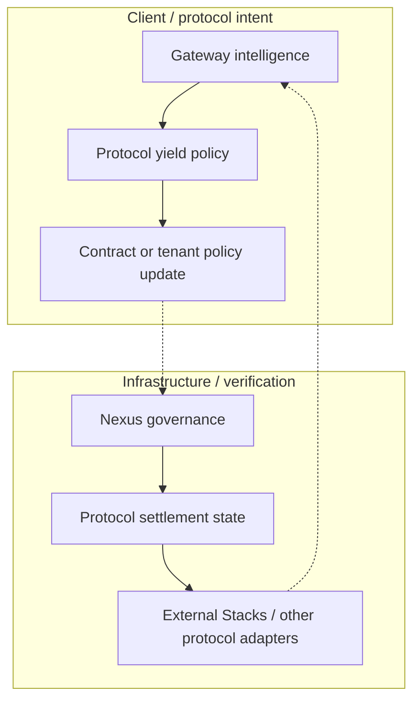
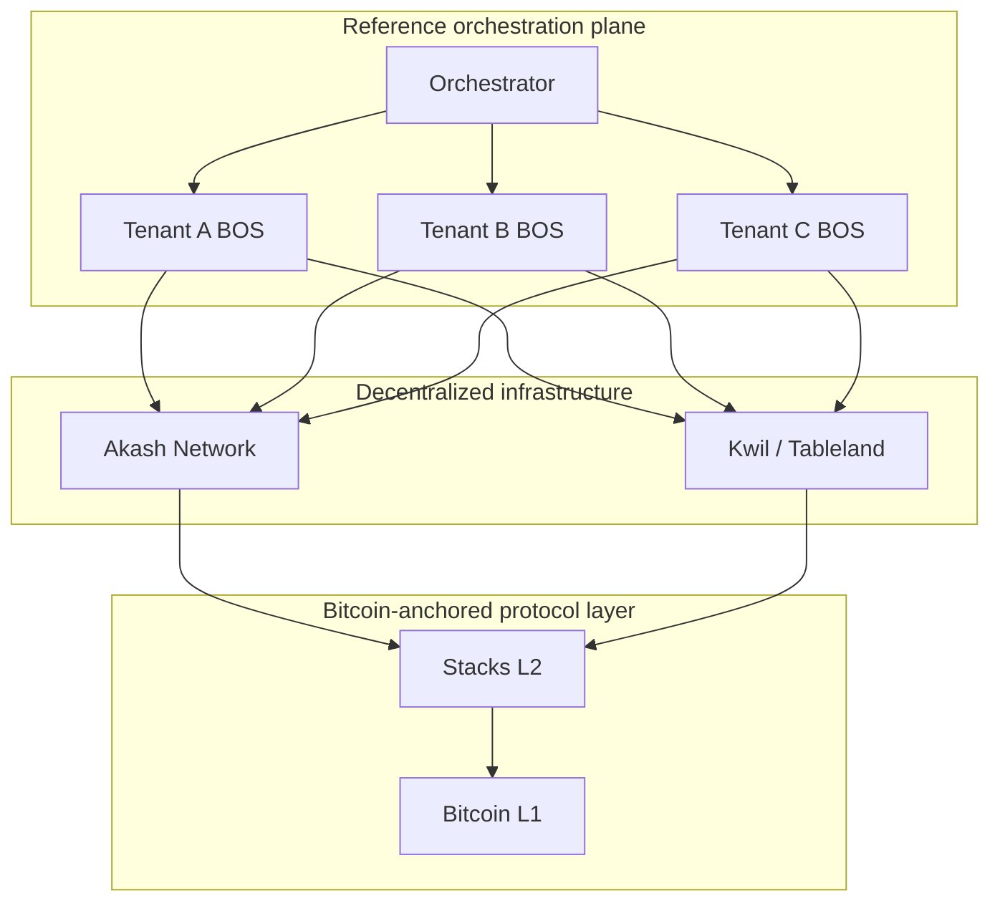

# Conxian BOS Service Loop

> **Classification:** Supporting · Public-safe
> **Operating label:** Reference implementation
> **Maturity / claim state:** Target-state reference model.
> **Doctrine boundary:** “Treasury”, “yield”, “settlement”, and “escrow” in this diagram describe protocol-, tenant-, or participant-level behavior. They do not describe Conxian-Labs custody, discretionary fund control, market operation, or user-data extraction.

This page shows how client intent, governance, routing, and verification could connect. It is not a description of a company-controlled financial workflow.

## Single-Tenant Operational Loop

## Multi-Tenant Platform Orchestration (BaaP)

The arrows represent routing and verification relationships. They do not imply that Conxian-Labs receives participant funds, controls tenant treasuries, or operates an investment or trading market.
