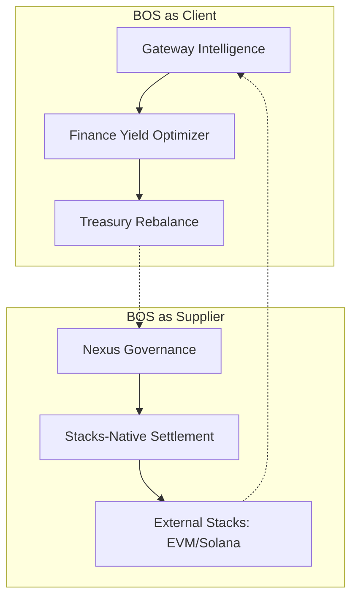

# Conxian BOS Service Loop

```mermaid
graph TD
    subgraph BOS_CLIENT [BOS as Client]
        A[Gateway Intelligence] --> B[Finance Yield Optimizer]
        B --> C[Treasury Rebalance]
    end

    subgraph BOS_SUPPLIER [BOS as Supplier]
        D[Nexus Governance] --> E[Stacks-Native Settlement]
        E --> F[External Stacks: EVM/Solana]
    end

    C -.-> D
    F -.-> A
```
