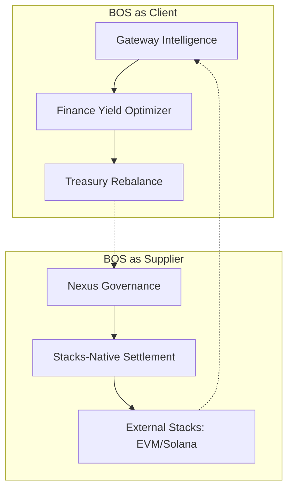
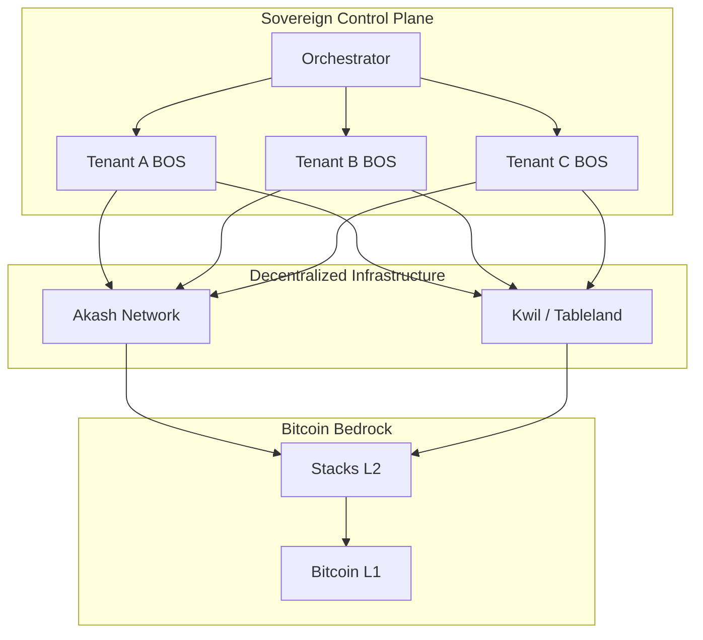

# Conxian BOS Service Loop

## Single-Tenant Operational Loop

```mermaid
graph TD
    subgraph BOS_CLIENT [BOS as Client]
        A[Gateway Intelligence] --> B[Finance Yield Optimizer]
        B --> C[Treasury Rebalance]
    end

    subgraph BOS_SUPPLIER [BOS as Supplier]
        D[Nexus Governance] --> E[Stacks-Native Settlement]
        E --> F[External Stacks: EVM/Solana]
    end

    C -.-> D
    F -.-> A
```

## Multi-Tenant Platform Orchestration (BaaP)

```mermaid
graph TD
    subgraph CONTROL_PLANE [Sovereign Control Plane]
        CP[Orchestrator] --> T1[Tenant A BOS]
        CP --> T2[Tenant B BOS]
        CP --> T3[Tenant C BOS]
    end

    subgraph SHARED_RUNTIME [Decentralized Infrastructure]
        T1 --> AK[Akash Network]
        T2 --> AK
        T3 --> AK
        T1 --> KW[Kwil / Tableland]
        T2 --> KW
        T3 --> KW
    end

    subgraph SETTLEMENT_LAYER [Bitcoin Bedrock]
        AK --> ST[Stacks L2]
        KW --> ST
        ST --> BTC[Bitcoin L1]
    end
```
