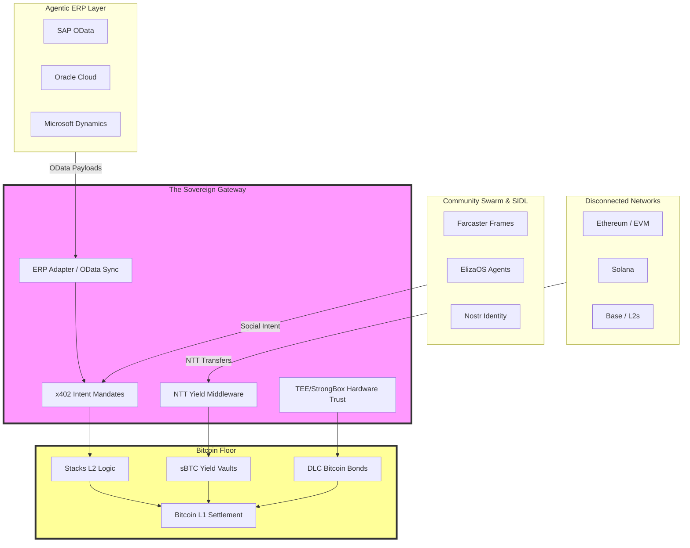

# Conxian Strategic Moat: 3D System View

## The Network Effect (Lock-In)
1. **Effortless Efficiency**: Disconnected networks (ETH/SOL) gain Bitcoin-native yield and security only through the Conxian Gateway.
2. **Deterministic Trust**: Hardware-anchored TEE/StrongBox enforcement makes Conxian the default "Trusted Execution" layer for Agentic Finance.
3. **Institutional Default**: By supporting ISO 20022 and OData natively, Conxian forces real-world business apps to settle on the Bitcoin floor.
